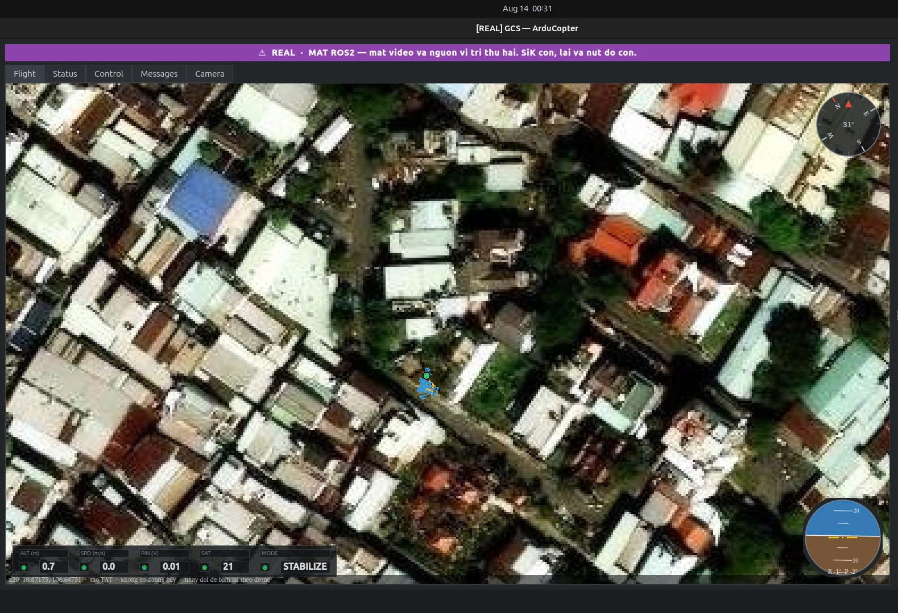
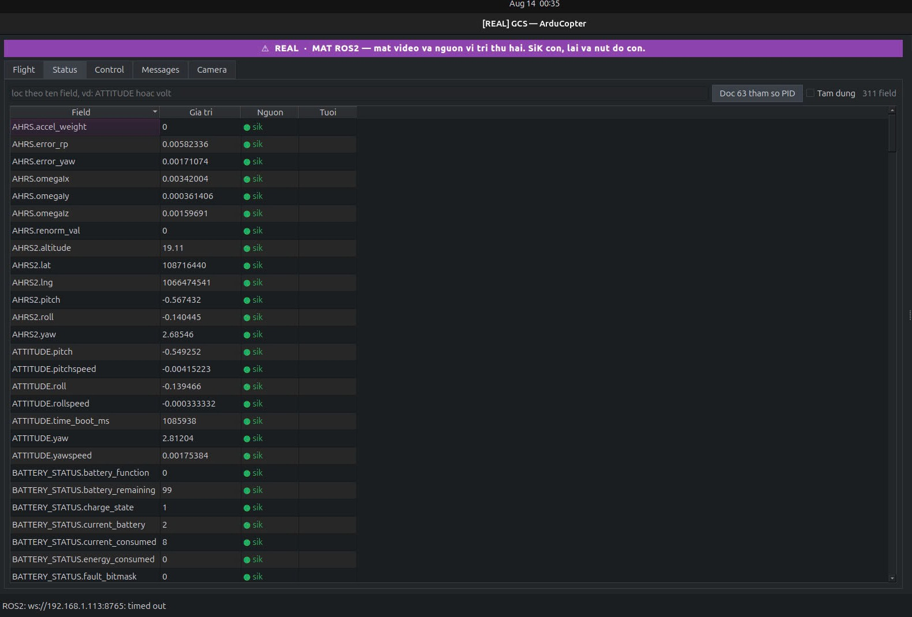
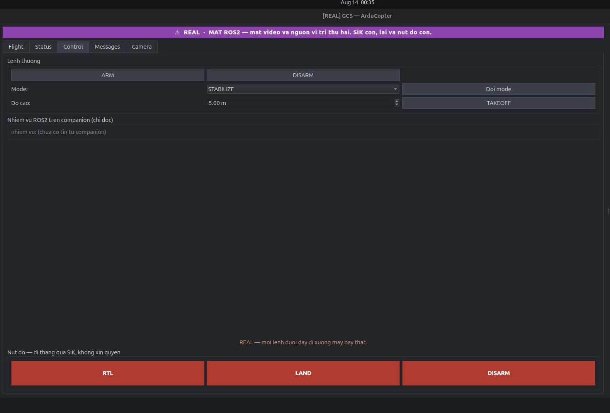
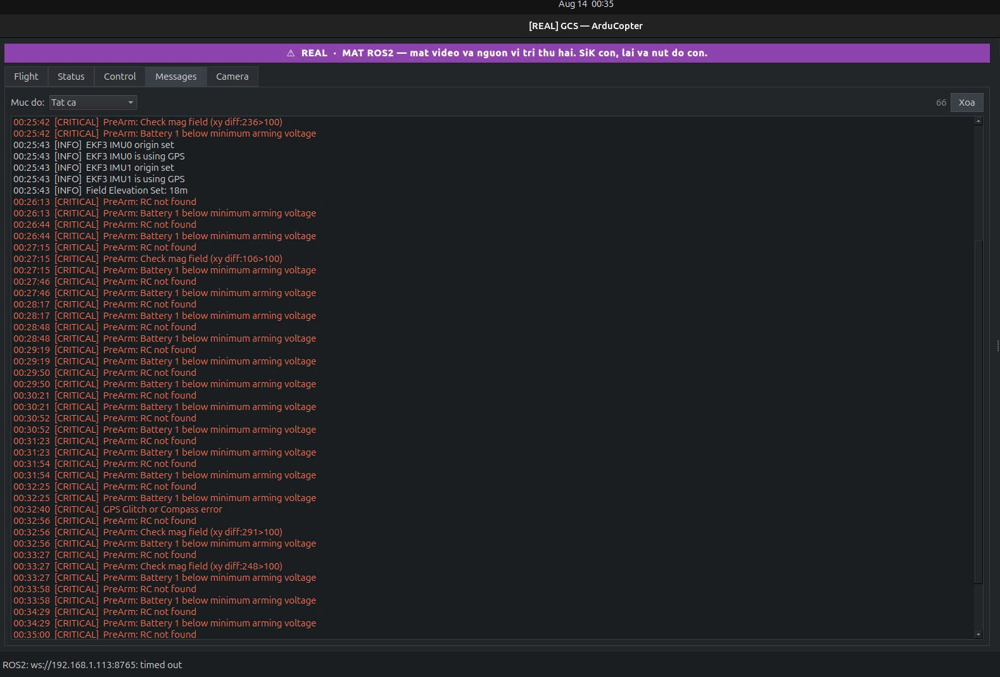

# Giao diện trạm điều khiển mặt đất cho ArduCopter — vận hành qua ROS 2/MAVROS

**Phần mềm khảo sát:** `GUI_NATIVE` (PySide6), phiên bản `7319e8a` · **Thực nghiệm:** 13–14/08/2026 — mô phỏng ArduPilot SITL + Gazebo + MAVROS + ROS 2 Humble, và phần cứng thật (mạch điều khiển bay Pixhawk 6C) qua radio SiK

---

## 1. Mục tiêu và phạm vi

Xây dựng trạm điều khiển mặt đất chạy trên Linux cho máy bay bốn cánh quạt ArduCopter, với yêu cầu riêng: hệ thống bay mang thêm một máy tính nhúng chạy ROS 2, nên trạm mặt đất phải nhận và hiển thị **hai nguồn dữ liệu song song** — một đường MAVLink trực tiếp và một đường ROS 2 đi qua MAVROS.

Điều này sinh ra vấn đề mà các phần mềm phổ thông không xử lý: hai đường truyền hỏng theo hai cách khác nhau và kéo theo hai hậu quả khác nhau. Mất đường MAVLink là mất khả năng can thiệp khẩn cấp. Mất đường ROS 2 là mất tầm nhìn — video, vị trí đối chứng, trạng thái node — trong khi nhiệm vụ tự hành trên máy bay vẫn chạy. Gộp cả hai thành một thông báo "mất kết nối" là sai cả về mức độ nghiêm trọng lẫn về việc phải làm tiếp theo [1].

Báo cáo giới hạn ở phần mềm phía mặt đất. Bộ số đo chi tiết lấy trên mô phỏng phần mềm trong vòng lặp (SITL); mạch điều khiển bay Pixhawk 6C nối qua radio SiK được dùng để kiểm chứng giao diện ở chế độ REAL (mục 5).

## 2. Kiến trúc và công nghệ

Mọi dữ liệu trong ứng dụng đều mang một dạng thống nhất, bất kể nguồn gốc [2]:

```python
{"src": "sik", "topic": "position", "data": {...}, "ts": 1721000000.123}
```

Adapter phía MAVLink chuẩn hoá đơn vị và đổi hệ toạ độ NED → ENU ngay tại tầng thấp nhất; adapter phía ROS 2 nhận envelope cùng định dạng qua WebSocket. Bộ trọng tài đa nguồn giữ mọi trường kèm nguồn và thời điểm nhận, trả về giá trị tươi nhất, và giao diện luôn hiển thị kèm chấm màu chỉ nguồn.

Chuỗi dữ liệu ở chế độ mô phỏng:

```
Gazebo ──9002──> ArduPilot SITL ─┬─5760─> MAVProxy ──14550──> MAVROS ──> ros2_bridge.py ──ws:8765──┐
                                 └─5763──────────────────────────────────────────────> GUI <───────┘
```

`ros2_bridge.py` là mảnh ghép bắt buộc: MAVROS chỉ phát topic DDS chứ không mở WebSocket, còn laptop chủ ý không cài ROS 2 [3]. Topic `/gcs/authority` được chốt cứng ở `"gcs"` ngay lúc cầu nối khởi động và không có đường nào đổi — node tự hành trên máy tính nhúng không bao giờ được lái; nửa ROS 2 chỉ còn là nguồn telemetry và video.

| Hạng mục | Nội dung |
|---|---|
| Ngôn ngữ, khung giao diện | Python 3.10, PySide6 (Qt 6); bố cục từ Qt Designer, các widget bản đồ/la bàn/chân trời/telemetry/video tự vẽ bằng `QPainter` |
| Thư viện | `pymavlink`, `websockets`, `rclpy` (phía cầu nối), `pyyaml`, `pyserial` |
| Đồng thời | 5 luồng: Qt chính (vẽ), 2 adapter (`QThread`), video, tải ảnh bản đồ — dữ liệu qua ranh giới luồng chỉ bằng `Signal` |
| Quy mô | 8 358 dòng Python: `core/` 1 280 · `laptop/` 3 131 · `tools/` 3 947 (mã đo và kiểm thử chiếm 47 %) |
| Bản đồ | 21 084 tile ngoại tuyến, 296 MB, độ phân giải tới 7,3 cm/pixel; tự tải bù khi có mạng |

## 3. Cấu hình thực nghiệm

```bash
gz sim -v4 -r -s iris_runway.sdf                        # Gazebo Harmonic, không cửa sổ
sim_vehicle.py -v ArduCopter -f gazebo-iris --model JSON --no-mavproxy \
    --custom-location=10.8221589,106.6868454,10,0 -A "--serial1=tcp:2 --serial2=tcp:3"
mavproxy.py --master tcp:127.0.0.1:5760 --out udp:127.0.0.1:14550 --daemon
ros2 launch simtofly_mavros_sitl mavros_apm.launch.py fcu_url:=udp://:14550@
python3 tools/ros2_bridge.py --host 127.0.0.1
```

Giao diện chạy dưới nền tảng đồ hoạ ngoại tuyến của Qt và được điều khiển bằng kịch bản thao tác trực tiếp lên widget thật; ảnh chụp bằng `QWidget.grab()` ở 1400×900. Mốc thời gian kiểm mỗi 400 ms, nên mọi số đo thời gian có sai số lấy mẫu cỡ ±0,4 s.

## 4. Tính năng chính

| Thành phần | Chức năng |
|---|---|
| **Banner chế độ** | Bảy trạng thái: chưa kết nối · đang chờ dữ liệu · REAL · SIM · REPLAY · mất nửa ROS 2 · mất telemetry |
| **Panel nguồn** | Tự quét mọi cổng USB-serial đang cắm, suy baud theo loại cổng, báo thiếu quyền kèm câu lệnh cần chạy |
| **Tab Flight** | Bản đồ vệ tinh ngoại tuyến + vệt bay, home, geofence, đường bay; la bàn, chân trời nhân tạo, thanh telemetry và ô video nổi đè lên bản đồ |
| **Tab Status** | Toàn bộ trường số của mọi message MAVLink (308 trường lúc đo), lọc theo tên, kèm nguồn và tuổi dữ liệu |
| **Tab Control** | ARM/DISARM, đổi mode, TAKEOFF, nhóm nút khẩn cấp, trạng thái node ROS 2 (chỉ đọc) |
| **Tab Messages** | STATUSTEXT của bộ điều khiển bay + kết quả mọi lệnh người dùng bấm |
| **Tab Camera** | Luồng MJPEG từ máy tính nhúng, dùng chung nguồn với ô PiP trên tab Flight |
| **Waypoint** | Đặt bằng chuột phải (tối đa 50), nạp lên bộ điều khiển bay, đọc ngược lại để đối chiếu, xoá đường bay |
| **Nhích bằng bàn phím** | Phím mũi tên gửi lệnh vận tốc trong mode GUIDED, tốc độ tăng dần 1→5 m/s |
| **Mô phỏng đứt truyền** | Bịt riêng từng nửa để diễn tập, chỉ hiện ở chế độ SIM |
| **Ghi log** | `.tlog` MAVLink thô ở mọi chế độ, `logs/commands.log` ghi mọi lệnh và phản hồi |


*Hình 1 — Tab Flight sau khi kết nối: bản đồ vệ tinh ngoại tuyến, la bàn và chân trời nhân tạo, thanh telemetry, hai hàng trạng thái đường truyền.*


*Hình 2 — Tab Status: 308 trường, mỗi hàng kèm nguồn và tuổi dữ liệu.*

## 5. Kết quả đo

**Kết nối và telemetry.** Gói MAVLink đầu tiên về sau 0,62 s, gói ROS 2 đầu tiên sau 1,42 s. Tải đường truyền đo trên cổng ứng dụng đang dùng: **2 899 B/s, 82,2 message/s**, nặng nhất là `SIMSTATE` (19,3 %), `ATTITUDE` (13,8 %), `AHRS2` (12,4 %). Tỉ lệ mất gói 0,0 % suốt phiên. Đây là số của TCP loopback, không suy ra được gì về sức chở thật của radio 57600 baud.

**Sai lệch giữa hai nguồn:** 0,00 m khi đứng yên · 0,10 m khi treo · 0,38 m khi bay 4,63 m/s. Sai lệch tăng theo tốc độ là điều phải xảy ra vì hai nguồn không lấy mẫu đồng thời; ngưỡng cảnh báo đặt ở 5 m.

**Đường bay waypoint.** Bốn điểm đặt bằng chuột, nạp lên và đọc ngược về **7 mục trong 0,68 s** — gồm điểm home, lệnh `NAV_TAKEOFF` và `NAV_LAND` do phần mềm tự chèn. Cái vẽ trên bản đồ là cái bộ điều khiển bay đang thật sự giữ, không phải cái vừa gửi đi.


*Hình 3 — Đường bay đã nạp, đọc ngược từ bộ điều khiển bay (nét liền tím).*

**Chuyến bay hoàn chỉnh:** GUIDED 0,3 s → ARM 1,2 s → TAKEOFF lên 12 m trong 9,2 s → AUTO qua bốn waypoint trong 22,4 s ở 4,63 m/s → RTL xác nhận sau 0,68 s, hạ cánh và tự disarm sau 50,7 s.


*Hình 4 — Bay AUTO theo đường bay đã nạp, vệt bay 79 điểm, đang tới waypoint 4.*

**Đường truyền vô tuyến SiK.** Ngoài phiên mô phỏng, giao diện còn được chạy trực tiếp trên cặp radio SiK 57600 baud nối với mạch điều khiển bay Pixhawk 6C. Đây là đường cứu sinh của hệ thống: mọi lệnh — kể cả nhóm nút khẩn cấp và việc nạp đường bay — đều đi qua nó và hoàn toàn không phụ thuộc vào WiFi hay máy tính nhúng. Ứng dụng nhận diện cổng và tự đặt baud theo loại thiết bị (`ttyUSB*` → 57600 cho radio SiK, `ttyACM*` → 115200 cho bộ điều khiển bay cắm USB trực tiếp), nên cắm vào là dùng được, không phải sửa cấu hình.

Các số đo trên radio thật:

| Đại lượng | Kết quả |
|---|---|
| Tỉ lệ mất gói, đo liên tục 30 s | **0,0 %** |
| Nạp và đọc lại đường bay 51 mục | **12 s mỗi chiều**, biên an toàn 6,2 lần so với ngưỡng chờ 2 s giữa hai mục |
| Độ trễ lệnh nhích vị trí bằng bàn phím | **132 ms** |
| Tự phục hồi khi luồng dữ liệu gián đoạn | Phát hiện sau 5 s im lặng, xin lại toàn bộ luồng; đo được băng thông trở lại 1 863 → 1 880 B/s |

Cơ chế xin lại luồng ở hàng cuối đáng nói thêm: thay vì chờ người vận hành phát hiện màn hình đứng hình rồi kết nối lại, ứng dụng tự nhận ra mình đã 5 giây không nhận được dữ liệu nào ngoài nhịp tim, rồi gửi lại toàn bộ yêu cầu luồng — tốn 7 gói khoảng 140 byte trên chiều lên vốn đang trống. Người vận hành chỉ thấy dữ liệu tiếp tục chạy.

Bốn hình dưới đây chụp phiên làm việc với mạch Pixhawk 6C lúc 00:25–00:35 ngày 14/08/2026; ảnh đã cắt bỏ dải chọn nguồn bên phải cho gọn khung hình. Băng thông đọc trên widget trạng thái đường truyền ở cả bốn thời điểm nằm trong khoảng **2 000 – 2 150 B/s**, tỉ lệ mất gói **0,0 %**.


*Hình 5 — Tab Flight ở chế độ REAL: tiêu đề cửa sổ mang nhãn `[REAL]`, banner báo suy giảm vì nửa ROS 2 chưa nối, bản đồ vệ tinh mức zoom 20, thanh telemetry báo 21 vệ tinh và mode STABILIZE.*


*Hình 6 — Tab Status trên mạch Pixhawk 6C: 311 trường, mọi hàng đều khai nguồn `sik`. Bảng tự dài ra theo những gì mạch gửi lên, không khai báo trước trường nào.*


*Hình 7 — Tab Control ở chế độ REAL: dòng nhắc "moi lenh duoi day di xuong may bay that", nhóm ba nút khẩn cấp sẵn sàng, dòng trạng thái node ROS 2 báo chưa có tin từ máy tính nhúng.*


*Hình 8 — Tab Messages nhận nguyên văn lý do bộ điều khiển bay từ chối cất cánh (nhóm `PreArm`), kèm mốc thời gian và mức độ nghiêm trọng. Đây là chỗ trả lời trực tiếp câu hỏi "vì sao nó không arm được", thay vì để người vận hành tự đoán.*

Bốn hình này cũng cho thấy cơ chế phân loại suy giảm hoạt động đúng trên phần cứng thật: máy tính nhúng chưa nối nên banner báo mất nửa ROS 2, đồng thời nói rõ đường điều khiển và nhóm nút khẩn cấp vẫn còn — chứ không quy về một thông báo mất kết nối chung. Tab Camera vì thế không có hình trong đợt chụp này.

**Video từ máy tính nhúng.** Máy chủ MJPEG chạy trên Raspberry Pi 5, cổng 8080 tách hẳn khỏi đường lệnh. Đo được **4,22 fps, 2,15 Mbps**, khung 62 KB, p90 nhịp 444 ms, đỉnh 4,77 s — thấp hơn nhiều so với 16,3 fps và 5,75 Mbps đo ngày 06/08/2026 [5]. Nguyên nhân nằm ở đường truyền (tốc độ liên kết WiFi tụt còn 7,2 Mbit/s ở −68 dBm) chứ không ở camera hay mã nguồn. Khi khoảng ngắt vượt ngưỡng 4 s, ô video chuyển xám kèm lý do thay vì đóng băng khung cũ.


*Hình 9 — Tab Camera: luồng MJPEG từ webcam gắn trên Pi 5.*

**Kịch bản mất nửa ROS 2.** Ngắt giữa lúc bay AUTO ở 14,9 m: banner chuyển tím với nội dung *"MAT ROS2 — mat video va nguon vi tri thu hai. SiK con, lai va nut do con"*, hàng Remote chuyển xám và đếm thời gian, hàng SiK giữ nguyên 3 425 B/s, các ô telemetry đổi chấm nguồn và tiếp tục cập nhật.


*Hình 10 — Mất nửa ROS 2 giữa chuyến bay: banner nói rõ mất cái gì và còn cái gì.*

**Kiểm thử tự động.** Bộ `tools/selfcheck.py` chạy **29/29 phép kiểm đạt**, gồm chuẩn hoá hệ toạ độ, trọng tài đa nguồn, nút khẩn cấp đi trước mọi kiểm tra, khoá nút ở chế độ phát lại, cấu trúc nhiệm vụ waypoint và giải mã MJPEG.

## 6. Điểm nổi bật của giao diện

1. **Hai nguồn dữ liệu có trọng tài tường minh.** Mỗi đại lượng hiển thị đều khai nguồn phát và tuổi dữ liệu; phần mềm tự tính sai lệch vị trí giữa hai nguồn và cảnh báo khi vượt ngưỡng. Thêm đường truyền thứ ba chỉ tốn một dòng cấu hình ưu tiên.
2. **Phân loại suy giảm theo hậu quả.** Mất nửa ROS 2 và mất telemetry cho hai màu banner khác nhau với hai thông điệp khác nhau, vì hành động tiếp theo của người vận hành là khác nhau.
3. **"Đã gửi" không bao giờ hiển thị giống "đã làm".** Đường bay được đọc ngược từ bộ điều khiển bay rồi mới vẽ; lệnh cất cánh được đối chiếu với độ cao thực sau 6 s để bắt trường hợp lệnh bị một luồng setpoint khác đè lên; lệnh không có phản hồi trong 3 s bị ghi rõ là không có phản hồi.
4. **Các chốt an toàn suy từ hành vi đo được của phần cứng, không từ suy đoán.** Chặn ARM khi cần ga chưa về vị trí thấp (bộ điều khiển bay không tự kiểm việc này); chặn TAKEOFF khi không ở GUIDED (ở LOITER nó chấp nhận rồi không làm gì); nút DISARM hai bậc chia theo "đang ở dưới đất hay không", xác định bằng hai nguồn độc lập chứ không suy từ độ cao tương đối.
5. **Không hộp thoại chặn trên màn hình bay.** Khi một hộp thoại đang mở, ba nút khẩn cấp vẫn báo là đang bật nhưng bấm không ăn — đo được. Xác nhận vì thế làm bằng cách bấm lại trong 3 giây.
6. **Không mặc định đoán.** Ứng dụng không tự kết nối; chế độ hiển thị lấy từ cấu hình chứ không suy từ chuỗi kết nối; hàng trạng thái đường truyền lấy mốc từ lần cuối thật sự có gói về chứ không từ việc "adapter đang chạy".
7. **Toàn bộ khẳng định đều có số đo kèm theo**, và mã sinh ra số đo được viết ngang hàng với chức năng (47 % số dòng).

## 7. So sánh với Mission Planner và QGroundControl

> *Ghi chú:* phần này đối chiếu với đặc điểm phổ biến của hai phần mềm mã nguồn mở nêu trên; không trích dẫn tài liệu ngoài nào. Riêng nhận định về Mission Planner trên Linux là quan sát trực tiếp trong quá trình làm việc [4].

### 7.1 Những gì phần mềm này có mà hai công cụ kia chưa có

| Đặc điểm | Ở đây | Mission Planner / QGroundControl |
|---|---|---|
| Hiển thị **nguồn phát cho từng đại lượng** và tự tính sai lệch giữa các nguồn | Có, ở mọi ô telemetry | Hiển thị một giá trị hợp nhất; không nêu đại lượng đó đến từ đường nào |
| Phân biệt **mất đường điều khiển** với **mất đường quan sát** | Hai màu banner, hai thông điệp | Thường quy về một trạng thái mất kết nối chung |
| Nhận thức về **máy tính nhúng và quyền điều khiển của node tự hành** | Chốt `/gcs/authority`, hiện tên node đang chạy | Không có khái niệm này — chúng nói chuyện với bộ điều khiển bay, không với node ROS 2 |
| **Đối chiếu sau lệnh**: đọc ngược nhiệm vụ, kiểm độ cao sau cất cánh | Có, tự động | Nạp nhiệm vụ và đọc lại được, nhưng việc đối chiếu do người vận hành chủ động làm |
| **Chốt an toàn theo số đo của chính khung máy bay** (ngưỡng cần ga, ngưỡng cảm biến khoảng cách) | Có, tham số hoá trong mã | Dựa vào kiểm tra phía bộ điều khiển bay |
| **Diễn tập đứt đường truyền ngay trong giao diện** | Có, chỉ ở chế độ mô phỏng | Không có sẵn |
| **Quy mô mã có thể đọc hết** | 8 358 dòng, một người nắm được toàn bộ | Rất lớn; sửa một hành vi nhỏ tốn nhiều công tìm hiểu |

Phần lớn khác biệt bắt nguồn từ một điều: hai công cụ kia là phần mềm đa dụng cho mọi loại máy bay và mọi loại người dùng, còn phần mềm này viết cho đúng một cấu hình — một khung bay, một radio, một máy tính nhúng chạy ROS 2 — nên nó được phép đưa tri thức về chính cấu hình đó vào trong mã.

### 7.2 Những gì nên học và cải tiến

| Học từ | Điều còn thiếu ở đây | Đề xuất |
|---|---|---|
| Cả hai | **Lưu và mở lại đường bay ra file** | Nhiệm vụ hiện chỉ tồn tại trên bộ điều khiển bay hoặc trong bản nháp; nên xuất ra tệp để tái sử dụng giữa các buổi bay |
| Cả hai | **Sửa waypoint đã đặt** (kéo thả, chèn giữa, đổi độ cao từng điểm) | Hiện chỉ thêm ở cuối và bỏ điểm cuối |
| Mission Planner | **Cây tham số đầy đủ, có ghi** | Hiện chỉ đọc 63 tham số điều khiển; nên cho tìm kiếm và ghi tham số có xác nhận |
| Mission Planner | **Phân tích log sau bay** (đồ thị dataflash) | Có `.tlog` nhưng chưa có công cụ đọc trực quan; hiện phải mở bằng phần mềm khác |
| QGroundControl | **Video H.264/RTSP thay MJPEG** | MJPEG tốn khoảng 60 KB mỗi khung; nén liên khung sẽ hạ băng thông xuống nhiều lần trên đúng đường WiFi đang là nút thắt |
| QGroundControl | **Mẫu nhiệm vụ khảo sát** (quét lưới, quét hành lang) | Sinh tự động từ một đa giác, thay vì đặt tay từng điểm |
| QGroundControl | **Chạy trên máy tính bảng / thiết bị di động** | Hữu ích khi ra bãi bay; kiến trúc envelope hiện tại đã tách sẵn phần lõi nên khả thi |
| Cả hai | **Điểm tập kết (rally point) và sửa geofence** | Hiện chỉ đọc và vẽ hàng rào, chưa sửa được từ giao diện |
| Cả hai | **Hỗ trợ tay cầm điều khiển** | Bổ sung cho chức năng nhích bằng bàn phím |

Ngược lại, có những thứ của hai công cụ kia **không nên bắt chước**: hộp thoại xác nhận chặn trên màn hình bay (đã đo được là làm nút khẩn cấp mất tác dụng), và việc gộp mọi loại sự cố đường truyền vào một thông báo chung.

## 8. Hạn chế

1. Mọi con số băng thông là của TCP loopback, không phải của radio SiK; tỉ lệ mất gói 0,0 % chỉ chứng minh bộ đếm chạy đúng.
2. Hai nguồn dữ liệu đều bắt nguồn từ cùng một bộ điều khiển bay mô phỏng — phép so vị trí bắt được lỗi hệ toạ độ và lỗi đơn vị, không nói gì về độ chính xác định vị.
3. Phiên phần cứng thật thực hiện trên bàn thử, chưa bay ngoài bãi, nên phần đối chiếu số liệu khi đang bay vẫn dựa trên mô phỏng.
4. Chất lượng WiFi lúc đo video kém hơn hẳn ngày dựng hệ thống, nên con số fps ở đây là cận dưới.

## 9. Kết luận

Giao diện vận hành trọn vẹn một chuyến bay ArduCopter qua ngăn xếp ROS 2/MAVROS, với độ trễ phản hồi lệnh dưới 1,2 s ở mọi bước và sai lệch giữa hai nguồn dữ liệu dưới 0,4 m khi bay. Giá trị thực tế của phần mềm nằm ở cách xử lý trạng thái xấu nhiều hơn ở trạng thái tốt: phân biệt hai kiểu mất kết nối theo hậu quả, đọc ngược để xác nhận thay vì tin vào lệnh đã gửi, hiện ô xám thay vì đóng băng khung hình cũ, và ghi lại mọi lệnh cùng phản hồi.

So với Mission Planner và QGroundControl, phần mềm này hẹp hơn nhiều về tính năng nhưng sâu hơn ở đúng phần bài toán của mình — vận hành một máy bay có máy tính nhúng ROS 2, với các chốt an toàn suy từ hành vi đo được của chính khung bay đang dùng. Hướng phát triển tiếp theo là bổ sung những tiện ích đã chín ở hai công cụ kia (lưu/sửa nhiệm vụ, ghi tham số, phân tích log, video nén liên khung), đồng thời lặp lại toàn bộ phép đo trên radio và phần cứng bay thật.

---

## Danh mục hình

| Hình | Tệp | Nội dung |
|---|---|---|
| 1 | `anh/02_ban_do_sau_ket_noi.png` | Tab Flight sau khi kết nối |
| 2 | `anh/03_trang_thai.png` | Tab Status, 308 trường |
| 3 | `anh/07_waypoint_tren_fc.png` | Đường bay đã nạp, đọc ngược từ FC |
| 4 | `anh/09_bay_auto_theo_duong_bay.png` | Bay AUTO theo đường bay |
| 5 | `anh/16_sik_flight.jpeg` | Tab Flight ở chế độ REAL qua radio SiK |
| 6 | `anh/13_sik_statusstatus.jpeg` | Tab Status trên mạch Pixhawk 6C, 311 trường |
| 7 | `anh/14_sik_controlcontrol.jpeg` | Tab Control ở chế độ REAL |
| 8 | `anh/15_sik_meseage.jpeg` | Tab Messages: lý do bộ điều khiển bay từ chối cất cánh |
| 9 | `anh/05_camera_tu_pi.png` | Tab Camera, luồng MJPEG từ Pi 5 |
| 10 | `anh/12_mat_nua_ros2.png` | Kịch bản mất nửa ROS 2 |

Ảnh dự phòng trong thư mục `anh/`: `01_chua_ket_noi.png`, `04_dieu_khien.png`, `06_waypoint_ban_nhap.png`, `08_dang_bay_pip_camera.png`, `10_rtl_dang_ve.png`, `11_thong_bao.png`. Số đo thô: `anh/so_do.json`. Bản phân tích chi tiết từng tính năng: `BAO_CAO_GIAO_DIEN_chi_tiet.md`.

## Tài liệu tham khảo

Nguồn là mã nguồn, tài liệu và nhật ký đo của chính dự án; không viện dẫn tài liệu ngoài.

[1] `GUI_NATIVE/README.md` — kiến trúc, ba chế độ kết nối, các bẫy đã gặp; phiên bản `7319e8a`.
[2] `GUI_NATIVE/docs/protocol.md` — đặc tả envelope, quy ước đơn vị, giao thức nạp đường bay, số đo băng thông trước đó.
[3] `GUI_NATIVE/tools/ros2_bridge.py` — cầu nối ROS 2 → WebSocket, cấu hình QoS, cơ chế chốt `/gcs/authority`.
[4] `GUI_NATIVE/docs/doi_chieu_gcs.md` — đối chiếu số liệu với MAVProxy trên cùng luồng gói tin (07/08/2026); mục 7 ghi lại quá trình thử Mission Planner trên Linux.
[5] `GUI_NATIVE/docs/setup_pi5.md` — dựng máy chủ MJPEG trên Pi 5 và các phép đo fps/băng thông ngày 06/08/2026.
[6] Nhật ký phiên 13/08/2026: `logs/commands.log`, `logs/*.tlog`, `baocao/anh/so_do.json`, kết quả `tools/selfcheck.py` và `tools/measure_bandwidth.py`.
