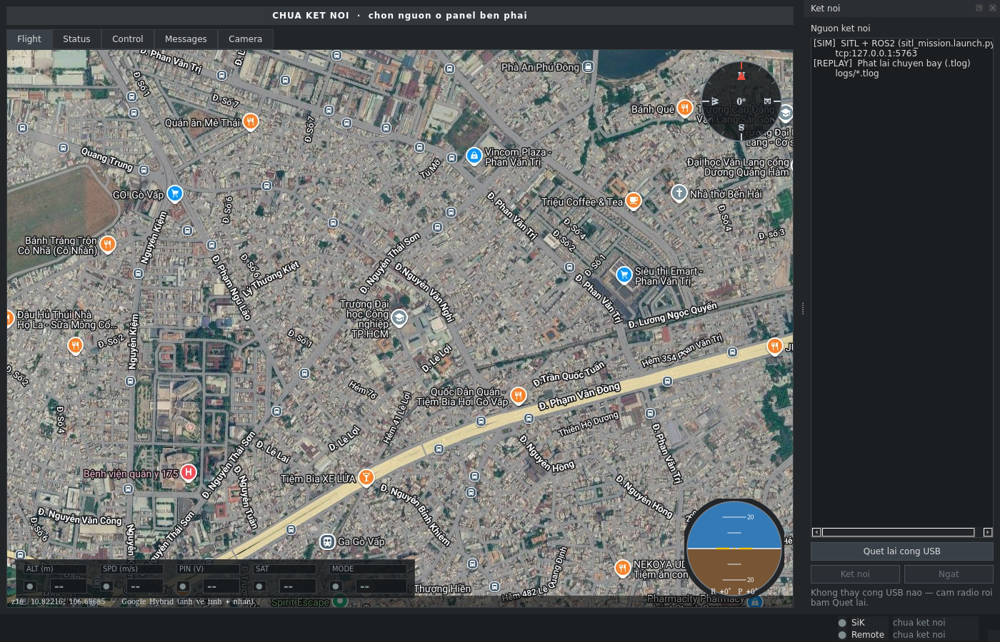
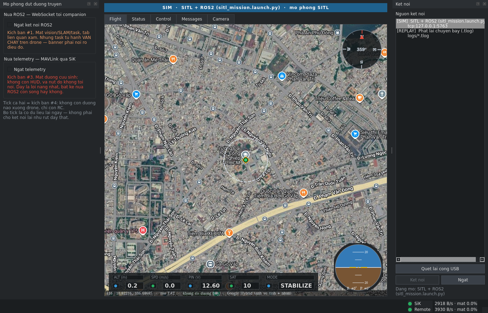
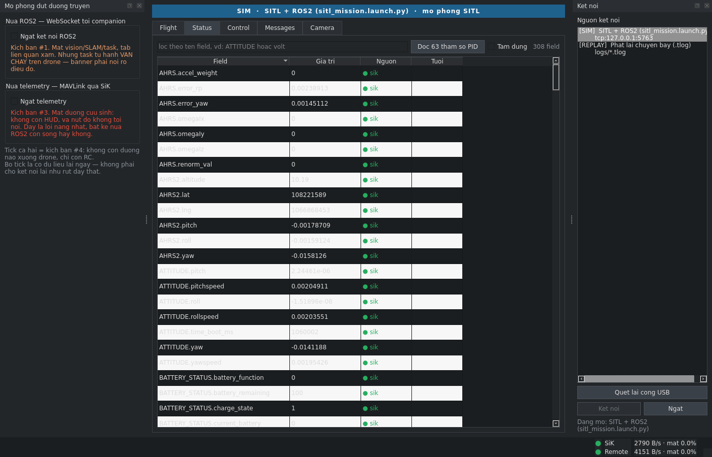
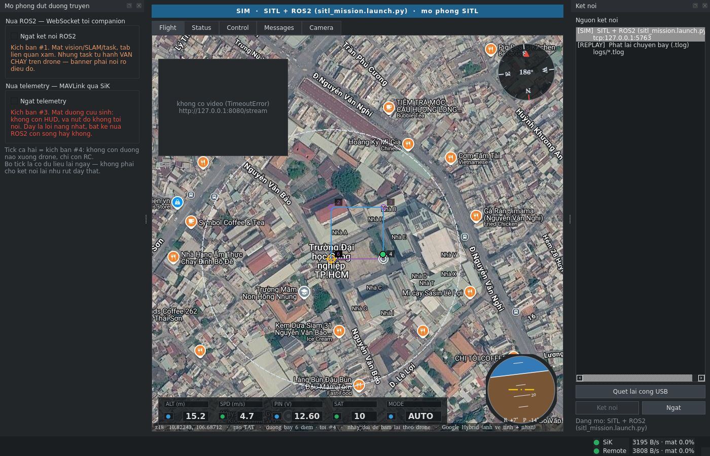
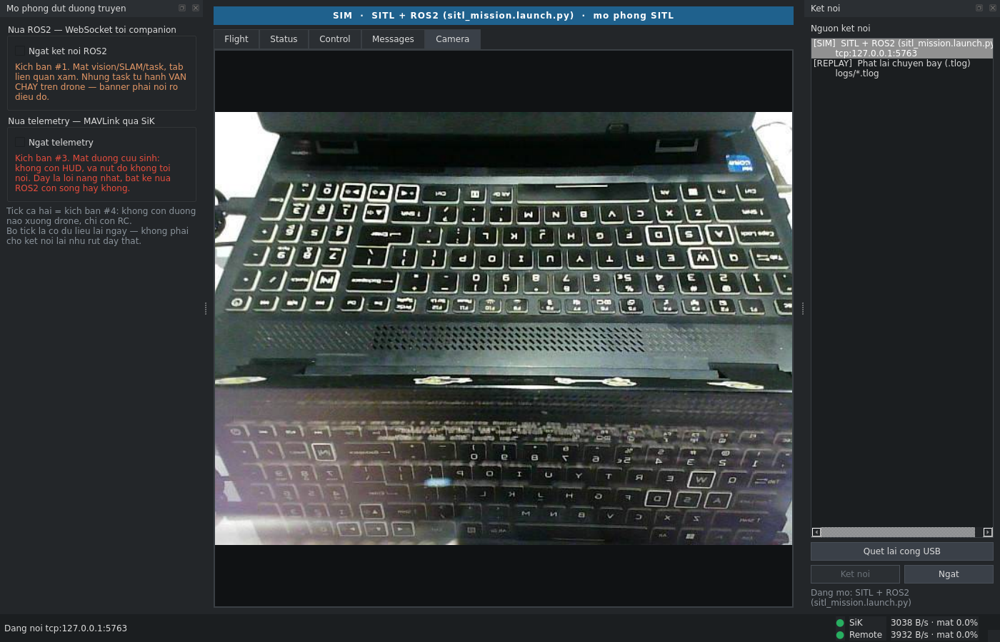
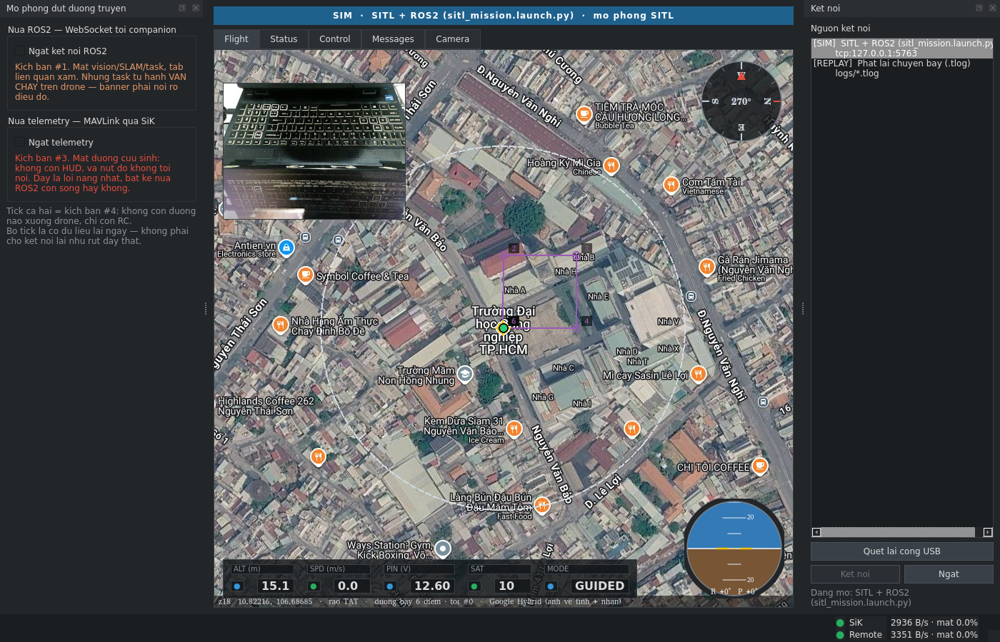
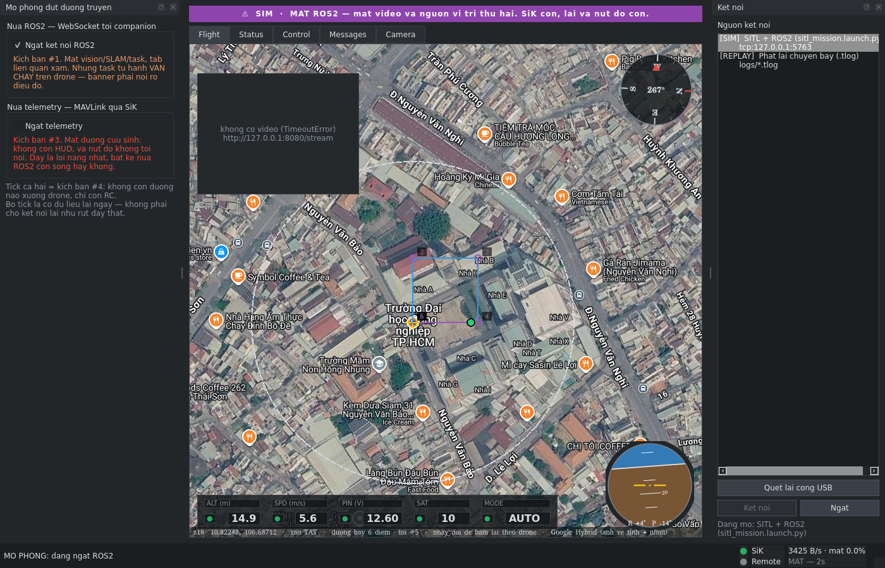

# Báo cáo: Giao diện trạm điều khiển mặt đất cho ArduCopter — vận hành qua ROS 2/MAVROS

**Đối tượng khảo sát:** ứng dụng `GUI_NATIVE` (PySide6), phiên bản mã nguồn `7319e8a`
**Chế độ chạy:** ROS 2 Humble + ArduPilot SITL + MAVROS (profile `SITL + ROS2 (sitl_mission.launch.py)`)
**Ngày thực nghiệm:** 13/08/2026, 23:20 – 00:00 (giờ Việt Nam)
**Máy chạy thử:** laptop Ubuntu 22.04, ROS 2 Humble; máy tính nhúng Raspberry Pi 5 (`192.168.1.113`) phục vụ luồng video

---

## Tóm tắt

Báo cáo mô tả và đánh giá thực nghiệm một trạm điều khiển mặt đất (GCS) viết bằng PySide6 cho máy bay không người lái chạy ArduCopter. Điểm khác biệt về kiến trúc của phần mềm là nó nhận dữ liệu từ **hai đường truyền độc lập chạy song song**: một đường MAVLink trực tiếp (radio SiK, hoặc TCP khi mô phỏng) và một đường ROS 2 đi qua MAVROS rồi được chuyển tiếp sang WebSocket bởi một tiến trình cầu nối đặt trên máy tính nhúng. Toàn bộ phép đo trong báo cáo được lấy trên ngăn xếp mô phỏng đầy đủ — Gazebo Harmonic, ArduPilot SITL, MAVROS, cầu nối ROS 2 → WebSocket — chứ không phải trên nguồn dữ liệu giả lập.

Báo cáo gồm hai phần bổ trợ nhau: một phân tích tính năng theo từng thành phần giao diện, trong đó mỗi quyết định thiết kế được truy về phép đo hoặc sự cố đã sinh ra nó (mục 4); và một phần nghiệm thu định lượng trên ngăn xếp mô phỏng đầy đủ (mục 5 đến 9).

Kết quả chính: giao diện dựng được đường bay bốn điểm và nạp thành công lên bộ điều khiển bay trong 0,68 s (bảy mục đọc ngược về, gồm điểm home, lệnh cất cánh và lệnh hạ cánh do phần mềm tự chèn); lệnh ARM được chấp nhận sau 1,2 s và máy bay đạt 12 m sau 9,2 s; sai lệch vị trí giữa hai nguồn dữ liệu nằm trong khoảng 0,0 – 0,38 m suốt chuyến bay; toàn bộ 29 phép tự kiểm của bộ `selfcheck` đều đạt. Luồng video từ Pi hoạt động nhưng chất lượng bị giới hạn bởi đường WiFi tại thời điểm đo (2,15 Mbps, đỉnh khoảng ngắt quãng 4,77 s), thấp hơn nhiều so với con số ghi nhận ngày 06/08/2026 (5,75 Mbps, đỉnh 615 ms) — và giao diện phản ứng đúng như thiết kế: chuyển sang ô xám thay vì đóng băng khung hình cũ.

---

## 1. Đặt vấn đề

Phần mềm điều khiển mặt đất phổ thông (Mission Planner, QGroundControl) được thiết kế cho một đường truyền MAVLink duy nhất tới bộ điều khiển bay. Khi hệ thống bay mang thêm một máy tính nhúng chạy ROS 2 — để xử lý thị giác máy tính, định vị hoặc điều khiển tự hành — thì trạm mặt đất phải đối diện với một tình huống mà các phần mềm trên không giải quyết: **hai nguồn dữ liệu cùng mô tả một máy bay, hỏng theo hai cách khác nhau, và kéo theo hai hậu quả khác nhau**.

Mất đường MAVLink nghĩa là mất khả năng can thiệp khẩn cấp. Mất đường ROS 2 (thường là mất WiFi) nghĩa là mất tầm nhìn — video, vị trí đối chứng, trạng thái các node — nhưng nhiệm vụ tự hành trên máy bay vẫn tiếp tục chạy. Gộp hai loại hỏng đó vào một thông báo "mất kết nối" là sai cả về mức độ nghiêm trọng lẫn về hành động phải làm tiếp theo [1].

Từ đó, câu hỏi mà báo cáo này trả lời là:

1. Giao diện có thể vận hành trọn vẹn một chuyến bay qua ngăn xếp ROS 2/MAVROS hay không, và mất bao lâu ở từng bước?
2. Hai nguồn dữ liệu có cho ra cùng một vị trí không, sai lệch bao nhiêu?
3. Cơ chế đọc/ghi đường bay waypoint hoạt động thế nào và tốn bao lâu?
4. Luồng video từ máy tính nhúng đạt chất lượng nào, và giao diện xử lý ra sao khi đường truyền suy giảm?

### 1.1 Mục tiêu, phạm vi và đóng góp

**Mục tiêu.** Xây dựng và đánh giá một trạm điều khiển mặt đất chạy trên Linux, đủ khả năng vận hành một máy bay bốn cánh quạt ArduCopter trong toàn bộ chu trình bay, đồng thời hiển thị song song dữ liệu từ hai đường truyền có bản chất khác nhau và phân biệt rành mạch các kiểu suy giảm của chúng.

**Phạm vi.** Báo cáo giới hạn ở phần mềm phía mặt đất. Phần mềm điều khiển bay (ArduCopter) và các node nhiệm vụ tự hành trên máy tính nhúng được xem là hệ thống có sẵn, chỉ can thiệp ở mức cấu hình. Toàn bộ phép đo thực hiện trên mô phỏng phần mềm trong vòng lặp (SITL); phần cứng bay thật nằm ngoài phạm vi phiên thực nghiệm này, và những hạn chế kéo theo được liệt kê tường minh ở mục 10.

**Đóng góp.** Bốn điểm có thể coi là đóng góp của công việc này:

1. **Một kiến trúc hai nguồn có trọng tài tường minh.** Mọi đại lượng hiển thị đều mang theo nguồn phát và tuổi dữ liệu, thay vì bị gộp lại thành một con số không truy nguyên được. Cơ chế trọng tài (mục 2.1) là mã dùng chung, không phụ thuộc vào loại đường truyền — thêm một đường thứ ba chỉ tốn một dòng cấu hình ưu tiên.
2. **Phân loại suy giảm theo hậu quả, không theo hiện tượng.** Mất đường ROS 2 và mất đường MAVLink cho ra hai màu banner khác nhau với hai thông điệp khác nhau, vì hành động phải làm tiếp theo của người vận hành là khác nhau (mục 8.2).
3. **Nguyên tắc "đọc ngược để xác nhận" áp cho mọi lệnh có trạng thái.** Đường bay sau khi nạp được tải lại từ bộ điều khiển bay rồi mới vẽ; lệnh cất cánh được đối chiếu với độ cao thực sau 6 s. "Đã gửi" không được phép hiển thị giống "đã làm" (mục 6.1 và 6.3).
4. **Một bộ số đo tái lập được** cho toàn bộ chu trình trên ngăn xếp ROS 2/MAVROS thật, kèm mã kiểm thử tự động 29 phép (mục 9), thay vì đánh giá định tính.

---

## 2. Kiến trúc hệ thống

### 2.1 Hai nửa dữ liệu, một bus chung

Mọi dữ liệu chảy trong ứng dụng đều mang dạng một *envelope* thống nhất, bất kể nó tới từ đâu [2]:

```python
{"src": "sik", "topic": "position", "data": {...}, "ts": 1721000000.123}
```

Trường `src` là thứ giữ cho hai nguồn không lẫn vào nhau. Adapter phía MAVLink (`core/adapters/sik.py`) chuẩn hoá đơn vị và đổi hệ toạ độ NED sang ENU ngay tại tầng thấp nhất, nên tầng giao diện không bao giờ phải biết dữ liệu gốc nằm trong hệ nào [2]. Adapter phía ROS 2 (`core/adapters/remote.py`) nhận envelope JSON đã cùng định dạng qua WebSocket; trường `src` của nó bị ghi đè thành `"remote"` khi vào ứng dụng, để một máy tính nhúng bị chiếm quyền cũng không thể tự xưng là nguồn khác và đánh lừa bộ trọng tài.

Bộ trọng tài đa nguồn (`core/field.py`) giữ mọi trường dữ liệu kèm nguồn và thời điểm nhận, rồi trả về giá trị *tươi nhất*. Giao diện luôn hiển thị kèm chấm màu chỉ nguồn đang dùng, nên người vận hành không bao giờ đọc một con số mà không biết nó từ đâu tới.

### 2.2 Vị trí của MAVROS trong chuỗi

Ở chế độ mô phỏng, chuỗi dữ liệu đầy đủ như sau:

```
Gazebo Harmonic  (vật lý + hình ảnh)
   ↑ UDP 9002 (FDM)
ArduPilot SITL  ─┬─ TCP 5760 ─→ MAVProxy ─→ UDP 14550 ─→ MAVROS ─→ topic ROS 2
                 │                                          ↓
                 │                              tools/ros2_bridge.py
                 │                                          ↓
                 │                                   WebSocket :8765
                 └─ TCP 5763 ────────────────────────────→  GUI (nửa MAVLink)
                                                            ↑
                                                     GUI (nửa ROS 2)
```

Hai cổng TCP khác nhau trên cùng một SITL là có chủ ý: MAVProxy giữ 5760, MAVROS lấy dữ liệu qua UDP 14550, còn giao diện cắm thẳng vào 5763 — nhờ vậy không phải sửa file launch bên kho ROS 2 và hai nửa không tranh nhau một cổng [1].

`ros2_bridge.py` là mảnh ghép bắt buộc vì MAVROS chỉ phát topic DDS, nó không mở WebSocket nào; trong khi laptop chủ ý **không cài ROS 2** để giảm phụ thuộc [3]. Cầu nối đăng ký sáu topic MAVROS (`global_position/global`, `local_position/pose`, `local_position/velocity_local`, `global_position/compass_hdg`, `battery`, `state`) với QoS BEST_EFFORT — đặt RELIABLE là không nhận được gói nào, vì MAVROS phát telemetry ở BEST_EFFORT [3].

### 2.3 Mô hình quyền điều khiển

Phiên bản hiện tại bỏ hoàn toàn cơ chế nhường quyền qua lại. Topic `/gcs/authority` được chốt cứng ở giá trị `"gcs"` ngay lúc cầu nối khởi động, với QoS TRANSIENT_LOCAL để node khởi động sau vẫn đọc được, và không có đường nào đổi giá trị đó [3]. Hệ quả: node tự hành trên máy tính nhúng không bao giờ được lái; nửa ROS 2 chỉ còn là nguồn telemetry và video. Mọi lệnh xuống máy bay — kể cả nạp đường bay — đều đi từ laptop qua đường MAVLink.

Nhóm ba nút khẩn cấp (RTL / LAND / DISARM) đi thẳng vào nhánh ESCAPE của `core/authority.py` tới adapter MAVLink, không qua máy tính nhúng, không qua WebSocket [2]. Chúng chỉ bị khoá duy nhất ở chế độ phát lại `.tlog`, khi ở đầu kia không còn gì để gửi lệnh tới.

### 2.4 Công nghệ, cấu trúc mã nguồn và quy mô

**Công nghệ sử dụng.** Phần mềm viết bằng Python 3.10, giao diện dựng trên PySide6 (Qt 6). Bố cục khung cửa sổ được vẽ trong Qt Designer và biên dịch ra Python bằng `tools/build_ui.sh`; những thành phần cần vẽ tay — bản đồ, la bàn, chân trời nhân tạo, thanh telemetry, khung video — là các lớp `QWidget` tự cài đặt `paintEvent` bằng `QPainter`. Giao tiếp MAVLink dùng thư viện `pymavlink`; đường ROS 2 dùng `websockets` phía ứng dụng và `rclpy` phía cầu nối; cấu hình đọc bằng `pyyaml`; quét cổng nối tiếp bằng `pyserial`. Không dùng máy chủ web, không dùng trình duyệt nhúng, không dùng môi trường ảo — chủ ý giữ nguyên `pip --user` để sau này chuyển thẳng sang `rclpy` trên cùng thông dịch viên Python mà không hỏng [1].

**Mô hình đồng thời.** Đây là chỗ quyết định phần mềm có đứng hình hay không, nên được thiết kế trước khi viết giao diện:

| Luồng | Việc | Ranh giới |
|---|---|---|
| Luồng chính (Qt) | Toàn bộ vẽ và xử lý sự kiện | Chỉ luồng này được chạm vào widget |
| `SikAdapter` (`QThread`) | Đọc/ghi MAVLink, ghi `.tlog`, hàng đợi lệnh | Đẩy dữ liệu ra bằng `Signal` — ranh giới luồng duy nhất |
| `RemoteAdapter` (`QThread`) | WebSocket tới máy tính nhúng, tự kết nối lại | Như trên |
| `VideoSource` (thread thường) | Đọc luồng MJPEG, giải mã | Gửi byte JPEG qua `Signal`, việc dựng `QPixmap` làm ở luồng chính |
| `TileFetcher` (`QThread`) | Tải bù ảnh bản đồ còn thiếu khi có mạng | Tách khỏi luồng vẽ để bản đồ không khựng |

Hai lớp video và tải ảnh bản đồ dùng thread thường thay vì `QThread` là một quyết định có lý do cụ thể: lỗi `QThread: Destroyed while thread is still running` làm huỷ cả tiến trình, và một trạm điều khiển mặt đất không được phép chết vì luồng xem video [5].

**Cấu trúc thư mục** phản ánh đúng ranh giới trách nhiệm:

```
core/            # tầng không biết gì về giao diện — dùng chung được với bản web
  bus.py         # phát tán envelope theo topic
  field.py       # trọng tài đa nguồn: best() trả cả giá trị lẫn nguồn
  authority.py   # đường ra drone + nhánh ESCAPE cho nút khẩn cấp
  adapters/sik.py     # pymavlink trong QThread, chuẩn hoá NED → ENU
  adapters/remote.py  # client WebSocket tới máy tính nhúng
laptop/          # tầng giao diện
  app.py         # cửa sổ chính, ghép mọi thành phần
  connection.py  # quét cổng USB + banner chế độ
  link_faults.py # mô phỏng đứt đường truyền (chỉ chế độ SIM)
  tabs/          # flight · status · control · messages
  widgets/       # map · compass · attitude · telemetry_bar · video
tools/           # công cụ đo, kiểm thử, tải ảnh bản đồ, cầu nối ROS 2
```

Quy tắc phụ thuộc một chiều: `laptop/` được phép gọi `core/`, chiều ngược lại thì không. Nhờ vậy toàn bộ logic xử lý dữ liệu kiểm thử được mà không cần dựng cửa sổ, và đó là điều kiện để bộ `selfcheck` chạy được 29 phép kiểm trong khoảng 90 giây mà không cần SITL.

**Quy mô mã nguồn** (đếm tại phiên bản `7319e8a`):

| Thành phần | Số dòng Python |
|---|---|
| `core/` (bus, trọng tài, quyền, hai adapter) | 1 280 |
| `laptop/` (cửa sổ chính, 4 tab, 5 widget vẽ tay) | 3 131 |
| `tools/` (kiểm thử, đo đạc, cầu nối, tải ảnh bản đồ) | 3 947 |
| **Tổng** | **8 358** |

Tỉ lệ đáng chú ý: mã công cụ đo và kiểm thử chiếm 47 % tổng số dòng, nhiều hơn cả tầng giao diện. Đây không phải sự mất cân đối mà là hệ quả của một nguyên tắc làm việc xuyên suốt dự án — mọi khẳng định về hành vi phần mềm phải có số đo kèm theo, nên công cụ tạo ra số đo được viết ngang hàng với chức năng.

**Dữ liệu bản đồ.** Ảnh vệ tinh được tải trước về đĩa dưới dạng tile `{z}/{x}/{y}.png` bằng `tools/fetch_tiles.py`: hiện có 21 084 tile, 296 MB, phủ nền thế giới ở mức zoom thấp và hai bãi bay ở mức zoom 13–19, riêng khu vực trường thêm mức 20–21. Nguồn ảnh được chọn sau một phép đo so sánh: nhà cung cấp trước đó hết ảnh gốc ở mức zoom 19 (mức 20 và 21 trả về cùng một tấm "không có dữ liệu", trùng mã băm), trong khi nguồn đang dùng vẫn cho ảnh thật ở mức 21 — quy ra độ phân giải mặt đất 29 cm/pixel so với 7,3 cm/pixel [1]. Bản đồ hoạt động hoàn toàn ngoại tuyến; khi có mạng, ứng dụng tải bù phần còn thiếu và lưu lại cho lần bay sau.

---

## 3. Phương pháp thực nghiệm

### 3.1 Ngăn xếp mô phỏng

Bốn tiến trình được khởi động theo thứ tự phụ thuộc, mỗi tiến trình chạy nền và ghi log riêng:

```bash
# 1. Gazebo Harmonic, chế độ không cửa sổ (server-only)
export GZ_VERSION=harmonic; source ~/gz_ws/setup.bash
gz sim -v4 -r -s iris_runway.sdf

# 2. ArduPilot SITL gắn vào Gazebo, home đặt tại ĐH Công nghiệp TP.HCM
~/ardupilot/Tools/autotest/sim_vehicle.py -v ArduCopter -f gazebo-iris \
    --model JSON --no-mavproxy --custom-location=10.8221589,106.6868454,10,0 \
    -A "--serial1=tcp:2 --serial2=tcp:3"

# 3. MAVProxy làm bộ tập trung, và MAVROS đọc từ nó
mavproxy.py --master tcp:127.0.0.1:5760 --out udp:127.0.0.1:14550 --daemon
ros2 launch simtofly_mavros_sitl mavros_apm.launch.py fcu_url:=udp://:14550@

# 4. Cầu nối ROS 2 → WebSocket
python3 ~/GUI_NATIVE/tools/ros2_bridge.py --host 127.0.0.1
```

Toạ độ home được đặt trùng với vùng đã tải sẵn ảnh vệ tinh ngoại tuyến (21 084 tile, 296 MB) để bản đồ trong giao diện có nền thật thay vì ô trống.

Ba điểm khác biệt so với quy trình khởi động chuẩn bằng `ros2 launch simtofly_mavros_sitl sitl_mission.launch.py`, cần nêu rõ để người đọc tái lập được:

| Khác biệt | Lý do |
|---|---|
| Không dùng file launch bốn cửa sổ `gnome-terminal` | Phiên desktop của người dùng đang được sử dụng; mọi tiến trình chạy nền, log ghi ra file |
| Gazebo chạy chế độ server (`-s`), không mở cửa sổ 3D | Không cần hình ảnh 3D cho phép đo giao diện; giảm tải máy |
| MAVProxy được gọi riêng thay vì đi kèm `sim_vehicle.py` | `sim_vehicle.py` khởi động MAVProxy ở chế độ tương tác, nó thoát ngay khi không có terminal |

Riêng bước 3 là chỗ đã phát sinh một sự cố đáng ghi lại, trình bày ở mục 8.1.

### 3.2 Cách chụp ảnh và thu số đo

Giao diện được chạy dưới nền tảng đồ hoạ ngoại tuyến của Qt (`QT_QPA_PLATFORM=offscreen`) và điều khiển bằng kịch bản Python thao tác trực tiếp lên các widget thật — đúng những đối tượng mà chuột người dùng bấm vào. Ảnh được lấy bằng `QWidget.grab()` ở độ phân giải 1400×900. Cách này tránh việc bơm sự kiện chuột/phím vào phiên desktop đang dùng (ứng dụng bật lên sẽ cướp focus và ăn phím người dùng đang gõ), đồng thời cho ảnh sạch, không lẫn cửa sổ khác.

Các mốc thời gian được đo bằng đồng hồ hệ thống tại thời điểm điều kiện chuyển trạng thái, với chu kỳ kiểm tra 400 ms — nghĩa là mọi con số thời gian dưới đây có sai số lấy mẫu cỡ ±0,4 s. Băng thông và tỉ lệ mất gói lấy trực tiếp từ widget trạng thái đường truyền của chính ứng dụng, vốn đếm byte thực trên socket và suy tỉ lệ mất gói từ số thứ tự gói MAVLink.

---

## 4. Phân tích tính năng giao diện

Ứng dụng gồm năm tab, một dải banner chế độ chiếm hết chiều ngang, một dock chọn nguồn kết nối bên phải, một dock mô phỏng đứt truyền bên trái (chỉ hiện ở chế độ mô phỏng), và widget trạng thái đường truyền ở góc dưới phải.

| Tab | Nội dung |
|---|---|
| **Flight** | Bản đồ vệ tinh ngoại tuyến; la bàn, chân trời nhân tạo, thanh telemetry và ô video PiP nổi đè lên bản đồ |
| **Status** | Toàn bộ trường số của mọi message MAVLink, kèm nguồn và tuổi dữ liệu |
| **Control** | ARM/DISARM, đổi mode, TAKEOFF; nhóm nút khẩn cấp; dòng trạng thái node ROS 2 (chỉ đọc) |
| **Messages** | STATUSTEXT của bộ điều khiển bay cộng kết quả mọi lệnh do người dùng bấm |
| **Camera** | Luồng MJPEG toàn khung từ máy tính nhúng |

Nguyên tắc thiết kế xuyên suốt là **không mặc định đoán**: ứng dụng mở lên không tự kết nối, banner xám, và người vận hành phải chọn nguồn rồi bấm "Ket noi" (Hình 1). Chế độ hiển thị (`REAL` đỏ / `SIM` xanh / `REPLAY` xám) lấy từ trường `mode` khai trong file cấu hình chứ không suy từ chuỗi kết nối — cắm radio thật mà chọn nhầm profile mô phỏng thì banner vẫn xanh, và đó là lỗi cấu hình chứ không phải suy đoán sai của phần mềm [1].


*Hình 1 — Trạng thái khởi động: chưa kết nối nguồn nào, banner xám, hai hàng trạng thái đường truyền đều báo "chua ket noi".*

Sau khi chọn profile `SITL + ROS2 (sitl_mission.launch.py)` và bấm kết nối, gói MAVLink đầu tiên về sau **0,62 s** và gói ROS 2 đầu tiên về sau **1,42 s**. Bản đồ tự bám theo máy bay ngay khi có toạ độ đầu tiên (Hình 2).


*Hình 2 — Tab Flight ngay sau khi kết nối: ảnh vệ tinh ngoại tuyến ở mức zoom 18, la bàn và chân trời nhân tạo nổi trên bản đồ, thanh telemetry ở đáy, hai hàng SiK/Remote đều xanh.*

### 4.1 Panel chọn nguồn và cơ chế quét cổng USB

Panel bên phải liệt kê các profile khai trong `config/connections.yaml`, cộng thêm **mọi cổng USB-serial đang cắm được quét tự động** tại thời điểm mở ứng dụng hoặc khi bấm "Quet lai cong USB". Cách quét có ba chi tiết đáng phân tích:

- **Không ghi cứng `/dev/ttyUSB0`.** Cắm sang cổng USB khác, hoặc cắm thêm một thiết bị USB trước đó, là số thứ tự đổi. Ghi cứng tên thiết bị trong cấu hình đồng nghĩa với việc phải sửa file mỗi lần cắm lại.
- **Lọc theo mã định danh USB thật.** Thư viện liệt kê cổng trả về cả khoảng 32 cổng UART trên bo mạch chủ (`/dev/ttyS*`) vốn không bao giờ có máy bay ở đầu kia; chỉ thiết bị có VID/PID USB mới được giữ.
- **Suy baud theo loại cổng.** `ttyUSB*` thường là radio SiK qua chip FTDI/CP210x nên đặt 57600; `ttyACM*` là bộ điều khiển bay cắm USB trực tiếp (lớp CDC) nên baud không có ý nghĩa, đặt 115200.

Nếu tài khoản người dùng không thuộc nhóm `dialout`, dòng đó hiện `⚠ khong co quyen` **kèm nguyên câu lệnh cần chạy**. Đây là ví dụ tiêu biểu cho một nguyên tắc trình bày lỗi được áp dụng nhất quán trong phần mềm: thông báo lỗi phải trả lời được câu hỏi "giờ tôi phải làm gì", chứ không chỉ mô tả triệu chứng.

Hàm chọn profile theo **tên** chứ không theo số thứ tự dòng, và trả về `False` khi không tìm thấy. Chi tiết nhỏ này bắt nguồn từ một sự cố thật: cổng USB tự quét được xếp lên đầu danh sách, nên một kịch bản kiểm thử chọn dòng số 0 đã nối thẳng vào máy bay thật trong khi nó định chạy chế độ phát lại [1].

### 4.2 Banner chế độ — bảy trạng thái, không phải ba

Dải banner chiếm hết chiều ngang đỉnh cửa sổ. Điểm cần phân tích là nó có **bảy** trạng thái chứ không phải ba như cách hiểu thông thường:

| Trạng thái | Màu | Ý nghĩa |
|---|---|---|
| `None` | xám đậm | Chưa chọn nguồn nào |
| `WAIT` | cam | Đã mở nguồn nhưng **chưa nhận được byte nào** |
| `REAL` | đỏ | Máy bay thật, mọi lệnh đều đi xuống phần cứng |
| `SIM` | xanh dương | Mô phỏng SITL |
| `REPLAY` | xám | Phát lại `.tlog`, mọi nút bị khoá |
| `DEGRADED` | tím | Mất nửa ROS 2, nửa MAVLink còn sống |
| `LOST` | đỏ tươi | Mất nửa MAVLink — mất đường cứu sinh |

Trạng thái `WAIT` tồn tại vì một lý do kỹ thuật cụ thể: mở một socket UDP luôn luôn *thành công*, nó chỉ bind cổng chứ không nói chuyện với ai. Nếu banner tô ngay màu của chế độ khi vừa mở nguồn thì nó đang nói dối — "đã mở được nguồn" không đồng nghĩa với "có máy bay ở đầu kia". Nguồn sự thật của banner vì thế là **thời điểm cuối cùng thật sự có gói về**, lấy từ widget trạng thái đường truyền, chứ không phải từ trạng thái "adapter đang chạy".

Việc tách `DEGRADED` khỏi `LOST` chính là hiện thực hoá luận điểm ở mục 1, và mục 8.2 đo được nó hoạt động đúng.

### 4.3 Bản đồ bay

Bản đồ là widget lớn nhất trong phần mềm (khoảng 800 dòng) và mang nhiều chức năng nhất:

| Chức năng | Chi tiết hiện thực |
|---|---|
| Nền ảnh vệ tinh ngoại tuyến | Tile đọc thẳng từ đĩa; mức zoom nào thiếu tile thì tự chọn mức gần nhất còn có và phóng to, thay vì để ô trống |
| Tải bù khi có mạng | Luồng riêng, tải xong lưu lại đĩa cho lần bay ngoại tuyến sau |
| Bám theo máy bay | Bật mặc định; kéo bản đồ bằng chuột là tự tắt, để người dùng khảo sát khu vực khác mà không bị giật về |
| Vệt bay | Tối đa 3 000 điểm (~15 phút ở 3 Hz), giới hạn có chủ ý để chuyến bay dài không ăn hết bộ nhớ |
| Điểm home | Lấy từ `HOME_POSITION` do bộ điều khiển bay gửi, không suy từ vị trí đầu tiên nhìn thấy — nối vào giữa chuyến bay thì hai thứ đó khác nhau |
| Hàng rào geofence | Vòng tròn (bán kính từ tham số `FENCE_RADIUS`) và đa giác (tải về như một nhiệm vụ riêng, `mission_type = 1`) |
| Đường bay | Nét liền tím: nhiệm vụ trên bộ điều khiển bay; nét đứt nhạt: bản nháp chưa nạp; dấu tròn: waypoint đang bay tới |
| Menu chuột phải | Đặt/bỏ waypoint, chọn độ cao, nạp lên bộ điều khiển bay, xoá đường bay, bay tới một điểm (GUIDED + goto), bật/tắt ô video |

Hai chi tiết đáng nêu về mặt thiết kế. Thứ nhất, menu chuột phải được chọn thay cho hộp thoại nhập liệu, vì một hộp thoại chặn (`QMessageBox`) làm các nút khẩn cấp **chết trong khi vẫn báo là đang bật** — đo được: khi một hộp thoại đang mở thì cửa sổ chính không nhận sự kiện chuột, ba nút vẫn trả `isEnabled() == True` nhưng bấm không ăn [1]. Thứ hai, mục "bay tới điểm này" gửi *hai* lệnh liên tiếp (đổi mode GUIDED, rồi mới gửi toạ độ), vì một lệnh goto trong mode không phù hợp sẽ bị âm thầm bỏ qua.

### 4.4 Lớp phủ HUD: la bàn, chân trời nhân tạo, thanh telemetry

Ba widget này là con trực tiếp của tab Flight chứ **không nằm trong layout nào** — toạ độ tính tay trong `resizeEvent` rồi gọi `raise_()` để nổi lên trên bản đồ. Lý do: bộ quản lý layout của Qt xếp widget cạnh nhau, trong khi màn hình bay cần chúng đè lên bản đồ. Cả ba đều đặt thuộc tính cho sự kiện chuột xuyên qua, nên bấm vào chỗ có la bàn vẫn là bấm vào bản đồ bên dưới.

Thanh telemetry (ALT/SPD/PIN/SAT/MODE) là nơi thể hiện rõ nhất nguyên tắc "mỗi con số phải khai nguồn": mỗi ô mang một chấm màu chỉ nguồn dữ liệu — xanh lá cho MAVLink, xanh dương cho ROS 2, xám khi hết tươi. Khi nguồn quá 2 giây không cập nhật, chữ số xám đi thay vì đứng yên như thật. Trong Hình 9 có thể thấy các chấm đồng loạt đổi màu ngay khi nửa ROS 2 bị ngắt — người vận hành nhìn thấy sự thay đổi nguồn chứ không chỉ nhìn thấy con số.

### 4.5 Tab Status — bảng tra cứu không hardcode

Tab này không khai báo trước một trường nào. Adapter trải phẳng `msg.to_dict()` của **mọi** message thành các cặp `TÊN_MESSAGE.field` rồi đẩy lên bus dưới topic `status`; bảng chỉ việc hiển thị. Đổi firmware hay bật thêm message thì bảng tự dài ra, không phải sửa mã.

Bốn chức năng phụ trợ: ô lọc theo tên (gõ `SENSOR.` là thấy ngay cảm biến nào hỏng), nút tạm dừng để đọc một giá trị đang nhảy, cột nguồn và cột tuổi cho từng hàng, và nút đọc 63 tham số PID theo yêu cầu. Tham số phải hỏi mới có vì bộ điều khiển bay không tự gửi; hỏi cả 1 431 tham số sẽ chiếm đường truyền vài chục giây, nên chỉ nhóm liên quan tới điều khiển và dẫn đường được hỏi.

Về hiệu năng: dữ liệu được gom lại và vẽ mỗi 200 ms thay vì vẽ theo từng gói. Với khoảng 82 message/s, mỗi message nhiều trường, việc vẽ từng cái một là lãng phí thấy rõ và làm giao diện giật.

### 4.6 Tab Control — nơi các chốt an toàn nằm

Đây là tab có mật độ luận cứ thiết kế cao nhất. Mỗi chốt chặn dưới đây đều bắt nguồn từ một phép đo trên phần cứng thật, không phải từ suy đoán [1][2]:

**Chốt ARM theo vị trí cần ga.** Bộ điều khiển bay *không* kiểm tra cần ga khi nhận lệnh ARM từ trạm mặt đất — mã nguồn ArduPilot chỉ kiểm ga có *thấp hơn* ngưỡng an toàn hay không, còn kiểm "ga quá cao" chỉ áp cho trường hợp arm bằng cần lái. Đo thật: ga ở 1496 → lệnh được chấp nhận → động cơ vọt lên ngay lập tức. Ứng dụng vì thế tự chặn ở ngưỡng `THR_ARM_MAX = 1150`, suy từ hai tham số của chính khung máy bay. Nhưng khi **không thấy** dữ liệu cần ga thì nó vẫn gửi lệnh và nói rõ là không biết cần ga ở đâu — khoá nút ARM chỉ vì mất telemetry là đổi một kiểu hỏng lấy một kiểu hỏng khác.

**Chốt TAKEOFF theo mode.** ArduCopter chỉ thật sự cất cánh bằng lệnh `NAV_TAKEOFF` khi đang ở GUIDED. Ở STABILIZE nó trả về thất bại; ở LOITER nó trả về **chấp nhận rồi không làm gì** — kiểu hỏng tệ nhất vì giao diện trông y hệt thành công. Ứng dụng chặn trước và nói rõ lý do, thay vì để người vận hành tự đoán qua chữ "THAT BAI".

**Xác nhận TAKEOFF ở chế độ thật bằng cách bấm lại trong 3 giây**, không bằng hộp thoại — cùng lý do đã nêu ở mục 4.3.

**Đối chiếu độ cao sau 6 giây** để bắt trường hợp lệnh được chấp nhận nhưng bị một luồng setpoint 30 Hz của node ROS 2 mồ côi đè lên.

**Nút DISARM hai bậc, chia theo "đang ở dưới đất hay không" chứ không theo cần ga.** ArduCopter từ chối mọi lệnh disarm từ trạm mặt đất khi nó chưa tin là đã hạ cánh, và nó ngừng tin ngay khi cần ga rời khỏi vị trí thấp nhất (đo thật: `ack = 4`, ba trên ba lần). Nghĩa là vị trí cần ga quyết định nút có ăn hay không — điều không ai đoán được lúc cần ngắt gấp. Logic thay thế:

| Đang ở dưới đất? | Bấm một phát | Giữ 2 giây |
|---|---|---|
| Có | force ngay — ga ở mức nào cũng ngắt được | — |
| Không (đang bay) | lệnh thường (bộ điều khiển bay sẽ từ chối nếu nó tin là đang bay) | force |
| **Không biết** (mất telemetry) | lệnh thường | force |

Hàng cuối là chỗ dễ làm sai nhất: không có dữ liệu thì **không được đoán là đang dưới đất**, vì đoán sai hướng đó là cho một cú bấm nhầm tắt động cơ giữa không trung.

**Câu hỏi "đang ở dưới đất chưa" không được suy từ độ cao tương đối.** Khi mất định vị vệ tinh, trường này đọc ra −8,5 m suốt 10 giây trong khi máy bay nằm yên và cảm biến khoảng cách báo 0,6 m — lệch âm 8,5 m nghĩa là máy bay ở 7 m vẫn ra "dưới 1 m", đúng hướng hỏng tệ nhất. Hàm kiểm tra vì thế hỏi **hai nguồn độc lập** (cờ hạ cánh của bộ điều khiển bay, và cảm biến khoảng cách), nguồn nào nói "dưới đất" cũng đủ, và chỉ tin cảm biến khi số đọc nằm trong dải hợp lệ của chính nó.

**Nhóm nút khẩn cấp** tách riêng cả về mã nguồn lẫn về đường đi: chúng gọi thẳng vào nhánh ESCAPE, nhánh này bỏ qua tham số `target` và luôn xuống đường MAVLink. Không có nhánh kiểm tra nào đứng trước chúng.

**Dòng trạng thái node ROS 2 là chỉ đọc.** Từ khi laptop cầm toàn quyền, một nút gửi lệnh cho node tự hành sẽ là một nút nói dối. Nhưng vẫn phải nhìn thấy node nào đang chạy: node không cầm quyền thì không lái được, song nó vẫn chiếm CPU và chiếm đường truyền, và tên nó là manh mối đầu tiên khi máy bay hành xử lạ.

### 4.7 Tab Messages và cơ chế ghi vết lệnh

Tab này gộp hai luồng vào một dòng thời gian: `STATUSTEXT` từ bộ điều khiển bay (thường là chỗ duy nhất nó nói rõ vì sao từ chối, ví dụ `PreArm: ...`) và kết quả mọi lệnh do người dùng bấm, đánh dấu `[APP]`. Bộ lọc bốn mức theo `MAV_SEVERITY`, tô màu theo mức, giới hạn 2 000 dòng để chuyến bay dài không ăn hết bộ nhớ, và **chỉ tự cuộn khi người đọc đang ở cuối danh sách** — đang kéo lên đọc thì để yên.

Việc đưa kết quả bấm nút vào đây là một sửa đổi có nguyên nhân: trước đó chúng chỉ hiện 6 giây ở thanh trạng thái rồi biến mất, nên bấm nút xong mà kết quả không như ý thì không còn gì để đọc lại. Nay mỗi lệnh đi ba nơi cùng lúc — thanh trạng thái (thấy ngay), tab Messages (đọc lại trong chuyến bay), và `logs/commands.log` (truy nguyên sau chuyến bay).

Ngoài ra, mọi lệnh gửi đi đều được đặt hạn chờ phản hồi 3 giây; hết hạn mà không có `COMMAND_ACK` thì ghi rõ "KHONG CO PHAN HOI". Im lặng không bao giờ được diễn giải thành thành công.

### 4.8 Widget trạng thái đường truyền

Góc dưới phải có hai hàng riêng biệt — SiK và Remote — mỗi hàng gồm chấm màu, băng thông thực (B/s) và tỉ lệ mất gói. Ba chi tiết:

- **Tỉ lệ mất gói suy từ số thứ tự gói MAVLink**, đóng vai trò thay cho chỉ số cường độ sóng vốn không phải lúc nào cũng có. Ngưỡng đổi màu đặt ở 5 %.
- **Con số 0,0 % vẫn hiện**, không bỏ trống: một giá trị đứng yên ở 0 là bằng chứng đường truyền sạch, còn ô trống thì không phân biệt được "sạch" với "chưa đo được".
- **Topic `link` do adapter tự sinh mỗi giây bị loại khỏi phép tính "lần cuối thấy dữ liệu"**. Nếu tính cả nó thì hàng này không bao giờ chuyển xám, và widget mất hoàn toàn tác dụng phát hiện mất sóng.

### 4.9 Dock mô phỏng đứt truyền và thanh phát lại

Dock bên trái (mục 8.2) chỉ hiện ở chế độ SIM. Nó không đụng tới socket mà chỉ bịt luồng envelope, nên bỏ tick là có dữ liệu lại tức thì. Ở chế độ REAL, dock bị ẩn hoàn toàn: một ô tick làm câm telemetry đặt ngay cạnh nút khẩn cấp là thứ không được phép tồn tại.

Chế độ phát lại đọc file `.tlog` với thanh tua riêng (tạm dừng, nhảy tới vị trí bất kỳ). Ứng dụng ghi `.tlog` ở **mọi** chế độ, kể cả bay thật — sau một sự cố, đó thường là bằng chứng duy nhất còn lại. Ở chế độ này mọi nút điều khiển đều bị khoá, kể cả nhóm nút khẩn cấp, vì ở đầu kia không còn gì để gửi lệnh tới.

### 4.10 Nhích vị trí bằng bàn phím

Chức năng bổ sung gần đây cho phép dịch chuyển máy bay bằng phím mũi tên trong mode GUIDED. Điểm phân tích nằm ở chỗ nó gửi **vận tốc** chứ không gửi toạ độ. Lý do là một phép đo: vị trí hiển thị trên màn hình trễ khoảng 387 ms (3 Hz cộng độ trễ một chiều), nên ở 5 m/s máy bay đã đi qua điểm đang thấy 1,9 m — gửi "về toạ độ vừa nhìn thấy" tức là bắt nó quay ngược lại gần 2 m mỗi lần thả phím. Lệnh vận tốc không có bệnh đó: 0 m/s nghĩa là "dừng ngay tại chỗ anh đang ở", không cần biết chỗ đó ở đâu.

Bốn chốt chặn trước khi nhích: phải ở chế độ gửi được lệnh, phải đã ARM, không được đang nằm dưới đất, và phải đang ở GUIDED — ứng dụng **không tự chuyển mode hộ**, vì đang bay AUTO mà một phím lỡ tay kéo sang GUIDED là bỏ ngang nhiệm vụ giữa chừng. Tốc độ tăng dần từ 1 m/s lên trần 5 m/s theo thời gian giữ phím, lệnh lặp ở 5 Hz (lệnh vận tốc của ArduPilot tự hết hạn sau ~3 s, nên mất liên lạc giữa chừng thì máy bay dừng và treo chứ không rơi vào chế độ an toàn khẩn cấp). Mất tiêu điểm cửa sổ giữa lúc đang giữ phím cũng phát lệnh dừng — thiếu chi tiết này thì sự kiện thả phím không bao giờ tới và máy bay giữ nguyên vận tốc cuối cho tới khi lệnh hết hạn.

---

## 5. Telemetry

### 5.1 Độ phủ dữ liệu

Tab Status liệt kê **308 trường** ở thời điểm chụp (Hình 3), gồm mọi trường số của mọi message MAVLink mà bộ điều khiển bay gửi lên, cộng các trường cảm biến đã giải mã và tham số PID đọc theo yêu cầu. Mỗi hàng mang tên nguồn và tuổi dữ liệu, nên một trường đứng yên vì hỏng phân biệt được với một trường đứng yên vì đại lượng không đổi.


*Hình 3 — Tab Status với 308 trường, ô lọc theo tên, và cột nguồn cho từng trường.*

### 5.2 Tải đường truyền

Đo trên chính cổng mà giao diện đang dùng (`tcp:127.0.0.1:5763`), trong 20 s, với đúng bộ luồng mà adapter xin từ bộ điều khiển bay:

| Message | Hz | B/s | % |
|---|---|---|---|
| SIMSTATE | 9,9 | 557 | 19,3 |
| ATTITUDE | 9,9 | 398 | 13,8 |
| AHRS2 | 9,9 | 358 | 12,4 |
| TIMESYNC | 10,2 | 285 | 9,9 |
| GLOBAL_POSITION_INT | 3,0 | 120 | 4,2 |
| VFR_HUD | 3,9 | 118 | 4,1 |
| LOCAL_POSITION_NED | 2,9 | 118 | 4,1 |
| GPS_RAW_INT | 1,9 | 101 | 3,5 |
| … (còn 15 loại) | | | |
| **Tổng** | **82,2 msg/s** | **2 899 B/s** | 100 |

Con số này gấp khoảng 3,6 lần ước lượng thiết kế ban đầu (~800 B/s) [2]. Phần chênh nằm ở những message mà không tầng giao diện nào đọc — `SIMSTATE`, `AHRS2`, `MEMINFO`, `TERRAIN_REPORT` — bị kéo theo vì chúng nằm chung cụm luồng với message cần dùng. Cần nhấn mạnh: đây là số trên TCP loopback, nơi băng thông thực tế không bị giới hạn. Nó chỉ nói "bộ điều khiển bay định gửi bấy nhiêu", không nói được gì về sức chở thật của radio SiK 57600 baud; muốn biết điều đó phải đo lại trên cổng `/dev/ttyUSB*` với phần cứng thật [2].

Trong lúc ứng dụng chạy, widget trạng thái báo **2 918 B/s** cho nửa MAVLink và **4 081 B/s** cho nửa ROS 2 khi máy bay đứng yên; khi bay lên lần lượt là **3 687** và **4 224 B/s**. Tỉ lệ mất gói suy từ số thứ tự MAVLink giữ nguyên **0,0 %** suốt phiên — điều dễ hiểu trên loopback, và chính vì thế con số này chỉ có ý nghĩa như một phép kiểm chứng rằng bộ đếm hoạt động, chưa phải bằng chứng về chất lượng đường truyền vô tuyến.

### 5.3 Đối chiếu hai nguồn

Sai lệch vị trí giữa nửa MAVLink và nửa ROS 2 (khoảng cách haversine giữa hai toạ độ tươi nhất của hai nguồn):

| Trạng thái | Sai lệch |
|---|---|
| Trên mặt đất | 0,00 m |
| Treo ở 15 m | 0,10 m |
| Đang bay AUTO, tốc độ 4,6 m/s | 0,38 m |

Sai lệch tăng theo tốc độ là điều phải xảy ra: hai nguồn không lấy mẫu đồng thời, nên ở 4,6 m/s một chênh lệch 80 ms đã đủ tạo ra 0,37 m. Ngưỡng cảnh báo của giao diện đặt ở 5 m, tức là còn cách hơn một bậc độ lớn.

Cần thận trọng khi diễn giải: cả hai nguồn cuối cùng đều bắt nguồn từ cùng một bộ điều khiển bay mô phỏng. Phép so này chứng minh **hai đường xử lý dữ liệu không làm sai lệch hệ toạ độ hay đơn vị của nhau** — đúng loại lỗi hay gặp khi một bên dùng NED còn bên kia dùng ENU — chứ không chứng minh được độ chính xác định vị. Việc đối chiếu với một GCS độc lập (MAVProxy) trên cùng một luồng gói tin đã được thực hiện ở một thí nghiệm riêng, cho kết quả toạ độ khớp tuyệt đối và mọi đại lượng khác lệch nhỏ hơn nửa đơn vị hiển thị cuối cùng [4].

---

## 6. Đặt và nạp đường bay waypoint

### 6.1 Quy trình

Đường bay được dựng bằng chuột phải trên bản đồ: mỗi lần bấm thêm một điểm vào *bản nháp* (vẽ nét đứt, màu nhạt), độ cao chọn trong menu con. Trần cứng là 50 waypoint. Bản nháp chưa hề chạm tới máy bay.


*Hình 4 — Bốn waypoint đang đặt (bản nháp) tạo thành hình vuông cạnh 60 m quanh điểm home, độ cao 15 m.*

Khi nạp, adapter chèn thêm ba mục mà người vận hành không phải nghĩ tới: mục 0 là điểm home (ArduPilot luôn giữ ở vị trí này), mục 1 là lệnh `NAV_TAKEOFF`, và mục cuối là `NAV_LAND`. Thiếu mục cất cánh ở đầu thì nhiệm vụ AUTO không bao giờ khởi động được từ mặt đất; thiếu mục hạ cánh ở cuối thì máy bay treo vô hạn tại waypoint cuối.

Giao thức nạp do bộ điều khiển bay dẫn nhịp: ứng dụng gửi `MISSION_COUNT`, bộ điều khiển bay xin từng mục, ứng dụng trả từng mục. Nếu bộ điều khiển bay im quá 2 s thì gửi lại, tối đa 5 lần rồi bỏ cuộc và **nói rõ là đã bỏ cuộc** [2].

Điểm quan trọng nhất về mặt an toàn nằm ở bước cuối: nạp xong, ứng dụng **xoá bản nháp và đọc ngược toàn bộ nhiệm vụ từ bộ điều khiển bay** rồi mới vẽ. Cái hiện trên bản đồ vì thế là cái bộ điều khiển bay đang thật sự giữ, không phải cái vừa gửi đi.

### 6.2 Kết quả đo

| Đại lượng | Giá trị |
|---|---|
| Số điểm đặt bằng chuột | 4 |
| Thời gian từ lúc bấm nạp tới lúc đường bay hiện lại trên bản đồ | **0,68 s** |
| Số mục đọc ngược về từ bộ điều khiển bay | **7** (home + TAKEOFF + 4 waypoint + LAND) |
| Nhật ký | `nap 4 waypoint: da gui, cho FC tra loi` → `FC nhan 4 waypoint — dang doc lai de doi chieu` |


*Hình 5 — Đường bay sau khi nạp: nét liền màu tím là nhiệm vụ đang nằm trên bộ điều khiển bay, đánh số theo `seq` của chính nó. Dải chữ dưới bản đồ ghi "duong bay 6 diem · toi #0".*

Con số 0,68 s cho bốn waypoint tương thích với phép đo trước đó trên cùng loại đường truyền: 50 waypoint nạp xong và đọc lại đủ 51 mục trong 2,1 s [2]. Đây vẫn là số của TCP loopback; trên radio SiK thật, phép đo ngày 13/08/2026 cho 12,0 s cho một nhiệm vụ 51 mục mỗi chiều — tức chậm hơn khoảng một bậc độ lớn nhưng vẫn còn biên an toàn lớn so với ngưỡng chờ 2 s giữa hai mục.

### 6.3 Bay tự động theo đường bay đã nạp

Sau khi nạp, chuyến bay được thực hiện trọn vẹn từ giao diện:

| Bước | Thời gian |
|---|---|
| Đổi sang GUIDED → bộ điều khiển bay xác nhận | 0,3 s |
| ARM → `armed = true` | **1,2 s** |
| TAKEOFF (đặt 15 m) → vượt 12 m | **9,2 s** (độ cao đo được lúc kiểm tra: 13,27 m) |
| Đổi sang AUTO → bộ điều khiển bay xác nhận | 0,3 s |
| Bay từ waypoint 1 tới waypoint 4 | **22,4 s** ở tốc độ 4,63 m/s |
| RTL → bộ điều khiển bay xác nhận đổi mode | **0,68 s** |
| RTL → hạ cánh xong và tự disarm | **50,7 s** (lần 1), **57,2 s** (lần 2) |


*Hình 6 — Đang bay AUTO: vệt bay màu xanh (79 điểm) bám sát đường bay tím, dấu tròn trắng đánh dấu waypoint đang bay tới ("toi #4"), thanh telemetry báo 15,2 m và 4,7 m/s. Ô video góc trên trái đang ở trạng thái mất tín hiệu — xem mục 7.*

Sau khi TAKEOFF, ứng dụng đối chiếu độ cao sau 6 s: nếu bộ điều khiển bay đã nhận lệnh mà độ cao không đổi, nó cảnh báo có node đang chiếm luồng setpoint trong mode GUIDED. Đây là phản ứng với một kiểu hỏng đã gặp thật, trong đó lệnh cất cánh được chấp nhận (`result = 0`) rồi bị chính luồng 30 Hz của một node ROS 2 mồ côi đè lên, khiến máy bay nằm im trong khi giao diện trông y hệt thành công [1].

---

## 7. Luồng video từ máy tính nhúng

### 7.1 Kiến trúc

```
Pi 5  /dev/video0 → mjpeg_server.py → HTTP :8080 → (WiFi) → VideoSource → tab Camera + ô PiP
```

Cổng 8080 tách hẳn khỏi cổng 8765 của đường lệnh ROS 2 và khỏi đường MAVLink. Lý do là bất đối xứng về hậu quả: một khung JPEG 40–60 KB xếp hàng trước một lệnh sẽ làm trễ đường lệnh, trong khi video chết thì chỉ mất video [5]. Địa chỉ video được **suy ra** từ dòng `remote` trong cấu hình (`ws://x:8765` → `http://x:8080/stream`) chứ không có khoá cấu hình riêng: điều kiện để có video trùng đúng với điều kiện đã biết địa chỉ máy tính nhúng.

Ba quyết định thiết kế đáng chú ý ở phía nhận [5]:

1. **Thời gian chờ đặt ở từng lần đọc**, không chỉ lúc bắt tay — vì khi WiFi rớt, lời gọi `read()` treo im lặng chứ không ném lỗi.
2. **Luôn vẽ khung mới nhất, không xếp hàng** — nếu xếp hàng thì độ trễ trôi dần thành vài giây.
3. **Mất tín hiệu thì hiện ô xám, tuyệt đối không đóng băng khung cuối.** Nhìn một khung hình cũ mà tưởng máy bay đang ở đó là kiểu nguy hiểm nhất của giao diện.

Một nguồn, hai chỗ vẽ: tab Camera để xem kỹ, ô PiP trên tab Flight để theo dõi mà không rời bản đồ. Máy tính nhúng chỉ phải phục vụ một luồng HTTP duy nhất.

### 7.2 Số đo ngày 13/08/2026

Máy chủ MJPEG được khởi động trên Pi 5 (`python3 ~/mjpeg_server.py --device /dev/video0`, 640×480, chất lượng JPEG 70). Hai lần đo từ laptop, mỗi lần 15–20 s:

| Lần đo | fps | Băng thông | Khung (trung vị) | p50 nhịp | p90 nhịp | Đỉnh |
|---|---|---|---|---|---|---|
| 23:26 | 0,64 | 0,30 Mbps | 58,5 KB | 1 459 ms | 2 351 ms | 5 297 ms |
| 00:02 | 4,22 | 2,15 Mbps | 62,1 KB | 23 ms | 444 ms | 4 772 ms |
| **06/08/2026** [5] | **16,3** | **5,75 Mbps** | 43 KB | 61 ms | 98 ms | 615 ms |

Trạng thái đường truyền WiFi của Pi tại thời điểm đo: băng 5 GHz (5300 MHz), tín hiệu −70 rồi −68 dBm, tốc độ liên kết phát 7,2 Mbit/s. Ngày 06/08 con số tương ứng là −64 dBm và 175 Mbit/s [5].

Diễn giải: **nghẽn nằm ở đường truyền, không ở camera và không ở mã nguồn** — cùng kết luận đã rút ra ngày dựng hệ thống, chỉ khác nguyên nhân cụ thể (lần đó là Pi bám băng 2,4 GHz; lần này là suy hao khoảng cách khiến tốc độ liên kết tụt còn 7,2 Mbit/s dù vẫn ở băng 5 GHz). Phân bố nhịp khung ở lần đo thứ hai — p50 chỉ 23 ms nhưng p90 tới 444 ms và đỉnh 4,77 s — là dấu hiệu điển hình của việc gói bị dồn rồi xả theo cụm trên một liên kết yếu, chứ không phải camera trả khung chậm đều.


*Hình 7 — Tab Camera hiển thị khung hình thật từ webcam gắn trên Pi 5, giải mã và vẽ toàn khung.*


*Hình 8 — Ô video PiP bật trên tab Flight trong lúc máy bay treo ở 15,1 m, mode GUIDED. Một nguồn video, hai chỗ vẽ.*

Khi đỉnh khoảng ngắt vượt ngưỡng 4,0 s của bộ đọc, ứng dụng đóng kết nối và thử lại; ô video chuyển sang xám kèm lý do và địa chỉ đang gọi (thấy ở Hình 6). Đây là hành vi đúng thiết kế chứ không phải lỗi — và nó cho thấy giá trị của quyết định "không đóng băng khung cuối": ở tình huống này người vận hành biết ngay mình đang không có hình, thay vì nhìn một khung hình 5 giây tuổi.

*Ghi chú về đường đi của gói tin ở phép đo này:* profile mô phỏng khai `remote: ws://127.0.0.1:8765` (cầu nối ROS 2 chạy ngay trên laptop), nên địa chỉ video suy ra cũng là loopback. Để giao diện vẫn nhận đúng khung hình thật từ Pi, cổng 8080 của Pi được chuyển tiếp về loopback của laptop qua một đường hầm SSH. Byte JPEG vì thế vẫn đi qua đúng đường WiFi thật và phản ánh đúng chất lượng liên kết, nhưng có thêm một chặng chuyển tiếp TCP — cần tính đến khi so sánh chặt chẽ với phép đo trực tiếp `http://192.168.1.113:8080/stream` trong bảng trên.

---

## 8. Mô phỏng và các kịch bản suy giảm

### 8.1 Một sự cố cấu hình đáng ghi lại

Trong lần dựng ngăn xếp đầu tiên, MAVROS được trỏ thẳng vào cổng nối tiếp thứ hai của SITL (`tcp://127.0.0.1:5762`) thay vì đi qua MAVProxy. MAVROS báo kết nối thành công — nhận HEARTBEAT, đọc được `AUTOPILOT_VERSION`, topic `/mavros/state` cập nhật đều 1 Hz — nhưng **mọi topic telemetry đều im lặng**: 0 message trong 10 s trên `global_position/global`, `global_position/raw/fix`, `imu/data` và `local_position/pose`, trong khi số publisher của cả bốn topic đều bằng 1. Chẩn đoán qua topic `/diagnostics` của chính MAVROS cho thấy bộ định tuyến đã nhận 4 450 gói, 0 gói lỗi phân tích.

Nguyên nhân: cổng SERIAL1 của ArduPilot chỉ phát bộ luồng theo tham số `SR1_*`, vốn không bao gồm nhóm message vị trí ở cấu hình mặc định; còn adapter MAVLink của giao diện thì tự xin luồng cho cổng của nó nên vẫn có đủ dữ liệu trên 5763. Sau khi chuyển MAVROS về đúng kiến trúc tài liệu hoá (MAVProxy giữ 5760, MAVROS đọc UDP 14550), cả bốn topic lên 40 message/10 s (4 Hz).

Một cái bẫy phụ trong quá trình chẩn đoán cũng đáng nêu: `ros2 topic echo` mặc định đăng ký ở QoS RELIABLE, trong khi MAVROS phát telemetry ở BEST_EFFORT — QoS lệch thì DDS im lặng hoàn toàn, không báo lỗi. Công cụ dòng lệnh vì thế cho kết quả "không có dữ liệu" ngay cả ở cấu hình đúng; kết luận chỉ đáng tin khi kiểm bằng một node `rclpy` đặt QoS khớp.

### 8.2 Mô phỏng đứt đường truyền

Dock bên trái (chỉ hiện ở chế độ mô phỏng) cho phép bịt riêng từng nửa. Nó không đụng tới socket mà chỉ chặn luồng envelope, nên bỏ tick là có dữ liệu lại tức thì — khác với rút dây thật, vốn phải chờ kết nối lại. Ở chế độ thật, một ô tick làm câm telemetry đặt ngay cạnh nút khẩn cấp là thứ không được phép tồn tại, nên dock này bị ẩn hoàn toàn.

Khi ngắt nửa ROS 2 trong lúc máy bay đang bay AUTO ở 14,9 m:

- Banner chuyển sang tím, nội dung: `⚠ SIM · MAT ROS2 — mat video va nguon vi tri thu hai. SiK con, lai va nut do con.`
- Hàng "Remote" trong widget đường truyền chuyển xám và bắt đầu đếm `MAT — 2s`
- Hàng "SiK" giữ nguyên xanh, 3 425 B/s, mất gói 0,0 %
- Các ô telemetry đổi chấm nguồn sang màu của nửa MAVLink và tiếp tục cập nhật
- Ô video chuyển xám


*Hình 9 — Mất nửa ROS 2 giữa chuyến bay AUTO. Banner nói rõ mất cái gì và còn cái gì, thay vì một thông báo "mất kết nối" chung chung.*

Đây chính là điểm phân biệt đã nêu ở mục 1: mất nửa ROS 2 là **mất tầm nhìn**, không phải mất quyền điều khiển — vì từ khi laptop cầm toàn quyền, node tự hành trên máy tính nhúng không lái được. Ngược lại, mất nửa MAVLink là mất đường cứu sinh, và giao diện dành cho nó banner đỏ với thông điệp khác hẳn.

---

## 9. Kiểm chứng

Ngoài phiên chạy mô tả ở trên, phần mềm mang theo ba lớp kiểm thử:

| Công cụ | Phạm vi | Kết quả 13/08/2026 |
|---|---|---|
| `tools/selfcheck.py` | 29 phép kiểm không cần SITL: chuẩn hoá NED→ENU, lọc nguồn, trọng tài đa nguồn, nút khẩn cấp đi trước kiểm tra quyền, khoá nút ở chế độ phát lại, quét cổng USB, chốt chặn TAKEOFF, cấu trúc nhiệm vụ waypoint, giải mã MJPEG | **PASS (29/29)** |
| `tools/measure_bandwidth.py` | Byte/s thực theo từng loại message trên cổng đang cắm | 2 899 B/s, 82,2 msg/s (mục 5.2) |
| `tools/compare_gcs.py` | Đối chiếu từng con số với MAVProxy trên **cùng một luồng gói tin**, ở hai trạng thái tĩnh | Toạ độ khớp tuyệt đối; mọi đại lượng khác lệch nhỏ hơn nửa đơn vị hiển thị [4] |

Bộ `selfcheck` đáng chú ý ở chỗ nó kiểm cả những hành vi *phải sai* — ví dụ nút khẩn cấp phải hoạt động ngay cả khi kiểm tra quyền thất bại, và chế độ phát lại phải khoá được mọi nút. Một bộ kiểm thử toàn màu xanh không chứng minh gì nếu nó không bao giờ biết kêu; nguyên tắc này được áp dụng tường minh trong công cụ đối chiếu, nơi bốn kiểu sai thật được bơm vào để bắt bảng số phải phát hiện đủ cả bốn [4].

Toàn bộ lệnh người dùng bấm và kết quả phản hồi từ bộ điều khiển bay đều được ghi vào `logs/commands.log` kèm dấu thời gian và chế độ kết nối. Trích đoạn của phiên thực nghiệm:

```
2026-08-13 23:50:23  [SIM]  nap 4 waypoint: da gui, cho FC tra loi
2026-08-13 23:50:23  [SIM]  nap duong bay: FC nhan 4 waypoint — dang doc lai de doi chieu
2026-08-13 23:50:26  [SIM]  doi mode: FC chap nhan
2026-08-13 23:50:27  [SIM]  ARM/DISARM: FC chap nhan
2026-08-13 23:50:28  [SIM]  TAKEOFF: FC chap nhan
2026-08-13 23:53:29  [SIM]  RTL: da gui
```

Song song, mọi chuyến bay ở mọi chế độ đều được ghi `.tlog` MAVLink thô, đọc lại được bằng Mission Planner. Sau một sự cố, đó thường là bằng chứng duy nhất cho biết chuyện gì đã xảy ra.

---

## 10. Bàn luận và hạn chế

**Những gì phiên thực nghiệm này chứng minh được.** Giao diện vận hành trọn vẹn một chuyến bay qua ngăn xếp ROS 2/MAVROS thật: kết nối, đọc telemetry từ hai nguồn, dựng và nạp đường bay, cất cánh, bay tự động theo nhiệm vụ, gọi về và hạ cánh — với độ trễ phản hồi lệnh dưới 1,2 s ở mọi bước. Cơ chế đọc ngược nhiệm vụ sau khi nạp hoạt động đúng: bảy mục đọc về khớp với bốn điểm đặt cộng ba mục tự chèn. Hai nửa dữ liệu cho cùng một vị trí trong sai số dưới 0,4 m ở tốc độ bay 4,6 m/s.

**Những gì nó chưa chứng minh được**, và đây là phần quan trọng hơn:

1. **Mọi con số băng thông đều là số của TCP loopback.** Chúng nói lên bộ điều khiển bay định gửi bao nhiêu, không nói được radio SiK 57600 baud chở nổi bao nhiêu. Chỉ số mất gói 0,0 % cũng vậy — nó chứng minh bộ đếm chạy đúng, không chứng minh chất lượng liên kết vô tuyến.
2. **Hai nguồn dữ liệu không thật sự độc lập.** Cả hai đều bắt nguồn từ cùng một bộ điều khiển bay mô phỏng. Phép so vị trí bắt được lỗi hệ toạ độ và lỗi đơn vị, nhưng không nói gì về độ chính xác định vị tuyệt đối.
3. **Chưa có phần cứng bay thật trong vòng lặp.** Những kiểu hỏng chỉ xuất hiện trên phần cứng — bộ điều khiển bay từ chối lệnh DISARM khi nó tin là đang bay, cảm biến khoảng cách trả giá trị 0 khi hỏng, độ cao tương đối đọc ra âm 8,5 m khi mất định vị vệ tinh [2] — đều nằm ngoài phạm vi phiên này.
4. **Video đo qua một chặng chuyển tiếp phụ** (mục 7.2), và chất lượng liên kết WiFi tại thời điểm đo kém hơn hẳn ngày dựng hệ thống, nên các con số fps ở đây là cận dưới chứ không phải năng lực thật của hệ thống.
5. **Gazebo chạy chế độ không cửa sổ và thế giới `iris_runway.sdf` không mang cảm biến ảnh**, nên toàn bộ phần thị giác của ngăn xếp mô phỏng không được kiểm ở phiên này; nguồn video là webcam thật gắn trên Pi.

**Về sự cố cấu hình MAVROS (mục 8.1).** Điều đáng rút ra không phải là "chọn sai cổng" mà là **một thành phần trung gian có thể báo kết nối thành công trong khi không chuyển được dữ liệu nào có ích**. MAVROS nói "Got HEARTBEAT, connected. FCU: ArduPilot", bộ định tuyến của nó đếm được 4 450 gói không lỗi, và các publisher đều tồn tại — ba tín hiệu đều xanh trong khi hệ thống hỏng. Chỉ phép đếm message thực tế trên từng topic mới phát hiện được. Đây đúng là loại lỗi mà nguyên tắc thiết kế của chính giao diện đang phòng: hàng trạng thái đường truyền không suy từ "adapter đang chạy" mà từ lần cuối thật sự có gói về [1].

---

## 11. Kết luận

Giao diện đạt được mục tiêu đặt ra ban đầu: vận hành một chuyến bay ArduCopter hoàn chỉnh thông qua ngăn xếp ROS 2/MAVROS, với hai nguồn dữ liệu song song được phân biệt rõ ràng ở mọi chỗ hiển thị. Ba khối chức năng được yêu cầu khảo sát đều hoạt động trong phiên thực nghiệm: telemetry (308 trường, 82 message/s, sai lệch hai nguồn dưới 0,4 m), đường bay waypoint (nạp và đọc ngược 7 mục trong 0,68 s, bay AUTO qua bốn điểm trong 22,4 s), và luồng video từ máy tính nhúng (hoạt động, nhưng bị giới hạn ở 2,15 Mbps bởi chất lượng WiFi tại thời điểm đo).

Giá trị thực tế của phần mềm nằm nhiều ở cách nó xử lý trạng thái xấu hơn là ở trạng thái tốt: phân biệt hai kiểu mất kết nối theo đúng hậu quả của chúng, đọc ngược nhiệm vụ thay vì tin vào cái vừa gửi đi, hiện ô xám thay vì đóng băng khung hình cũ, và ghi lại mọi lệnh cùng phản hồi để sau sự cố còn truy được nguyên nhân.

Hướng phát triển tiếp theo, theo thứ tự ưu tiên rút ra từ chính các hạn chế nêu trên: (i) lặp lại toàn bộ phép đo trên radio SiK và bộ điều khiển bay thật để có số băng thông và tỉ lệ mất gói có ý nghĩa; (ii) thay module WiFi rời cho Pi 5 để đưa luồng video về lại mức 16 fps đã đạt được ngày 06/08; (iii) đưa cảm biến ảnh mô phỏng của Gazebo vào vòng kiểm thử để phần thị giác của ngăn xếp cũng được nghiệm thu tự động.

---

## Danh mục hình

| Hình | Tệp | Nội dung |
|---|---|---|
| 1 | `anh/01_chua_ket_noi.png` | Trạng thái khởi động, chưa kết nối |
| 2 | `anh/02_ban_do_sau_ket_noi.png` | Tab Flight sau khi kết nối |
| 3 | `anh/03_trang_thai.png` | Tab Status, 308 trường |
| 4 | `anh/06_waypoint_ban_nhap.png` | Bản nháp đường bay bốn điểm |
| 5 | `anh/07_waypoint_tren_fc.png` | Đường bay đã nạp, đọc ngược từ FC |
| 6 | `anh/09_bay_auto_theo_duong_bay.png` | Bay AUTO theo đường bay, có vệt bay |
| 7 | `anh/05_camera_tu_pi.png` | Tab Camera, luồng MJPEG từ Pi 5 |
| 8 | `anh/08_dang_bay_pip_camera.png` | Ô video PiP trên tab Flight khi đang bay |
| 9 | `anh/12_mat_nua_ros2.png` | Kịch bản mất nửa ROS 2 |

Các ảnh còn lại trong thư mục `anh/`: `04_dieu_khien.png` (tab Control), `10_rtl_dang_ve.png` (đang bay về), `11_thong_bao.png` (tab Messages). Toàn bộ số đo thô nằm ở `anh/so_do.json`.

---

## Tài liệu tham khảo

Báo cáo này lấy nguồn từ chính mã nguồn, tài liệu và nhật ký đo của dự án. Không có nguồn ngoài nào được viện dẫn.

[1] `GUI_NATIVE/README.md` — mô tả kiến trúc, ba chế độ kết nối, năm tab, và mục "Bẫy đã gặp"; kho mã tại phiên bản `7319e8a`.

[2] `GUI_NATIVE/docs/protocol.md` — đặc tả envelope, quy ước đơn vị và hệ toạ độ, bảng topic, giao thức nạp đường bay, và các phép đo băng thông trước đó (03/08/2026 và 11/08/2026).

[3] `GUI_NATIVE/tools/ros2_bridge.py` — mã nguồn cầu nối ROS 2 → WebSocket, gồm cấu hình QoS và cơ chế chốt `/gcs/authority`.

[4] `GUI_NATIVE/docs/doi_chieu_gcs.md` — quy trình và kết quả đối chiếu số liệu với MAVProxy trên cùng một luồng gói tin (SITL ArduCopter, 07/08/2026).

[5] `GUI_NATIVE/docs/setup_pi5.md` — quy trình dựng máy chủ MJPEG trên Raspberry Pi 5 và các phép đo fps/băng thông/độ trễ ngày 06/08/2026, kèm phân tích nghẽn WiFi.

[6] Nhật ký và số đo của phiên thực nghiệm 13/08/2026: `GUI_NATIVE/logs/commands.log`, `GUI_NATIVE/logs/*.tlog`, `GUI_NATIVE/baocao/anh/so_do.json`, kết quả `tools/selfcheck.py` và `tools/measure_bandwidth.py`.
