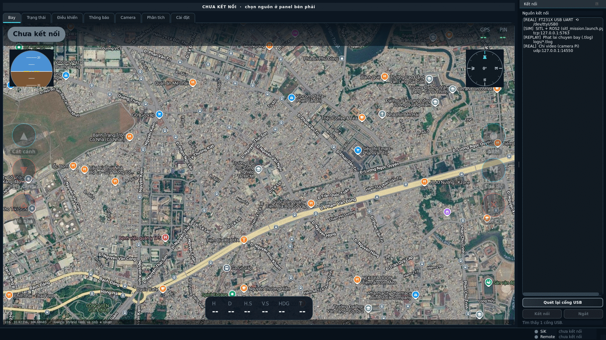
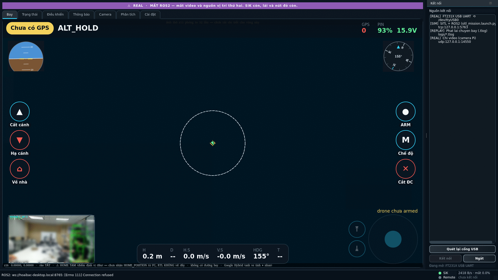
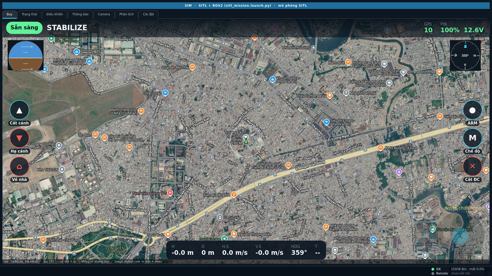
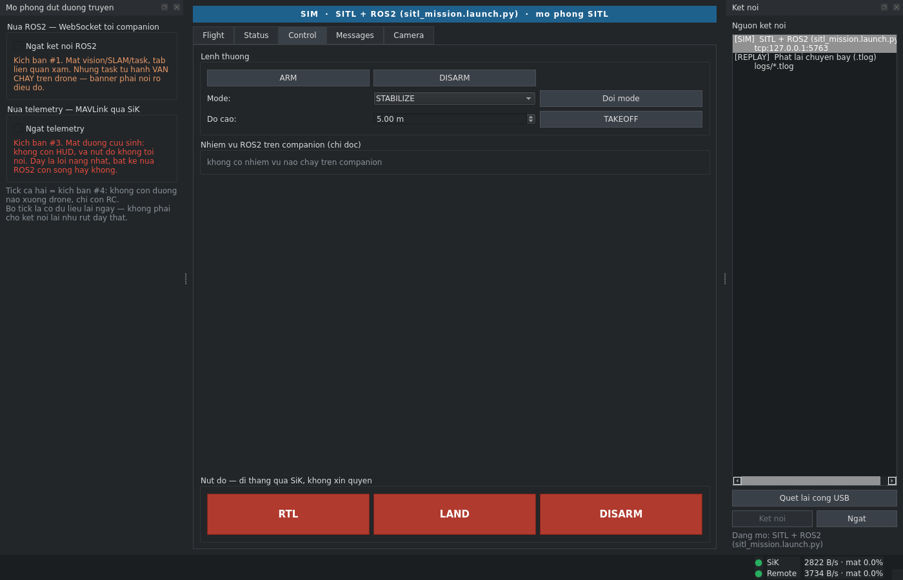
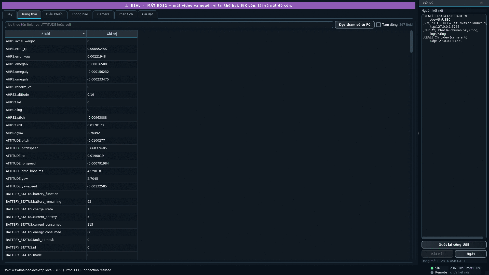
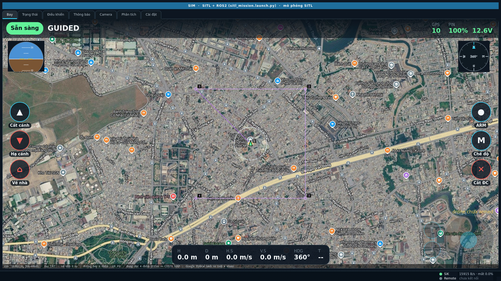
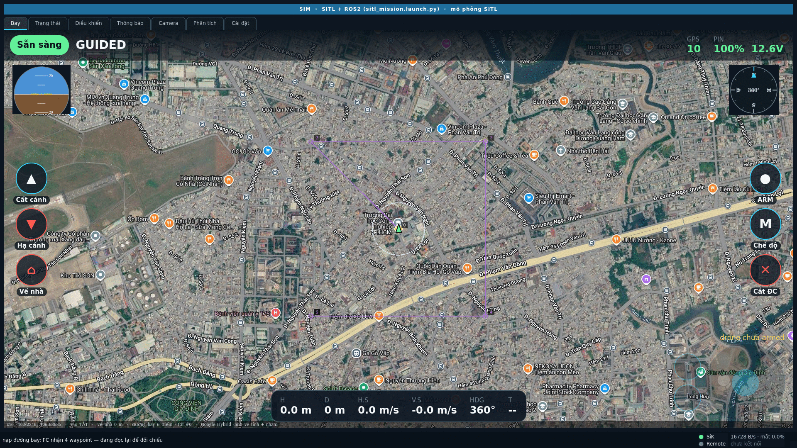
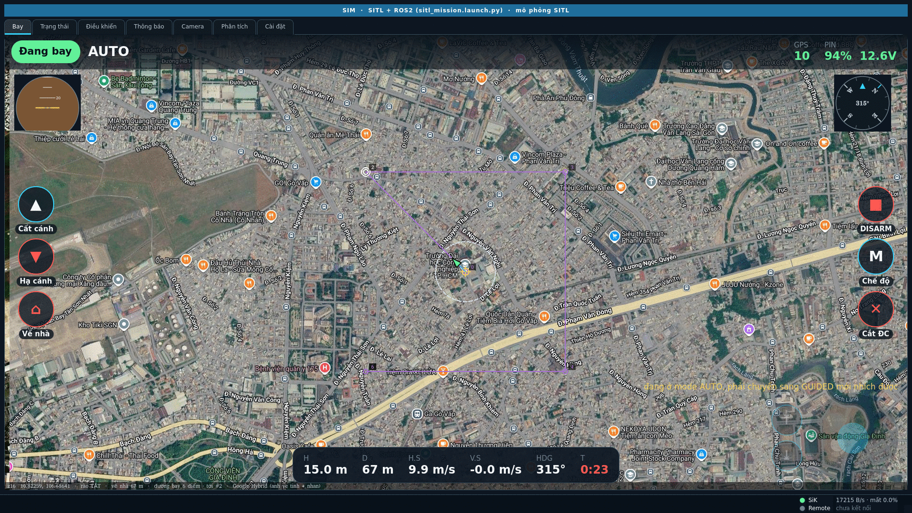
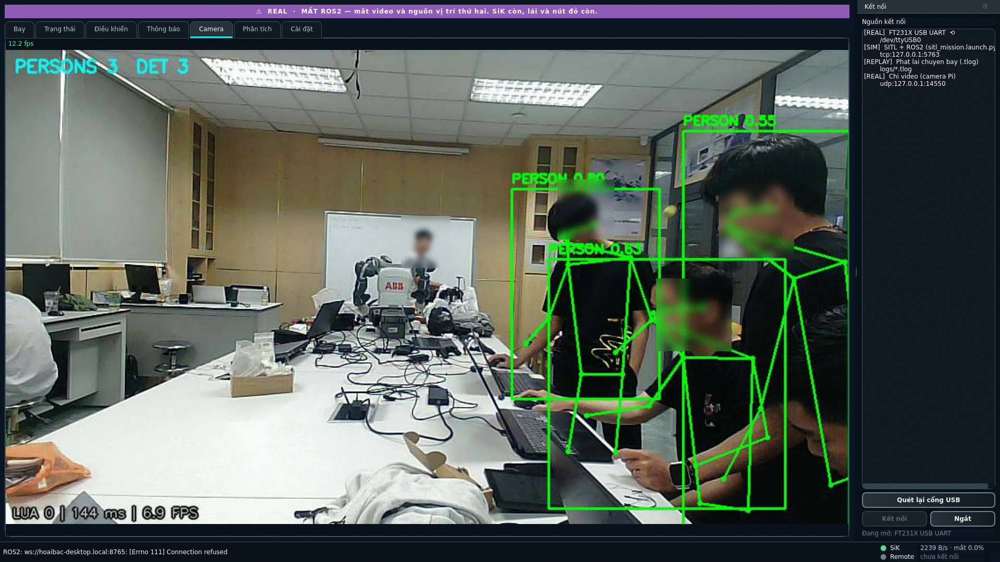

# Báo cáo: Giao diện trạm điều khiển mặt đất cho ArduCopter — vận hành qua ROS 2/MAVROS

**Đối tượng khảo sát:** ứng dụng `GUI_NATIVE` (PySide6), phiên bản mã nguồn `59fc2e7` cộng phần đổi giọng đọc sang Piper cùng ngày (20/09/2026 — commit cuối cùng chạm tới `laptop/`, `core/`, `tools/`). Ba mốc thời gian không trùng nhau, và chỗ nào trong báo cáo cũng ghi rõ mình thuộc mốc nào:
- **Số đo ở mục 5–8** lấy tại phiên bản `7319e8a` ngày 13–14/08/2026, trên bố cục cũ. Phần làm thêm sau đó mô tả ở mục 4.11–4.12 và nghiệm thu ở mục 9.
- **Phần làm ngày 19/09/2026** (ô CÒN, SẴN SÀNG ARM, cảnh báo đứng yên, giọng nói, tự nối lại USB, giữ 2 s chọn điểm, chạm đúp z20, bỏ thao tác giữ-2-giây của DISARM) mô tả ở mục 4.14, phần làm tối 19/09 – 20/09 (giọng nói đọc lỗi đỏ/ARM/mode, bản đồ gọn hơn, cột Giải thích tiếng Việt) ở mục 4.15; cả hai **không có ảnh chụp**; nghiệm thu bằng `selfcheck` và `e2e_sitl` (mục 9). **Phụ lục A** liệt kê toàn bộ tính năng theo mã nguồn hiện tại.
- **Toàn bộ chín ảnh chụp lại ngày 18/09/2026** trên bố cục hiện tại — bộ ảnh cũ đã xoá hẳn vì nó tả một giao diện không còn tồn tại (tab Bay cũ gỡ ở `14ec366`). Danh mục hình ở cuối báo cáo ghi rõ hình nào chụp trên máy bay thật, hình nào trên mô phỏng.

**Chế độ chạy:** ROS 2 Humble + ArduPilot SITL + MAVROS (profile `SITL + ROS2 (sitl_mission.launch.py)`); ảnh 18/09 chụp trên cả profile máy bay thật `SiK radio` lẫn profile SITL
**Ngày thực nghiệm:** 13/08/2026, 23:20 – 00:00 · chụp lại ảnh 18/09/2026, 16:23 – 16:41 (giờ Việt Nam)
**Máy chạy thử:** laptop Ubuntu 22.04, ROS 2 Humble; máy tính nhúng Raspberry Pi 5 phục vụ luồng video — `192.168.1.113` ở phiên 13/08, nay gọi bằng tên máy `hoaibac-desktop.local` vì địa chỉ do DHCP cấp đã đổi hai lần trong một ngày (mục 7)

---

## Tóm tắt

Báo cáo mô tả và đánh giá thực nghiệm một trạm điều khiển mặt đất (GCS) viết bằng PySide6 cho máy bay không người lái chạy ArduCopter. Điểm khác biệt về kiến trúc của phần mềm là nó nhận dữ liệu từ **hai đường truyền độc lập chạy song song**: một đường MAVLink trực tiếp (radio SiK, hoặc TCP khi mô phỏng) và một đường ROS 2 đi qua MAVROS rồi được chuyển tiếp sang WebSocket bởi một tiến trình cầu nối đặt trên máy tính nhúng. Toàn bộ phép đo trong báo cáo được lấy trên ngăn xếp mô phỏng đầy đủ — Gazebo Harmonic, ArduPilot SITL, MAVROS, cầu nối ROS 2 → WebSocket — chứ không phải trên nguồn dữ liệu giả lập.

Báo cáo gồm hai phần bổ trợ nhau: một phân tích tính năng theo từng thành phần giao diện, trong đó mỗi quyết định thiết kế được truy về phép đo hoặc sự cố đã sinh ra nó (mục 4); và một phần nghiệm thu định lượng trên ngăn xếp mô phỏng đầy đủ (mục 5 đến 9).

Kết quả chính: giao diện dựng được đường bay bốn điểm và nạp thành công lên bộ điều khiển bay trong 0,68 s (bảy mục đọc ngược về, gồm điểm home, lệnh cất cánh và lệnh hạ cánh do phần mềm tự chèn); lệnh ARM được chấp nhận sau 1,2 s và máy bay đạt 12 m sau 9,2 s; sai lệch vị trí giữa hai nguồn dữ liệu nằm trong khoảng 0,0 – 0,38 m suốt chuyến bay; toàn bộ 29 phép tự kiểm của bộ `selfcheck` đều đạt (bộ kiểm ở phiên bản hiện tại đã lên 45 phép và vẫn đạt hết — mục 9). Luồng video từ Pi hoạt động nhưng chất lượng bị giới hạn bởi đường WiFi tại thời điểm đo (2,15 Mbps, đỉnh khoảng ngắt quãng 4,77 s), thấp hơn nhiều so với con số ghi nhận ngày 06/08/2026 (5,75 Mbps, đỉnh 615 ms) — và giao diện phản ứng đúng như thiết kế: chuyển sang ô xám thay vì đóng băng khung hình cũ.

---

## 1. Đặt vấn đề

Phần mềm điều khiển mặt đất phổ thông (Mission Planner, QGroundControl) được thiết kế cho một đường truyền MAVLink duy nhất tới bộ điều khiển bay. Khi hệ thống bay mang thêm một máy tính nhúng chạy ROS 2 — để xử lý thị giác máy tính, định vị hoặc điều khiển tự hành — thì trạm mặt đất phải đối diện với một tình huống mà các phần mềm trên không giải quyết: **hai nguồn dữ liệu cùng mô tả một máy bay, hỏng theo hai cách khác nhau, và kéo theo hai hậu quả khác nhau**.

Mất đường MAVLink nghĩa là mất khả năng can thiệp khẩn cấp. Mất đường ROS 2 (thường là mất WiFi) nghĩa là mất tầm nhìn — video, vị trí đối chứng, trạng thái các node — nhưng nhiệm vụ tự hành trên máy bay vẫn tiếp tục chạy. Gộp hai loại hỏng đó vào một thông báo "mất kết nối" là sai cả về mức độ nghiêm trọng lẫn về hành động phải làm tiếp theo [1].

Từ đó, câu hỏi mà báo cáo này trả lời là:

1. Giao diện có thể vận hành trọn vẹn một chuyến bay qua ngăn xếp ROS 2/MAVROS hay không, và mất bao lâu ở từng bước?
2. Hai nguồn dữ liệu có cho ra cùng một vị trí không, sai lệch bao nhiêu?
3. Cơ chế đọc/ghi đường bay waypoint hoạt động thế nào và tốn bao lâu?
4. Luồng video từ máy tính nhúng đạt chất lượng nào, và giao diện xử lý ra sao khi đường truyền suy giảm?

### 1.1 Mục tiêu, phạm vi và đóng góp

**Mục tiêu.** Xây dựng và đánh giá một trạm điều khiển mặt đất chạy trên Linux, đủ khả năng vận hành một máy bay bốn cánh quạt ArduCopter trong toàn bộ chu trình bay, đồng thời hiển thị song song dữ liệu từ hai đường truyền có bản chất khác nhau và phân biệt rành mạch các kiểu suy giảm của chúng.

**Phạm vi.** Báo cáo giới hạn ở phần mềm phía mặt đất. Phần mềm điều khiển bay (ArduCopter) và các node nhiệm vụ tự hành trên máy tính nhúng được xem là hệ thống có sẵn, chỉ can thiệp ở mức cấu hình. Toàn bộ phép đo thực hiện trên mô phỏng phần mềm trong vòng lặp (SITL); phần cứng bay thật nằm ngoài phạm vi phiên thực nghiệm này, và những hạn chế kéo theo được liệt kê tường minh ở mục 10.

**Đóng góp.** Bốn điểm có thể coi là đóng góp của công việc này:

1. **Một kiến trúc hai nguồn có trọng tài tường minh.** Mọi đại lượng hiển thị đều mang theo nguồn phát và tuổi dữ liệu, thay vì bị gộp lại thành một con số không truy nguyên được. Cơ chế trọng tài (mục 2.1) là mã dùng chung, không phụ thuộc vào loại đường truyền — thêm một đường thứ ba chỉ tốn một dòng cấu hình ưu tiên.
2. **Phân loại suy giảm theo hậu quả, không theo hiện tượng.** Mất đường ROS 2 và mất đường MAVLink cho ra hai màu banner khác nhau với hai thông điệp khác nhau, vì hành động phải làm tiếp theo của người vận hành là khác nhau (mục 8.2).
3. **Nguyên tắc "đọc ngược để xác nhận" áp cho mọi lệnh có trạng thái.** Đường bay sau khi nạp được tải lại từ bộ điều khiển bay rồi mới vẽ; lệnh cất cánh được đối chiếu với độ cao thực sau 6 s. "Đã gửi" không được phép hiển thị giống "đã làm" (mục 6.1 và 6.3).
4. **Một bộ số đo tái lập được** cho toàn bộ chu trình trên ngăn xếp ROS 2/MAVROS thật, kèm mã kiểm thử tự động 29 phép ở thời điểm đo, nay là 45 phép không cần SITL cộng 58 bài chạy trọn một chuyến bay trên SITL thật (mục 9), thay vì đánh giá định tính.

---

## 2. Kiến trúc hệ thống

### 2.1 Hai nửa dữ liệu, một bus chung

Mọi dữ liệu chảy trong ứng dụng đều mang dạng một *envelope* thống nhất, bất kể nó tới từ đâu [2]:

```python
{"src": "sik", "topic": "position", "data": {...}, "ts": 1721000000.123}
```

Trường `src` là thứ giữ cho hai nguồn không lẫn vào nhau. Adapter phía MAVLink (`core/adapters/sik.py`) chuẩn hoá đơn vị và đổi hệ toạ độ NED sang ENU ngay tại tầng thấp nhất, nên tầng giao diện không bao giờ phải biết dữ liệu gốc nằm trong hệ nào [2]. Adapter phía ROS 2 (`core/adapters/remote.py`) nhận envelope JSON đã cùng định dạng qua WebSocket; trường `src` của nó bị ghi đè thành `"remote"` khi vào ứng dụng, để một máy tính nhúng bị chiếm quyền cũng không thể tự xưng là nguồn khác và đánh lừa bộ trọng tài.

Bộ trọng tài đa nguồn (`core/field.py`) giữ mọi trường dữ liệu kèm nguồn và thời điểm nhận, rồi trả về giá trị *tươi nhất*. Giao diện luôn hiển thị kèm chấm màu chỉ nguồn đang dùng, nên người vận hành không bao giờ đọc một con số mà không biết nó từ đâu tới.

### 2.2 Vị trí của MAVROS trong chuỗi

Ở chế độ mô phỏng, chuỗi dữ liệu đầy đủ như sau:

```
Gazebo Harmonic  (vật lý + hình ảnh)
   ↑ UDP 9002 (FDM)
ArduPilot SITL  ─┬─ TCP 5760 ─→ MAVProxy ─→ UDP 14550 ─→ MAVROS ─→ topic ROS 2
                 │                                          ↓
                 │                              tools/ros2_bridge.py
                 │                                          ↓
                 │                                   WebSocket :8765
                 └─ TCP 5763 ────────────────────────────→  GUI (nửa MAVLink)
                                                            ↑
                                                     GUI (nửa ROS 2)
```

Hai cổng TCP khác nhau trên cùng một SITL là có chủ ý: MAVProxy giữ 5760, MAVROS lấy dữ liệu qua UDP 14550, còn giao diện cắm thẳng vào 5763 — nhờ vậy không phải sửa file launch bên kho ROS 2 và hai nửa không tranh nhau một cổng [1].

`ros2_bridge.py` là mảnh ghép bắt buộc vì MAVROS chỉ phát topic DDS, nó không mở WebSocket nào; trong khi laptop chủ ý **không cài ROS 2** để giảm phụ thuộc [3]. Cầu nối đăng ký sáu topic MAVROS (`global_position/global`, `local_position/pose`, `local_position/velocity_local`, `global_position/compass_hdg`, `battery`, `state`) với QoS BEST_EFFORT — đặt RELIABLE là không nhận được gói nào, vì MAVROS phát telemetry ở BEST_EFFORT [3].

### 2.3 Mô hình quyền điều khiển

Phiên bản hiện tại bỏ hoàn toàn cơ chế nhường quyền qua lại. Topic `/gcs/authority` được chốt cứng ở giá trị `"gcs"` ngay lúc cầu nối khởi động, với QoS TRANSIENT_LOCAL để node khởi động sau vẫn đọc được, và không có đường nào đổi giá trị đó [3]. Hệ quả: node tự hành trên máy tính nhúng không bao giờ được lái; nửa ROS 2 chỉ còn là nguồn telemetry và video. Mọi lệnh xuống máy bay — kể cả nạp đường bay — đều đi từ laptop qua đường MAVLink.

Nhóm ba nút khẩn cấp (RTL / LAND / DISARM) đi thẳng vào nhánh ESCAPE của `core/authority.py` tới adapter MAVLink, không qua máy tính nhúng, không qua WebSocket [2]. Chúng chỉ bị khoá duy nhất ở chế độ phát lại `.tlog`, khi ở đầu kia không còn gì để gửi lệnh tới.

### 2.4 Công nghệ, cấu trúc mã nguồn và quy mô

**Công nghệ sử dụng.** Phần mềm viết bằng Python 3.10, giao diện dựng trên PySide6 (Qt 6). Bố cục khung cửa sổ được vẽ trong Qt Designer và biên dịch ra Python bằng `tools/build_ui.sh`; những thành phần cần vẽ tay — bản đồ, la bàn, chân trời nhân tạo, thanh telemetry, khung video — là các lớp `QWidget` tự cài đặt `paintEvent` bằng `QPainter`. Giao tiếp MAVLink dùng thư viện `pymavlink`; đường ROS 2 dùng `websockets` phía ứng dụng và `rclpy` phía cầu nối; cấu hình đọc bằng `pyyaml`; quét cổng nối tiếp bằng `pyserial`. Không dùng máy chủ web, không dùng trình duyệt nhúng, không dùng môi trường ảo — chủ ý giữ nguyên `pip --user` để sau này chuyển thẳng sang `rclpy` trên cùng thông dịch viên Python mà không hỏng [1].

**Mô hình đồng thời.** Đây là chỗ quyết định phần mềm có đứng hình hay không, nên được thiết kế trước khi viết giao diện:

| Luồng | Việc | Ranh giới |
|---|---|---|
| Luồng chính (Qt) | Toàn bộ vẽ và xử lý sự kiện | Chỉ luồng này được chạm vào widget |
| `SikAdapter` (`QThread`) | Đọc/ghi MAVLink, ghi `.tlog`, hàng đợi lệnh | Đẩy dữ liệu ra bằng `Signal` — ranh giới luồng duy nhất |
| `RemoteAdapter` (`QThread`) | WebSocket tới máy tính nhúng, tự kết nối lại | Như trên |
| `VideoSource` (thread thường) | Đọc luồng MJPEG, giải mã | Gửi byte JPEG qua `Signal`, việc dựng `QPixmap` làm ở luồng chính |
| `TileFetcher` (thread thường) | Tải bù ảnh bản đồ còn thiếu khi có mạng | Tách khỏi luồng vẽ để bản đồ không khựng |

Hai lớp video và tải ảnh bản đồ dùng thread thường thay vì `QThread` là một quyết định có lý do cụ thể: lỗi `QThread: Destroyed while thread is still running` làm huỷ cả tiến trình, và một trạm điều khiển mặt đất không được phép chết vì luồng xem video [5].

**Cấu trúc thư mục** phản ánh đúng ranh giới trách nhiệm:

```
core/            # tầng không biết gì về giao diện — dùng chung được với bản web
  bus.py         # phát tán envelope theo topic
  field.py       # trọng tài đa nguồn: best() trả cả giá trị lẫn nguồn
  authority.py   # đường ra drone + nhánh ESCAPE cho nút khẩn cấp
  adapters/sik.py     # pymavlink trong QThread, chuẩn hoá NED → ENU
  adapters/remote.py  # client WebSocket tới máy tính nhúng
laptop/          # tầng giao diện
  app.py         # cửa sổ chính, ghép mọi thành phần
  connection.py  # quét cổng USB + banner chế độ
  link_faults.py # mô phỏng đứt đường truyền (chỉ chế độ SIM)
  commands.py    # logic lệnh (ARM · TAKEOFF · RTL · goto · waypoint), MỘT thể
                 # hiện dùng chung cho màn bay cảm ứng và tab Control
  safety.py      # thời gian RTL, kiểm failsafe, % pin theo điện áp (không Qt)
  voice.py       # đọc cảnh báo thành tiếng (Piper, dự phòng Qt TextToSpeech)
  touch/         # màn bay cảm ứng QML: backend.py (trạng thái) + qml/ + items.py
  tabs/          # status · control · messages · analysis · settings
  widgets/       # map · compass · attitude · video · trajectory3d · alerts
                 # telemetry_bar.py nay chỉ còn NGƯỠNG pin/GPS, không còn widget
  theme.py       # bảng màu và QSS dùng chung cho mọi widget
tools/           # công cụ đo, kiểm thử, tải ảnh bản đồ, cầu nối ROS 2
```

Quy tắc phụ thuộc một chiều: `laptop/` được phép gọi `core/`, chiều ngược lại thì không. Nhờ vậy toàn bộ logic xử lý dữ liệu kiểm thử được mà không cần dựng cửa sổ, và đó là điều kiện để bộ `selfcheck` chạy được 45 phép kiểm trong khoảng hai phút mà không cần SITL.

**Quy mô mã nguồn.** Năm mốc: `7319e8a` (phiên bản lấy số đo ở mục 5–8), `affa8d8` (phiên bản viết báo cáo), `f3ebff1` (sau khi gộp hai màn bay — mục 4.12), `e05fc1d` (sau phần an toàn 19/09 — mục 4.14), và `59fc2e7` (hiện tại — mục 4.15; chưa tính ba file dữ liệu JSON mô tả tham số/trường):

| Thành phần | `7319e8a` | `affa8d8` | `f3ebff1` | `e05fc1d` | `59fc2e7` |
|---|---|---|---|---|---|
| `core/` (bus, trọng tài, quyền, hai adapter, bộ đọc log, bảng chữ song ngữ) | 1 280 | 2 055 | 2 955 | 3 016 | 3 092 |
| `laptop/` (cửa sổ chính, 7 tab, widget vẽ tay, logic lệnh, bảng màu chung) | 3 131 | 4 568 | 5 412 | 5 882 | 5 916 |
| `laptop/touch/qml/` (màn bay cảm ứng, QML) | — | — | 911 | 947 | 947 |
| `tools/` (kiểm thử, đo đạc, cầu nối, tải ảnh bản đồ, máy chủ video) | 3 947 | 5 310 | 6 605 | 7 009 | 7 103 |
| **Tổng** | **8 358** | **11 933** | **15 883** | **16 854** | **17 058** |

Con số `laptop/` tăng ít hơn phần thêm vào vì cùng đợt đó **817 dòng chết bị xoá** (`14ec366`): mã không còn ai gọi tới thì không được nằm lại trong cây, kể cả khi nó vẫn chạy được.

Tỉ lệ đáng chú ý: mã công cụ đo và kiểm thử chiếm 44 % tổng số dòng, nhiều hơn cả tầng giao diện. Đây không phải sự mất cân đối mà là hệ quả của một nguyên tắc làm việc xuyên suốt dự án — mọi khẳng định về hành vi phần mềm phải có số đo kèm theo, nên công cụ tạo ra số đo được viết ngang hàng với chức năng.

**Dữ liệu bản đồ.** Ảnh vệ tinh được tải trước về đĩa dưới dạng tile `{z}/{x}/{y}.png` bằng `tools/fetch_tiles.py`: hiện có 21 773 tile, 307 MB, phủ nền thế giới ở mức zoom thấp và hai bãi bay ở mức zoom 13–19, riêng khu vực trường thêm mức 20–21. Nguồn ảnh được chọn sau một phép đo so sánh: nhà cung cấp trước đó hết ảnh gốc ở mức zoom 19 (mức 20 và 21 trả về cùng một tấm "không có dữ liệu", trùng mã băm), trong khi nguồn đang dùng vẫn cho ảnh thật ở mức 21 — quy ra độ phân giải mặt đất 29 cm/pixel so với 7,3 cm/pixel [1]. Bản đồ hoạt động hoàn toàn ngoại tuyến; khi có mạng, ứng dụng tải bù phần còn thiếu và lưu lại cho lần bay sau.

---

## 3. Phương pháp thực nghiệm

### 3.1 Ngăn xếp mô phỏng

Bốn tiến trình được khởi động theo thứ tự phụ thuộc, mỗi tiến trình chạy nền và ghi log riêng:

```bash
# 1. Gazebo Harmonic, chế độ không cửa sổ (server-only)
export GZ_VERSION=harmonic; source ~/gz_ws/setup.bash
gz sim -v4 -r -s iris_runway.sdf

# 2. ArduPilot SITL gắn vào Gazebo, home đặt tại ĐH Công nghiệp TP.HCM
~/ardupilot/Tools/autotest/sim_vehicle.py -v ArduCopter -f gazebo-iris \
    --model JSON --no-mavproxy --custom-location=10.8221589,106.6868454,10,0 \
    -A "--serial1=tcp:2 --serial2=tcp:3"

# 3. MAVProxy làm bộ tập trung, và MAVROS đọc từ nó
mavproxy.py --master tcp:127.0.0.1:5760 --out udp:127.0.0.1:14550 --daemon
ros2 launch simtofly_mavros_sitl mavros_apm.launch.py fcu_url:=udp://:14550@

# 4. Cầu nối ROS 2 → WebSocket
python3 ~/GUI_NATIVE/tools/ros2_bridge.py --host 127.0.0.1
```

Toạ độ home được đặt trùng với vùng đã tải sẵn ảnh vệ tinh ngoại tuyến (21 134 tile, 297 MB) để bản đồ trong giao diện có nền thật thay vì ô trống.

Ba điểm khác biệt so với quy trình khởi động chuẩn bằng `ros2 launch simtofly_mavros_sitl sitl_mission.launch.py`, cần nêu rõ để người đọc tái lập được:

| Khác biệt | Lý do |
|---|---|
| Không dùng file launch bốn cửa sổ `gnome-terminal` | Phiên desktop của người dùng đang được sử dụng; mọi tiến trình chạy nền, log ghi ra file |
| Gazebo chạy chế độ server (`-s`), không mở cửa sổ 3D | Không cần hình ảnh 3D cho phép đo giao diện; giảm tải máy |
| MAVProxy được gọi riêng thay vì đi kèm `sim_vehicle.py` | `sim_vehicle.py` khởi động MAVProxy ở chế độ tương tác, nó thoát ngay khi không có terminal |

Riêng bước 3 là chỗ đã phát sinh một sự cố đáng ghi lại, trình bày ở mục 8.1.

### 3.2 Cách chụp ảnh và thu số đo

Giao diện được chạy dưới nền tảng đồ hoạ ngoại tuyến của Qt (`QT_QPA_PLATFORM=offscreen`, với `QT_QUICK_BACKEND=software` cho cảnh QML của màn bay) và điều khiển bằng kịch bản Python thao tác trực tiếp lên các widget thật — đúng những đối tượng mà ngón tay người dùng chạm vào. Kịch bản gọi vào `Backend.addWp/sendWp/act` rồi để lệnh tự đi tiếp qua `Commands` → `authority` → adapter, **không gọi tắt xuống pymavlink**: chụp một đường tắt thì ảnh sẽ tả một thứ người dùng không bao giờ thấy. Ảnh được lấy bằng `QWidget.grab()` ở độ phân giải 1920×1080. Cách này tránh việc bơm sự kiện chuột/phím vào phiên desktop đang dùng (ứng dụng bật lên sẽ cướp focus và ăn phím người dùng đang gõ), đồng thời cho ảnh sạch, không lẫn cửa sổ khác.

Các mốc thời gian được đo bằng đồng hồ hệ thống tại thời điểm điều kiện chuyển trạng thái, với chu kỳ kiểm tra 400 ms — nghĩa là mọi con số thời gian dưới đây có sai số lấy mẫu cỡ ±0,4 s. Băng thông và tỉ lệ mất gói lấy trực tiếp từ widget trạng thái đường truyền của chính ứng dụng, vốn đếm byte thực trên socket và suy tỉ lệ mất gói từ số thứ tự gói MAVLink.

---

## 4. Phân tích tính năng giao diện

Ứng dụng gồm bảy tab, một dải banner chế độ chiếm hết chiều ngang, một dock chọn nguồn kết nối bên phải, một dock mô phỏng đứt truyền bên trái (chỉ hiện ở chế độ mô phỏng), và widget trạng thái đường truyền ở góc dưới phải.

| Tab | Nội dung |
|---|---|
| **Flight** | **Màn cảm ứng kiểu DJI** (mục 4.12–4.13): bản đồ vệ tinh ngoại tuyến; la bàn, chân trời nhân tạo, thanh telemetry, dòng lỗi nổi, cần ảo và ô video PiP đè lên bản đồ; ô **CÒN**, dòng **SẴN SÀNG ARM** và cảnh báo đứng yên (mục 4.14). Mọi lệnh xác nhận bằng cách **trượt**, không bằng hộp thoại |
| **Status** | Toàn bộ trường số của mọi message MAVLink; hàng quá hạn chuyển xám |
| **Control** | ARM/DISARM, đổi mode, TAKEOFF; nhóm nút khẩn cấp; dòng trạng thái node ROS 2 (chỉ đọc); khối SẴN SÀNG ARM / CÒN / cảnh báo giống màn bay |
| **Messages** | STATUSTEXT của bộ điều khiển bay cộng kết quả mọi lệnh do người dùng bấm; chạm dòng lỗi nổi trên màn bay là nhảy tới đúng dòng đó |
| **Camera** | Luồng MJPEG toàn khung từ máy tính nhúng |
| **Phân tích** | Mở `.tlog`/`.bin` từ đĩa hoặc kéo log từ thẻ SD của bộ điều khiển bay qua telemetry; tối đa 4 đồ thị, quỹ đạo bay 3D, chế độ trực tiếp giữ 60 s (mục 4.11) |
| **Cài đặt** | Đổi ngôn ngữ giao diện Việt ↔ Anh ngay lúc đang chạy (mục 4.11); bật/tắt đọc cảnh báo thành tiếng (mục 4.14) |

Nguyên tắc thiết kế xuyên suốt là **không mặc định đoán**: ứng dụng mở lên không tự kết nối, banner xám, và người vận hành phải chọn nguồn rồi bấm "Ket noi" (Hình 1). Chế độ hiển thị (`REAL` đỏ / `SIM` xanh / `REPLAY` xám) lấy từ trường `mode` khai trong file cấu hình chứ không suy từ chuỗi kết nối — cắm radio thật mà chọn nhầm profile mô phỏng thì banner vẫn xanh, và đó là lỗi cấu hình chứ không phải suy đoán sai của phần mềm [1].


*Hình 1 — Trạng thái khởi động: chưa kết nối nguồn nào, banner xám, hai hàng trạng thái đường truyền đều báo "chua ket noi". Mọi nút trên màn bay đều mờ. Panel bên phải đã có sẵn dòng `[REAL] FT231X USB UART /dev/ttyUSB0` do quét cổng USB lúc mở ứng dụng — radio SiK đang cắm, nhưng ứng dụng vẫn không tự nối.*

Sau khi chọn profile `SITL + ROS2 (sitl_mission.launch.py)` và bấm kết nối, gói MAVLink đầu tiên về sau **0,62 s** và gói ROS 2 đầu tiên về sau **1,42 s**. Bản đồ tự bám theo máy bay ngay khi có toạ độ đầu tiên.

Hình 2 chụp cùng màn hình đó khi nối vào **máy bay thật qua radio SiK** (`/dev/ttyUSB0`, 57600 baud): banner ghi rõ nguồn, telemetry về thật (pin 93% / 15,9 V, mode ALT_HOLD, hướng 155°), widget đường truyền đếm **2 418 B/s, mất 0,0%**. Máy bay đang nằm trên bàn trong nhà nên chưa bắt được vệ tinh — ô GPS báo 0, dải chữ dưới bản đồ cảnh báo chưa nhận `HOME_POSITION`, và bản đồ không vẽ được gì vì chưa có toạ độ để bám. Đó chính là hành vi đúng: giao diện không bịa ra một vị trí mặc định để bản đồ trông "có vẻ chạy".

Hình này cũng cho thấy **ba nguồn dữ liệu độc lập với nhau** tại cùng một thời điểm: telemetry qua SiK đang về (banner, HUD, thanh đáy), nửa ROS 2 thì không (banner tím báo mất, mục 8), còn luồng video vẫn chạy bình thường ở ô PiP góc dưới trái — vì nó đi cổng 8080 riêng của máy tính nhúng chứ không qua cầu nối WebSocket. Mất một nửa không kéo theo hai nửa kia.


*Hình 2 — Màn bay cảm ứng sau khi nối radio SiK vào máy bay thật (18/09/2026, trên bàn). Ba nút bên trái (Cất cánh / Hạ cánh / Về nhà) và ba nút bên phải (ARM / Chế độ / Cắt ĐC) là nút chạm cỡ ngón tay; cần ảo nằm ở góc dưới phải, cạnh hai nút leo/hạ. Ô video PiP góc dưới trái đang chạy 12,3 fps — **nội dung ô đã được làm mờ**, dải fps giữ nguyên.*

### 4.1 Panel chọn nguồn và cơ chế quét cổng USB

Panel bên phải liệt kê các profile khai trong `config/connections.yaml`, cộng thêm **mọi cổng USB-serial đang cắm được quét tự động** tại thời điểm mở ứng dụng hoặc khi bấm "Quet lai cong USB". Cách quét có ba chi tiết đáng phân tích:

- **Không ghi cứng `/dev/ttyUSB0`.** Cắm sang cổng USB khác, hoặc cắm thêm một thiết bị USB trước đó, là số thứ tự đổi. Ghi cứng tên thiết bị trong cấu hình đồng nghĩa với việc phải sửa file mỗi lần cắm lại.
- **Lọc theo mã định danh USB thật.** Thư viện liệt kê cổng trả về cả khoảng 32 cổng UART trên bo mạch chủ (`/dev/ttyS*`) vốn không bao giờ có máy bay ở đầu kia; chỉ thiết bị có VID/PID USB mới được giữ.
- **Suy baud theo loại cổng.** `ttyUSB*` thường là radio SiK qua chip FTDI/CP210x nên đặt 57600; `ttyACM*` là bộ điều khiển bay cắm USB trực tiếp (lớp CDC) nên baud không có ý nghĩa, đặt 115200.

Nếu tài khoản người dùng không thuộc nhóm `dialout`, dòng đó hiện `⚠ khong co quyen` **kèm nguyên câu lệnh cần chạy**. Đây là ví dụ tiêu biểu cho một nguyên tắc trình bày lỗi được áp dụng nhất quán trong phần mềm: thông báo lỗi phải trả lời được câu hỏi "giờ tôi phải làm gì", chứ không chỉ mô tả triệu chứng.

Hàm chọn profile theo **tên** chứ không theo số thứ tự dòng, và trả về `False` khi không tìm thấy. Chi tiết nhỏ này bắt nguồn từ một sự cố thật: cổng USB tự quét được xếp lên đầu danh sách, nên một kịch bản kiểm thử chọn dòng số 0 đã nối thẳng vào máy bay thật trong khi nó định chạy chế độ phát lại [1].

### 4.2 Banner chế độ — bảy trạng thái, không phải ba

Dải banner chiếm hết chiều ngang đỉnh cửa sổ. Điểm cần phân tích là nó có **bảy** trạng thái chứ không phải ba như cách hiểu thông thường:

| Trạng thái | Màu | Ý nghĩa |
|---|---|---|
| `None` | xám đậm | Chưa chọn nguồn nào |
| `WAIT` | cam | Đã mở nguồn nhưng **chưa nhận được byte nào** |
| `REAL` | đỏ | Máy bay thật, mọi lệnh đều đi xuống phần cứng |
| `SIM` | xanh dương | Mô phỏng SITL |
| `REPLAY` | xám | Phát lại `.tlog`, mọi nút bị khoá |
| `DEGRADED` | tím | Mất nửa ROS 2, nửa MAVLink còn sống |
| `LOST` | đỏ tươi | Mất nửa MAVLink — mất đường cứu sinh |

Trạng thái `WAIT` tồn tại vì một lý do kỹ thuật cụ thể: mở một socket UDP luôn luôn *thành công*, nó chỉ bind cổng chứ không nói chuyện với ai. Nếu banner tô ngay màu của chế độ khi vừa mở nguồn thì nó đang nói dối — "đã mở được nguồn" không đồng nghĩa với "có máy bay ở đầu kia". Nguồn sự thật của banner vì thế là **thời điểm cuối cùng thật sự có gói về**, lấy từ widget trạng thái đường truyền, chứ không phải từ trạng thái "adapter đang chạy".

Việc tách `DEGRADED` khỏi `LOST` chính là hiện thực hoá luận điểm ở mục 1, và mục 8.2 đo được nó hoạt động đúng.

### 4.3 Bản đồ bay

Bản đồ là widget lớn nhất trong phần mềm (khoảng 800 dòng) và mang nhiều chức năng nhất:

| Chức năng | Chi tiết hiện thực |
|---|---|
| Nền ảnh vệ tinh ngoại tuyến | Tile đọc thẳng từ đĩa; mức zoom nào thiếu tile thì tự chọn mức gần nhất còn có và phóng to, thay vì để ô trống |
| Tải bù khi có mạng | Luồng riêng, tải xong lưu lại đĩa cho lần bay ngoại tuyến sau |
| Bám theo máy bay | Bật mặc định; kéo bản đồ bằng chuột là tự tắt, để người dùng khảo sát khu vực khác mà không bị giật về |
| Vệt bay | Tối đa 3 000 điểm (~15 phút ở 3 Hz), giới hạn có chủ ý để chuyến bay dài không ăn hết bộ nhớ |
| Điểm home | Lấy từ `HOME_POSITION` do bộ điều khiển bay gửi, không suy từ vị trí đầu tiên nhìn thấy — nối vào giữa chuyến bay thì hai thứ đó khác nhau |
| Hàng rào geofence | Vòng tròn (bán kính từ tham số `FENCE_RADIUS`) và đa giác (tải về như một nhiệm vụ riêng, `mission_type = 1`) |
| Đường bay | Nét liền tím: nhiệm vụ trên bộ điều khiển bay; nét đứt nhạt: bản nháp chưa nạp; dấu tròn: waypoint đang bay tới |
| Bảng chạm trên bản đồ | Đặt/bỏ waypoint, chọn độ cao, nạp lên bộ điều khiển bay, xoá đường bay, bay tới một điểm (GUIDED + goto). Mở bằng **giữ 2 s** (`holdMs = 2000`), có vòng tròn chạy quanh ngón tay; thả sớm hoặc kéo bản đồ là huỷ (chốt theo `Qt.styleHints.startDragDistance`), chạm một cái không mở — từ 19/09, mục 4.14 |
| Chạm đúp | Tâm về máy bay, bật bám theo, phóng tới zoom 20 (`FOLLOW_ZOOM`); chưa có vị trí thì giữ nguyên zoom và nói ra — mục 4.14 |

Hai chi tiết đáng nêu về mặt thiết kế. Thứ nhất, bảng chọn là một lớp phủ **không chặn** chứ không phải hộp thoại nhập liệu, vì một hộp thoại chặn (`QMessageBox`) làm các nút khẩn cấp **chết trong khi vẫn báo là đang bật** — đo được: khi một hộp thoại đang mở thì cửa sổ chính không nhận sự kiện chuột, ba nút vẫn trả `isEnabled() == True` nhưng bấm không ăn [1]. Thứ hai, mục "bay tới điểm này" gửi *hai* lệnh liên tiếp (đổi mode GUIDED, rồi mới gửi toạ độ), vì một lệnh goto trong mode không phù hợp sẽ bị âm thầm bỏ qua.

### 4.4 Lớp phủ HUD: la bàn, chân trời nhân tạo, thanh telemetry

Màn bay là một cảnh QML, nhưng **bản đồ, la bàn, chân trời nhân tạo và khung video không được viết lại bằng QML**: chúng vẫn là bốn lớp `QWidget` vẽ tay bằng `QPainter`, được đưa vào cảnh qua một `QQuickPaintedItem` gọi thẳng `QWidget.render()` (`laptop/touch/items.py`). Lý do là một nguyên tắc kỹ thuật chứ không phải tiết kiệm công: bản đồ ~900 dòng đã được đo và kiểm kỹ, viết bản thứ hai bằng QML nghĩa là nuôi hai bản của cùng một thứ và chấp nhận chúng sẽ lệch nhau. Vì một widget không nằm trong cây cửa sổ thì không tự phát yêu cầu vẽ, nhịp vẽ được đặt theo chỗ đứng: bản đồ 5 fps ở cả hai vị trí (nó chỉ đổi khi máy bay nhích), video 30 fps khi chiếm cả màn và 15 fps khi thu về ô nhỏ.

La bàn và chân trời **chỉ trả lời câu hỏi tư thế**: máy bay đang quay mặt về đâu và thân có đang nghiêng không. Cả hai lấy cùng một nguồn hướng với mũi tam giác trên bản đồ, nên không bao giờ có chuyện kim la bàn chỉ một đằng còn mũi máy bay chỉ một nẻo — đó là kiểu mâu thuẫn khiến người vận hành mất niềm tin vào cả màn hình.

Thanh telemetry vẽ bằng QML, đọc thẳng `Backend.state`. Nó chia hai đầu theo mức độ gấp của thông tin: **đỉnh màn** là những thứ quyết định "có được bay tiếp không" — viên trạng thái, chế độ bay của bộ điều khiển, số vệ tinh, phần trăm và điện áp pin; **đáy màn** là những thứ trả lời "đang bay thế nào" — độ cao, khoảng cách về nhà, tốc độ ngang, tốc độ lên/xuống, hướng mũi và đồng hồ giờ bay. Màu của hai ô GPS và PIN không tự chế mà lấy từ cùng bảng ngưỡng với quy trình vận hành (mục 4.11), nên màu trên màn hình và ngưỡng trong tài liệu không thể nói hai điều khác nhau.

Nguyên tắc "không con số nào được tự nhận là đúng" được hiện thực bằng hai cơ chế tách bạch, thay vì gắn nhãn nguồn lên từng ô:

- **Dữ liệu hết tươi:** quá `STALE` = 2 s không có gói nào từ radio thì viên trạng thái ở đỉnh chuyển đỏ và **đếm giây** — `MẤT TÍN HIỆU SiK 7 s`. Một con số đứng yên trông y hệt một con số ổn định; câu đếm giây là thứ phân biệt được hai thứ đó.
- **Hai nguồn nói khác nhau:** khi vị trí từ MAVLink và từ ROS 2 lệch quá ngưỡng, một **dòng đỏ riêng** hiện ra kèm số mét lệch, và nó đứng suốt trong lúc còn lệch. Đây là kịch bản hỏng số 8 của quy trình, và nó cố ý **không** đi chung hàng với các dòng lỗi khác: gộp vào đó thì nó bị đếm gộp `×n` trong khi nội dung chỉ là một sự việc kéo dài.

Hai hình trên đều chụp trên bàn, nơi không có định vị vệ tinh, nên bản đồ và HUD không có gì để vẽ. Hình 3 chụp cùng màn hình đó trên **ArduCopter SITL** — nguồn duy nhất trong tầm tay cho một vị trí thật để bản đồ bám theo.


*Hình 3 — Màn bay cảm ứng khi có định vị: ảnh vệ tinh ngoại tuyến (Google Hybrid, zoom 16) chiếm trọn khung, máy bay là tam giác vàng ở giữa vòng tròn nét đứt. Chân trời nhân tạo góc trên trái, la bàn góc trên phải, thanh telemetry ở đáy — cả bốn lớp phủ đều là `QWidget` vẽ tay, đưa vào cảnh QML qua `QWidget.render()` như mô tả ngay trên. Banner xanh `SIM` ghi thẳng tên profile, huy hiệu "Sẵn sàng" xanh, GPS 10 vệ tinh, pin 100% / 12,6 V, 15 936 B/s mất 0,0%. Hai dock hai bên (chọn nguồn, mô phỏng đứt đường truyền) đã ẩn để hình chỉ còn màn bay; dock mô phỏng vốn **chỉ hiện ở chế độ mô phỏng** — mục 4.9.*

### 4.5 Tab Status — bảng tra cứu không hardcode

Tab này không khai báo trước một trường nào. Adapter trải phẳng `msg.to_dict()` của **mọi** message thành các cặp `TÊN_MESSAGE.field` rồi đẩy lên bus dưới topic `status`; bảng chỉ việc hiển thị. Đổi firmware hay bật thêm message thì bảng tự dài ra, không phải sửa mã.

Bốn chức năng phụ trợ: ô lọc theo tên (gõ `SENSOR.` là thấy ngay cảm biến nào hỏng), nút tạm dừng để đọc một giá trị đang nhảy, dấu hiệu quá hạn cho từng hàng, và nút đọc bảng tham số của bộ điều khiển bay theo yêu cầu.

Ba chi tiết của bảng này đã đổi theo thời gian. Thứ nhất, **hai cột Nguồn và Tuổi bị bỏ**, còn Field và Giá trị: ở chế độ thật mọi hàng đều mang cùng một nguồn `sik`, nên cột nguồn lặp lại một chữ suốt 300 hàng mà không thêm thông tin nào, còn cột tuổi thì con số nhảy liên tục làm mắt khó bám — thông tin "hàng này đã cũ" nay thể hiện bằng cách chuyển chữ sang xám. Nguồn phát vẫn hiện đầy đủ ở thanh telemetry, nơi hai nguồn thật sự tranh nhau. Thứ hai, nhóm `SENSOR.*` được adapter giải mã sẵn từ mặt nạ bit thành tên bộ cảm biến. Thứ ba, từ 20/09 có **cột Giải thích** thứ ba cho mọi hàng, theo ngôn ngữ đang chọn (mục 4.15). Tham số phải hỏi mới có vì bộ điều khiển bay không tự gửi. Ban đầu chỉ hỏi 63 tham số PID theo một danh sách ghim cứng; từ 23/08 nút này kéo **cả bảng** (1 037 tham số trên FC thật), vì firmware 4.7-dev đổi tên hàng loạt sang đơn vị SI — 30/63 tên trong danh sách cũ không còn tồn tại và FC im lặng chứ không báo sai. Giá phải trả: ~9 s qua USB, ước ~20 s qua SiK và chiếm gần hết đường truyền trong lúc đó, nên nó là nút bấm chứ không tự làm lúc kết nối.

Về hiệu năng: dữ liệu được gom lại và vẽ mỗi 200 ms thay vì vẽ theo từng gói. Với khoảng 82 message/s, mỗi message nhiều trường, việc vẽ từng cái một là lãng phí thấy rõ và làm giao diện giật.

### 4.6 Tab Control — nơi các chốt an toàn nằm

Đây là tab có mật độ luận cứ thiết kế cao nhất. Mọi chốt mô tả dưới đây **áp cho cả màn bay cảm ứng**, vì hai giao diện dùng chung đúng một thể hiện `laptop/commands.py` (mục 4.12): thanh trượt và nút bấm chỉ là hai cách đặt tay lên cùng một bộ logic lệnh. Mỗi chốt chặn dưới đây đều bắt nguồn từ một phép đo trên phần cứng thật, không phải từ suy đoán [1][2]:

**Chốt ARM theo vị trí cần ga.** Bộ điều khiển bay *không* kiểm tra cần ga khi nhận lệnh ARM từ trạm mặt đất — mã nguồn ArduPilot chỉ kiểm ga có *thấp hơn* ngưỡng an toàn hay không, còn kiểm "ga quá cao" chỉ áp cho trường hợp arm bằng cần lái. Đo thật: ga ở 1496 → lệnh được chấp nhận → động cơ vọt lên ngay lập tức. Ứng dụng vì thế tự chặn ở ngưỡng `THR_ARM_MAX = 1150`, suy từ hai tham số của chính khung máy bay. Nhưng khi **không thấy** dữ liệu cần ga thì nó vẫn gửi lệnh và nói rõ là không biết cần ga ở đâu — khoá nút ARM chỉ vì mất telemetry là đổi một kiểu hỏng lấy một kiểu hỏng khác.

**Chốt TAKEOFF theo mode và theo ARM.** ArduCopter chỉ thật sự cất cánh bằng lệnh `NAV_TAKEOFF` khi đang ở GUIDED **và đã ARM**; chưa ARM thì nó chỉ trả "THẤT BẠI" chung chung, nên từ 19/09 ứng dụng chặn trước và nói thẳng "drone CHƯA ARM" — chỉ chặn khi *biết chắc* là chưa ARM, mất telemetry thì vẫn gửi. Ở STABILIZE nó trả về thất bại; ở LOITER nó trả về **chấp nhận rồi không làm gì** — kiểu hỏng tệ nhất vì giao diện trông y hệt thành công. Ứng dụng chặn trước và nói rõ lý do, thay vì để người vận hành tự đoán qua chữ "THAT BAI".

**Xác nhận TAKEOFF ở chế độ thật bằng cách bấm lại trong 3 giây**, không bằng hộp thoại — cùng lý do đã nêu ở mục 4.3.

**Đối chiếu độ cao sau 6 giây** để bắt trường hợp lệnh được chấp nhận nhưng bị một luồng setpoint 30 Hz của node ROS 2 mồ côi đè lên. Phép đối chiếu chỉ chạy khi bộ điều khiển bay **chấp nhận đúng lần cất cánh đó** (đếm lượt `_climb_seq`): đo thật 19/09 16:06:46, cất cánh lúc chưa ARM bị từ chối mà 6 s sau vẫn hiện "FC đã nhận nhưng độ cao không đổi" — sai cả sự thật lẫn lý do.

**Nút DISARM hai bậc, chia theo "đang ở dưới đất hay không" chứ không theo cần ga.** ArduCopter từ chối mọi lệnh disarm từ trạm mặt đất khi nó chưa tin là đã hạ cánh, và nó ngừng tin ngay khi cần ga rời khỏi vị trí thấp nhất (đo thật: `ack = 4`, ba trên ba lần). Nghĩa là vị trí cần ga quyết định nút có ăn hay không — điều không ai đoán được lúc cần ngắt gấp. Logic thay thế:

| Đang ở dưới đất? | Bấm một phát | Bấm lại trong 3 giây |
|---|---|---|
| Có | force ngay — ga ở mức nào cũng ngắt được | — |
| Không (đang bay) | lệnh thường (bộ điều khiển bay sẽ từ chối nếu nó tin là đang bay) | force |
| **Không biết** (mất telemetry) | lệnh thường | force |

Hàng cuối là chỗ dễ làm sai nhất: không có dữ liệu thì **không được đoán là đang dưới đất**, vì đoán sai hướng đó là cho một cú bấm nhầm tắt động cơ giữa không trung.

**Câu hỏi "đang ở dưới đất chưa" không được suy từ độ cao tương đối.** Khi mất định vị vệ tinh, trường này đọc ra −8,5 m suốt 10 giây trong khi máy bay nằm yên và cảm biến khoảng cách báo 0,6 m — lệch âm 8,5 m nghĩa là máy bay ở 7 m vẫn ra "dưới 1 m", đúng hướng hỏng tệ nhất. Hàm kiểm tra vì thế hỏi **hai nguồn độc lập** (cờ hạ cánh của bộ điều khiển bay, và cảm biến khoảng cách), nguồn nào nói "dưới đất" cũng đủ, và chỉ tin cảm biến khi số đọc nằm trong dải hợp lệ của chính nó.

**Nhóm nút khẩn cấp** tách riêng cả về mã nguồn lẫn về đường đi: chúng gọi thẳng vào nhánh ESCAPE, nhánh này bỏ qua tham số `target` và luôn xuống đường MAVLink. Không có nhánh kiểm tra nào đứng trước chúng.

**Dòng trạng thái node ROS 2 là chỉ đọc.** Từ khi laptop cầm toàn quyền, một nút gửi lệnh cho node tự hành sẽ là một nút nói dối. Nhưng vẫn phải nhìn thấy node nào đang chạy: node không cầm quyền thì không lái được, song nó vẫn chiếm CPU và chiếm đường truyền, và tên nó là manh mối đầu tiên khi máy bay hành xử lạ.


*Hình 4 — Tab Điều khiển khi đang nối máy bay thật. Nhóm lệnh thường ở trên (ARM/DISARM, đổi mode, độ cao + TAKEOFF); ô mode hiện ALT_HOLD là mode máy bay đang thật sự ở, đọc về chứ không phải lựa chọn đang chờ. Dòng nhiệm vụ ROS 2 ghi "(chưa có tin từ companion)" vì nửa WebSocket đang đứt. **Nhóm nút đỏ nằm tách hẳn xuống đáy** — RTL / LAND / DISARM — kèm dòng cảnh báo vàng "REAL — mọi lệnh dưới đây đi thẳng xuống máy bay thật".*

### 4.7 Tab Messages và cơ chế ghi vết lệnh

Tab này gộp hai luồng vào một dòng thời gian: `STATUSTEXT` từ bộ điều khiển bay (thường là chỗ duy nhất nó nói rõ vì sao từ chối, ví dụ `PreArm: ...`) và kết quả mọi lệnh do người dùng bấm, đánh dấu `[APP]`. Bộ lọc bốn mức theo `MAV_SEVERITY`, tô màu theo mức, giới hạn 2 000 dòng để chuyến bay dài không ăn hết bộ nhớ, và **chỉ tự cuộn khi người đọc đang ở cuối danh sách** — đang kéo lên đọc thì để yên.

Việc đưa kết quả bấm nút vào đây là một sửa đổi có nguyên nhân: trước đó chúng chỉ hiện 6 giây ở thanh trạng thái rồi biến mất, nên bấm nút xong mà kết quả không như ý thì không còn gì để đọc lại. Nay mỗi lệnh đi ba nơi cùng lúc — thanh trạng thái (thấy ngay), tab Messages (đọc lại trong chuyến bay), và `logs/commands.log` (truy nguyên sau chuyến bay).

Ngoài ra, mọi lệnh gửi đi đều được đặt hạn chờ phản hồi 3 giây; hết hạn mà không có `COMMAND_ACK` thì ghi rõ "KHONG CO PHAN HOI". Im lặng không bao giờ được diễn giải thành thành công.

### 4.8 Widget trạng thái đường truyền

Góc dưới phải có hai hàng riêng biệt — SiK và Remote — mỗi hàng gồm chấm màu, băng thông thực (B/s) và tỉ lệ mất gói. Ba chi tiết:

- **Tỉ lệ mất gói suy từ số thứ tự gói MAVLink**, đóng vai trò thay cho chỉ số cường độ sóng vốn không phải lúc nào cũng có. Ngưỡng đổi màu đặt ở 5 %.
- **Con số 0,0 % vẫn hiện**, không bỏ trống: một giá trị đứng yên ở 0 là bằng chứng đường truyền sạch, còn ô trống thì không phân biệt được "sạch" với "chưa đo được".
- **Topic `link` do adapter tự sinh mỗi giây bị loại khỏi phép tính "lần cuối thấy dữ liệu"**. Nếu tính cả nó thì hàng này không bao giờ chuyển xám, và widget mất hoàn toàn tác dụng phát hiện mất sóng.

### 4.9 Dock mô phỏng đứt truyền và thanh phát lại

Dock bên trái (mục 8.2) chỉ hiện ở chế độ SIM. Nó không đụng tới socket mà chỉ bịt luồng envelope, nên bỏ tick là có dữ liệu lại tức thì. Ở chế độ REAL, dock bị ẩn hoàn toàn: một ô tick làm câm telemetry đặt ngay cạnh nút khẩn cấp là thứ không được phép tồn tại.

Chế độ phát lại đọc file `.tlog` với thanh tua riêng (tạm dừng, nhảy tới vị trí bất kỳ). Ứng dụng ghi `.tlog` ở **mọi** chế độ, kể cả bay thật — sau một sự cố, đó thường là bằng chứng duy nhất còn lại. Ở chế độ này mọi nút điều khiển đều bị khoá, kể cả nhóm nút khẩn cấp, vì ở đầu kia không còn gì để gửi lệnh tới.

### 4.10 Bay tay: cần ảo, hai nút leo/hạ, và vì sao gửi vận tốc chứ không gửi toạ độ

Ngoài bay tự động theo đường bay, màn hình cho phép **lái tay trực tiếp** trong mode GUIDED bằng ba bộ phận đặt ở góc dưới phải, nơi ngón cái phải rơi tới một cách tự nhiên khi cầm máy hai tay:

| Bộ phận | Công dụng | Cách hoạt động |
|---|---|---|
| **Cần ảo** (vòng tròn, núm kéo được) | Dịch máy bay theo mặt phẳng ngang — chỉnh lại khung hình camera, né một vật cản nhìn thấy bằng mắt, đưa máy bay về đúng vị trí muốn treo | Độ lệch ngón tay so với tâm chính là độ lớn vận tốc; đẩy ra ngoài vành thì bị kẹp lại đúng 1, nên góc chéo không nhanh hơn đi thẳng |
| **Hai nút ⤒ / ⤓** | Lên cao, xuống thấp | **Giữ là đi, buông là thôi.** Cố ý không làm kiểu bấm một cái rồi máy bay tự leo mãi |
| **Dòng chữ vàng trên cần** | Nói **lý do** khi cần bị khoá | Cần mờ đi 65 % và không nhận chạm, kèm câu giải thích tại chỗ |

**Gửi vận tốc, không gửi toạ độ.** Đây là điểm thiết kế quan trọng nhất của phần này, và nó đến từ một phép đo: vị trí hiển thị trên màn hình trễ khoảng 387 ms (3 Hz cộng độ trễ một chiều), nên ở 5 m/s máy bay đã đi qua điểm đang thấy 1,9 m. Gửi "hãy về toạ độ tôi vừa nhìn thấy" tức là bắt nó quay ngược lại gần 2 m mỗi lần nhấc tay. Lệnh vận tốc không có bệnh đó: 0 m/s nghĩa là "dừng ngay tại chỗ anh đang ở", không cần biết chỗ đó ở đâu.

**Bốn chốt chặn trước khi cần ảo ăn:** phải ở chế độ gửi được lệnh, phải đã ARM, không được đang nằm dưới đất, và phải đang ở GUIDED. Ứng dụng **không tự chuyển mode hộ** — đang bay AUTO mà một cú chạm lỡ tay kéo sang GUIDED là bỏ ngang nhiệm vụ giữa chừng. Khi một trong bốn chốt chưa đạt, cần không im lặng vô hiệu hoá mà nói rõ thiếu cái gì; một nút bấm không ăn mà không giải thích là thứ đẩy người vận hành vào việc bấm loạn lên.

**Tốc độ và nhịp lặp.** Vận tốc chạy từ 1 m/s tới trần 5 m/s theo độ đẩy cần (`v = 1 + 4·|đẩy|`), lệnh lặp ở 5 Hz. Nhịp lặp là bắt buộc chứ không phải để mượt: lệnh vận tốc của ArduPilot tự hết hạn sau khoảng 3 s, nên nếu mất liên lạc giữa chừng thì máy bay dừng lại và treo tại chỗ, chứ không lao tiếp theo lệnh cuối cùng.

**Ba đường buông cần**, và cả ba đều phải phát lệnh dừng chứ không chỉ đặt biến về 0:

1. **Nhấc ngón tay** (`onReleased`) — trường hợp thường.
2. **Chuỗi chạm bị cướp giữa chừng** (`onCanceled`): ngón tay trượt ra ngoài cửa sổ, hoặc một cử chỉ khác giành mất. Thiếu nhánh này thì sự kiện nhấc tay **không bao giờ tới** và máy bay giữ nguyên vận tốc cuối cho tới lúc lệnh hết hạn — đúng loại lỗi im lặng nguy hiểm nhất.
3. **Mất đường xuống máy bay** giữa lúc đang đẩy: mỗi nhịp trong 5 Hz đều hỏi lại bốn chốt, nên mode đổi hay radio đứt là cần tự buông và màn hình nói ra lý do.

Chi tiết cuối đáng nêu vì nó từng sai: lệnh dừng lấy mốc ở **bộ đếm nhịp còn chạy hay không**, không lấy ở giá trị cần. Người gọi đã đặt cần về 0 trước khi vào hàm dừng, nên nếu hàm đó đọc giá trị cần thì nó luôn thấy số 0, kết luận "có đẩy đâu mà dừng", và lệnh dừng không bao giờ được gửi đi.

### 4.11 Bổ sung sau phiên đo (19–23/08/2026)

Phần này làm sau khi đã chụp ảnh và lấy số ở các mục 5–8, nên **không có ảnh chụp kèm** và cũng không có số đo trên phần cứng thật; nghiệm thu bằng bộ kiểm tự động (mục 9), vốn dựng widget thật trên nền đồ hoạ ngoại tuyến.

**Tab Phân tích — đọc lại chuyến vừa bay mà không phải rời ứng dụng.** Tab đọc thẳng một tệp `.tlog` từ đĩa chứ không lấy qua bus: bus chỉ mang giá trị đang chạy và `core/field.py` chỉ giữ giá trị mới nhất, còn đồ thị thì cần cả lịch sử. Log mẫu tách ra 16 trường vẽ được; nhóm `PARAM.*` tách theo tên tham số thay vì gộp thành một đường vô nghĩa. Hai chi tiết đáng nói:

- Điểm `lat = lon = 0` bị lọc bỏ. Bộ điều khiển bay báo toạ độ 0 khi chưa bắt được định vị, và vẽ nguyên xi thì quỹ đạo 3D thành một đường thẳng đứng ở giữa Đại Tây Dương. Log không có định vị nào thì tab **nói thành lời** rằng log này chỉ có độ cao, thay vì vẽ một hình sai trông như đúng.
- Tuỳ chọn chuẩn hoá 0–1 để so **hình dạng** giữa các đường khác đơn vị: điện áp 12 V và độ cao 30 m trên cùng một trục thì đường điện áp bẹp thành vạch ngang. Khoảng giá trị thật vẫn hiện trong chú giải, nên chuẩn hoá không giấu mất con số.

Việc này trùng với `MAVExplorer.py` có sẵn kèm `pymavlink`; tab trong ứng dụng cốt để không phải thoát ra giữa buổi bay, còn đào sâu — FFT, so hai log, lọc theo chế độ bay — thì vẫn nên mở MAVExplorer.

**Song ngữ Việt – Anh.** Toàn bộ chữ trong giao diện đi qua một bảng tra hai thứ tiếng (207 mục lúc đó, nay 282); tab Cài đặt đổi ngôn ngữ ngay lúc đang chạy, mọi widget viết lại chữ tại chỗ, và lựa chọn được nhớ cho lần chạy sau. Kèm theo đó, 63 tham số PID mỗi cái có một dòng giải thích hiện trong tooltip khi rê chuột lên hàng `PARAM.*` — đọc `ATC_RAT_RLL_FLTD` mà không phải tra tài liệu ArduPilot ở cửa sổ khác.

**Thanh telemetry mở rộng.** Thêm ba thông tin lấy từ nhận xét khi bay thật: **trạng thái ARM nói thành lời** (chế độ bay không nói được cánh quạt có quay hay không — `GUIDED` đúng cả lúc đang nằm im lẫn lúc đang bay, nên viên trạng thái phân biệt rõ "đã ARM, còn dưới đất" với "đang bay"), **đồng hồ giờ bay** tính từ sườn lên của cờ `armed` chứ không từ lúc bấm nút (lệnh ARM có thể bị từ chối, và con số phải đếm từ lúc động cơ thật sự sống), và **khoảng cách về nhà**. Màu pin bám vào phần trăm bộ điều khiển bay báo (≤ 30 % vàng, ≤ 20 % đỏ) chứ không bám vào điện áp — điện áp vẫn là con số hiện ra vì người bay quen đọc nó, nhưng ngưỡng thì lấy theo phần trăm. Ô GPS xét đủ ba điều kiện: kiểu định vị, số vệ tinh (≥ 8) và HDOP (≤ 2,0); đủ vệ tinh mà HDOP xấu vẫn phải là màu cảnh báo.

**Bốn mục kiểm tra trước bay đọc ngay trên màn hình bay.** Các mục D và F của quy trình vận hành trước đây phải mở tài liệu ra đối chiếu; nay ba điều kiện GPS gộp vào một ô, chưa có điểm home thì nói thành lời thay vì để trống, và số cảnh báo chưa đọc hiện ngay trên tên tab Messages.

**Hàng rào vẽ và đo theo `FENCE_TYPE`, không theo sự có mặt của tham số.** Tham số hàng rào còn nằm trong bộ điều khiển bay không có nghĩa là hàng rào đang bật: chỉ bit tương ứng trong `FENCE_TYPE` mới quyết định. Giao diện vì thế chỉ vẽ và chỉ đo những hàng rào đang thật sự có hiệu lực, hiện khoảng cách tới hàng rào **gần nhất**, và với vùng cấm thì khoảng cách được nói ngược lại — tính từ trong ra mép, vì ở đó "gần rào" mang nghĩa ngược với hàng rào bao ngoài.

**Máy bay trên bản đồ thành tam giác nhọn chỉ hướng mũi**, theo lối QGroundControl: một hình tròn không nói được máy bay đang quay mặt về đâu, mà đó lại là câu hỏi đầu tiên khi nhìn xuống bản đồ. Khi chưa biết hướng, phần mềm vẽ lại hình tròn thay vì đoán một hướng nào đó.

**Chặn đóng cửa sổ khi đang ARM.** Đóng nhầm ứng dụng lúc cánh quạt đang quay thì mất luôn màn hình theo dõi. Lần bấm đầu bị chặn, phải bấm lại trong 3 giây — dùng đúng cơ chế xác nhận hai bậc của nút khẩn cấp, không dùng hộp thoại chặn, vì hộp thoại chặn đã đo được là làm ba nút khẩn cấp mất tác dụng (mục 4.6).

**Video.** Nhịp khung nay đo ngay tại đầu nhận trong ứng dụng thay vì hỏi máy chủ: máy chủ báo nó gửi 15 fps không nói lên được gì, cái quyết định người lái thấy mượt hay giật là số khung **về tới giao diện** sau khi qua WiFi. Máy chủ video nhận thêm hai đường vào: một topic ảnh ROS 2 (đổi `imgmsg` sang mảng numpy bằng một phép reshape viết tay, cố ý không dùng `cv_bridge` vì nó kéo theo cả ngăn xếp thị giác ROS và gây xung đột ABI với OpenCV cài bằng `pip`), và một mô hình YOLO11n ONNX bám vết lửa/khói vẽ hộp thẳng lên khung trước khi nén JPEG. Giao diện không sửa một dòng nào cho việc này — nó vẫn chỉ biết một địa chỉ `http://<host>:8080/stream`. Cần nói rõ: hộp vẽ ra là **để người xem**; quyết định thả bóng chữa cháy vẫn do bộ phát hiện bên hệ thống bay quyết theo ngưỡng màu đo được, không theo mô hình này.

**Bảng màu gom về một chỗ.** Trước đây mỗi widget tự khai mã màu riêng, nên cùng một ý nghĩa "cảnh báo" có ba sắc vàng khác nhau tuỳ file. Toàn bộ chuyển về `laptop/theme.py`; đây là thay đổi không đụng tới hành vi, và bộ kiểm chạy qua để chứng minh đúng điều đó.

### 4.12 Xác nhận bằng thanh trượt, và bố cục màn bay

Màn bay được dựng cho **màn cảm ứng ngoài bãi bay**: nơi không có chuột, nơi màn hình bị nắng rọi, và nơi mọi thao tác phải chịu được một cú chạm nhầm. Ba ràng buộc đó quyết định gần như toàn bộ bố cục.

**Mọi lệnh xác nhận bằng cách trượt.** Nút lệnh không gửi gì cả — chạm vào nó chỉ **mở một bảng**, và chỉ khi kéo núm đi hết vệt trượt thì lệnh mới đi xuống. Điều này áp cho **tất cả**, kể cả RTL, LAND, DISARM và cắt động cơ. Cắt động cơ trước đây phải trượt hết rồi giữ thêm 2 giây; từ 19/09 thao tác giữ đã bỏ (cả trên tab Control, thay bằng bấm lại trong 3 giây) — thay vào đó **hậu quả ghi ngay đỏ trên bảng trượt**: "Cánh quạt dừng NGAY. Đang bay thì drone RƠI TỰ DO…". Đây là lựa chọn có ý thức đi ngược nguyên tắc ở mục 2.1 (lệnh khẩn cấp nên tới được trong một thao tác): trên một thiết bị cầm tay, xác suất chạm nhầm vào DISARM giữa lúc đang bay lớn hơn hẳn cái giá nửa giây trượt. Ba chi tiết làm vệt trượt thành một xác nhận thật chứ không phải hình thức:

- **Thả giữa chừng thì núm trôi về vạch xuất phát và không có gì xảy ra.** Không có trạng thái "gần như đã xác nhận".
- **Vuốt ngang qua thanh không tính.** Chỉ cú chạm bắt đúng vào núm mới bắt đầu kéo; vuốt lướt trên màn hình đi qua thanh trượt bị bỏ qua.
- **Bảng tự đóng sau 15 giây**, và **đóng ngay khi mất đường xuống máy bay**: trượt xong mà lệnh rơi vào khoảng không còn tệ hơn là không cho trượt.

Bảng xác nhận cũng là nơi **chọn tham số** của chính lệnh đó: cất cánh chọn trong 3/5/10/20/30 m **hoặc ô nhập số 1–120 m** (kẹp cả ở QML lẫn `Backend.act`, thêm 19/09), đổi mode chọn trong danh sách mode của bộ điều khiển bay. Với hai lệnh này, số chọn sẵn thay cho ô nhập là để không có bàn phím ảo nào bật lên che mất nửa màn hình đúng lúc máy bay sắp rời đất. Độ cao đường bay thì khác — xem mục 6.1.

**Bố cục và công dụng từng thành phần:**

| Vị trí | Thành phần | Công dụng |
|---|---|---|
| Đỉnh màn | Viên trạng thái, chế độ bay, GPS, PIN | Trả lời "có được bay tiếp không" — xem mục 4.4 |
| Ngay dưới đỉnh | Dòng SẴN SÀNG ARM, cảnh báo đứng yên, dòng lệch hai nguồn, rồi các dòng lỗi | Sự cố phải tự tìm đến mắt người vận hành, không đợi người mở tab đi tìm (mục 4.11, 4.14); chạm dòng lỗi là mở tab Messages đúng dòng đó |
| Trái, giữa chiều cao | Ba nút bay: cất cánh ▲, hạ cánh ▼, về nhà ⌂ | Vòng đời một chuyến bay, xếp theo đúng thứ tự dùng |
| Phải, giữa chiều cao | ARM/DISARM (đổi hình và chữ theo trạng thái thật), chọn mode, cắt động cơ ✕ | Nhóm động cơ và chế độ, tách khỏi nhóm bay để không bấm nhầm nhóm |
| Phải, dưới | Cần ảo + hai nút leo/hạ | Lái tay (mục 4.10) |
| Trái, dưới | Ô camera / bản đồ nhỏ | Chạm để đổi chỗ với nền, xem mục 4.13 |
| Đáy màn | H, D, H.S, V.S, HDG, T, CÒN | Trả lời "đang bay thế nào" và "còn bay được bao lâu" (mục 4.14) |
| Dock bên phải (ngoài màn QML) | Chọn nguồn kết nối | Chọn profile, kết nối/ngắt, quét lại cổng USB. Ngăn kéo kết nối từ mép trái màn bay (chỉ dành cho bản điện thoại) đã gỡ ở `e05fc1d` — hai chỗ kết nối là hai chỗ để bấm nhầm |
| Giữ 2 s trên bản đồ | Bảng đường bay | Đặt waypoint, chọn độ cao, bay tới điểm, nạp/xoá đường bay (mục 6) |

Nút tròn nhỏ nhất là 46 px và núm cần ảo cũng 46 px — dưới ngưỡng đó thì ngón tay che mất chính cái mình đang bấm. Mọi kích thước nhân với một hệ số co giãn theo chiều cao cửa sổ (kẹp trong 0,7–1,4), nên cùng một màn hình chạy được trên laptop 720 px lẫn điện thoại nằm ngang.

Toàn bộ file QML **không chứa một chốt an toàn nào**: nó chỉ mở bảng và gọi `backend.act()`. Mọi kiểm tra — quyền, mode, đã ARM chưa, có đang dưới đất không — nằm ở `laptop/commands.py`, **cùng một thể hiện** mà tab Control dùng. Hai giao diện chia nhau một bản logic lệnh, nên một lệnh bị từ chối thì cả hai nơi đều ghi cùng một dòng vết, và không có chuyện chốt an toàn được vá ở một màn hình mà quên màn hình kia.

**Bốn lỗi chỉ lộ ra khi cắm SITL.** Bộ kiểm không cần SITL (mục 9) không bắt được cái nào trong bốn lỗi dưới đây, vì cả bốn đều thuộc loại "mã nguồn đúng mà máy bay không làm đúng":

| Lỗi | Nguyên nhân | Đã chặn lại bằng |
|---|---|---|
| Bảng đường bay tự đóng sau 200 ms khi chưa kết nối | Tín hiệu đổi trạng thái bắn 5 Hz, chốt đóng bảng kiểm theo **mức** chứ không theo **sườn** | Chuyển sang `wasConnected && !connected` |
| Chạm bản đồ một cái không mở được bảng, phải giữ đủ 800 ms | Chỉ có `onPressAndHold`, thiếu `onClicked` | Thêm `onClicked` + chốt `dragged` theo `startDragDistance`. *Ngày 19/09 đảo lại có chủ ý*: chạm một cái mở bảng thì chạm nhầm cũng thành chọn điểm, nên nay phải giữ 2 s có vòng tiến trình (mục 4.14) |
| "Bay tới đây" **đóng cứng 10 m**: đang bay 50 m mà bấm là tụt xuống 10 m | `Commands.goto` không truyền `alt`, adapter điền mặc định `args.get("alt", 10)`; lại là lệnh duy nhất không đi qua nhánh ghi vết nên **không để lại dấu** | `alt` thành tham số bắt buộc ở adapter; đổi tên ô "Độ cao" → "Độ cao điểm" |
| Ngắt kết nối xong **điểm home giả mọc lại** sau 200 ms, các ô độ cao/pin/vệ tinh treo số cũ sang cả chuyến sau | `map.reset()` xoá home nhưng vòng vẽ lại đọc thẳng `REGISTRY` còn số cũ (đo được: `10,82441 / 106,68946` → `10,82667 / 106,69270`) | `attach()` xoá `REGISTRY` khi profile về `None` |

Lỗi thứ ba là ví dụ sạch nhất cho luận điểm của cả báo cáo: một giá trị mặc định nằm đúng chỗ giao nhau giữa hai tầng, không tầng nào sai riêng, và vì nó không đi qua đường ghi vết nên sau chuyến bay cũng không có gì để lần lại. Chỉ một chuyến bay thật trên SITL mới lộ ra.

### 4.13 Ô camera và bản đồ đổi chỗ cho nhau

Camera và bản đồ là hai thứ người lái cần cùng lúc nhưng không cùng mức độ: lúc bay tới khu vực thì bản đồ là chính, lúc đã tới nơi và đang quan sát thì camera là chính. Màn hình vì thế cho **đổi chỗ** hai thứ đó bằng một cú chạm vào ô nhỏ, thay vì bắt chuyển sang tab Camera và mất bản đồ khỏi tầm mắt.

- Ô nhỏ tự hiện khi có luồng video, và giữ nguyên vị trí ở cả hai chiều đổi — chạm đúng chỗ vừa chạm là quay lại được.
- **Chạm giữa ảnh lớn thì không đổi.** Chạm nhầm giữa lúc đang xem không được đá người dùng về bản đồ.
- **Ô nhỏ không nhận cử chỉ bản đồ:** kéo hay chụm trên một ô 256 px chỉ làm lệch khung nhìn mà không giúp gì; đặt waypoint và bay-tới-điểm chỉ có khi bản đồ đang lớn.
- **Ngắt kết nối thì tự trả bản đồ về lớn.** Không có đường truyền thì video đã chết, và kẹt lại trong một khung hình đứng im trong lúc máy bay còn trên trời là kiểu hỏng nguy hiểm.

### 4.14 Bổ sung ngày 19/09/2026: an toàn pin, sẵn sàng ARM, giọng nói, tự nối lại

Phần này làm sau khi chụp chín hình (18/09), nên **không có ảnh**; nghiệm thu bằng `selfcheck` 45/45 và `e2e_sitl` 58/58 trên SITL khởi động lạnh (mục 9). Số đo tham số lấy từ bộ điều khiển bay MicoAir743 thật (tham số 07/09, pin 19/09).

**Ô CÒN — thời gian bay còn lại.** Nằm cạnh ô `T` ở đáy màn bay, chỉ hiện khi đang ARM:

```
CÒN = (BATT_CAPACITY − mAh đã xài − mốc failsafe) ÷ dòng điện
```

Mốc failsafe là `BATT_LOW_MAH`, không có thì `BATT_CRT_MAH`, cả hai bằng 0 thì 20 % dung lượng. mAh đã xài lấy `BATTERY_STATUS.current_consumed` của bộ điều khiển bay (đối chiếu trên log thật: khớp phép tự tích phân dòng điện, lệch 1,2 mAh sau 716 s); dòng điện làm mượt ~5 s; ≤ 3 phút vàng, ≤ 1 phút đỏ; dòng < 0,1 A coi là nhiễu và hiện `--`. Một cái bẫy đã gặp: tham số bộ điều khiển bay chỉ về **một lần** lúc kết nối, nên đọc qua `REGISTRY` thì sau `STALE` = 2 s nó hết tươi và ô CÒN hiện `--` suốt chuyến — `Backend` vì thế giữ tham số riêng.

**Dòng SẴN SÀNG ARM.** Theo bit `PREARM_CHECK` của `SYS_STATUS` — cùng nguồn Mission Planner và QGroundControl dùng. Chưa sẵn sàng thì dòng vàng kèm lý do lấy từ câu `PreArm:` gần nhất (giữ 40 s, vì bộ điều khiển bay chỉ nhắc lại mỗi ~31 s). Đã ARM hoặc mất số liệu thì ẩn — không nói "sẵn sàng" khi không biết.

**Cảnh báo đứng yên** (`laptop/safety.py`, không phụ thuộc Qt). Khác dòng lỗi nổi ở chỗ không tự tắt: còn đúng thì còn hiện.

| Lúc | Cảnh báo | Điều kiện |
|---|---|---|
| Chưa ARM | Failsafe pin TẮT | `BATT_FS_LOW_ACT = BATT_FS_CRT_ACT = 0` |
| Chưa ARM | Failsafe mất RC / mất GCS TẮT | `FS_THR_ENABLE = 0` / `FS_GCS_ENABLE = 0` |
| Chưa ARM | `BATT_LOW_VOLT` sai số cell | ngoài 3,3–3,9 V/cell (số cell = ⌈V / 4,25⌉) |
| Chưa ARM | Pin có thể KHÔNG đầy lúc cắm | % suy từ điện áp nghỉ thấp hơn % bộ điều khiển bay báo ≥ 25 điểm, dòng < 1 A |
| Đang bay | **VỀ NHÀ NGAY** (đỏ) / Sắp phải về (vàng) | CÒN ≤ thời gian RTL + 30 s / + 90 s |

Thời gian RTL tính theo đúng chuỗi bước của ArduCopter: leo tới `RTL_ALT`, bay ngang về (`RTL_SPEED`, 0 thì lấy `WP_SPD`), lơ lửng `RTL_LOIT_TIME`, hạ nhanh tới `LAND_ALT_LOW`, hạ chậm `LAND_SPEED`. Ứng dụng hỏi cả tên cũ lẫn tên đơn vị SI của firmware 4.7-dev (`RTL_ALT` cm ↔ `RTL_ALT_M` m…). Thiếu tham số nào thì im lặng — không nói "tắt" thay cho "chưa biết".

Chạy với số thật của MicoAir743, **cả bốn** cảnh báo chưa-ARM đều bật: failsafe pin và GCS đang tắt, `BATT_LOW_VOLT = 10,8 V` là 2,70 V/cell trên pin 4S, và pin 3,82 V/cell ≈ 45 % trong khi bộ điều khiển bay báo 99 % (vì nó coi pin đầy lúc cắm). Cùng bộ số đó, `WP_SPD = 1 m/s` nên RTL từ 500 m mất ~8 phút 51 giây. Tức là trước phần này, chiếc máy bay thật đang có bốn lỗi cấu hình an toàn mà không màn hình nào nói ra. (Sau đó failsafe trên bộ điều khiển bay đã được bật đủ.)

**Đọc cảnh báo thành tiếng** (`laptop/voice.py`; engine lúc đầu là Qt TextToSpeech — speech-dispatcher/espeak-ng trên Linux, SAPI trên Windows — nay là Piper, xem mục 4.15). Chỉ đọc **khi trạng thái đổi**: "Sẵn sàng arm", "Mất tín hiệu", "Sắp phải về", "Pin yếu, còn N phần trăm"; riêng "Về nhà ngay" nhắc lại mỗi 30 s còn đúng. Ngôn ngữ theo tab Cài đặt, đổi giữa chuyến thì câu sau đổi theo. Không có engine TTS thì im lặng và ứng dụng vẫn chạy; tắt được ở tab Cài đặt.

**Rút cáp USB rồi cắm lại — tự nối lại.** Đang có dữ liệu mà cổng biến mất thì ứng dụng giữ nguyên profile, banner đỏ ghi "mất cổng … — cắm lại là tự kết nối", và quét cổng mỗi giây. Thiết bị được nhận lại theo **VID:PID:số serial** chứ không theo tên cổng: cắm lại ra `ttyACM1` vẫn nhận, cắm một radio khác vào thì không nối nhầm. Chỉ áp cho cổng serial — TCP/UDP đã có `autoreconnect` của pymavlink, còn REPLAY không có gì để cắm lại. Bấm **Ngắt** là thôi chờ.

**Thao tác bản đồ.** Chọn điểm (đặt waypoint, bay tới đây) nay phải **giữ 2 s** có vòng tiến trình quanh ngón tay; chạm một cái không làm gì — đảo lại quyết định ở bảng lỗi mục 4.12, vì chạm nhầm không được phép thành chọn điểm. **Chạm đúp** đưa tâm về máy bay, bật bám và phóng tới zoom 20; trước đây ngón tay rung 2 px ở lần chạm thứ hai là tắt bám và bản đồ đứng im, nay bản đồ chỉ bắt đầu kéo khi vượt `startDragDistance`.

**Video khi mô phỏng vẫn lấy từ Pi.** Địa chỉ video bình thường suy từ dòng `remote` (mục 7.1), nhưng ở profile SITL nửa ROS 2 chạy trên laptop còn camera nằm trên Pi — nên profile có thêm khoá `video` riêng; có thì dùng, không có thì suy như cũ. Nhờ đó không còn cần đường hầm SSH như ghi chú ở mục 7.2.

**Tab Control hiện cùng trạng thái** (SẴN SÀNG ARM, CÒN, cảnh báo) như màn bay, và **chạm một dòng lỗi nổi** trên màn bay là mở tab Messages, chọn sẵn đúng dòng đó.

**Gỡ bỏ:** bản sao thứ hai của đường kết nối nằm trong `Backend` (~110 dòng, chỉ `e2e_sitl` dùng) cùng ngăn kéo kết nối trong màn QML (80 dòng) đã xoá; `e2e_sitl` nay kết nối qua đúng `MainWindow.connect_to`, nên bộ kiểm phủ luôn tự nối lại USB, video và việc hỏi tham số.

### 4.15 Bổ sung tối 19/09 – 20/09/2026: giọng nói, bản đồ gọn hơn, cột Giải thích

Cũng không có ảnh; nghiệm thu bằng `selfcheck` 45/45 và `e2e_sitl` 58/58 trong 167 s trên SITL khởi động lạnh (20/09).

**Giọng nói đọc thêm ba loại sự kiện.** (1) **Mọi dòng lỗi đỏ** của bộ điều khiển bay: "Lỗi: <câu của FC>", mỗi dòng một lần lúc nó hiện, xếp hàng sau câu đang đọc chứ không cắt ngang, tối đa 3 câu mỗi nhịp; bỏ các câu `PreArm:` vì dòng SẴN SÀNG ARM đã nói và FC nhắc lại chúng mỗi ~31 s. (2) **ARM / DISARM**: "Đã arm", "Đã disarm". (3) **Đổi mode**: "Chế độ LOITER" — tên mode giữ nguyên chữ của FC. Hai loại sau chỉ đọc khi giá trị **đổi từ một giá trị đã biết**: vừa kết nối vào một máy bay đang nằm đất thì không được nghe "Đã disarm" như thể có ai vừa tắt máy. `RTL` / `SMART_RTL` đọc đầy đủ "return to launch" / "smart return to launch", kể cả trong câu lỗi của FC — "RTL" đọc tắt thì không ai nghe ra; chữ trên màn hình vẫn là `RTL`.

**Đổi engine đọc sang Piper (20/09).** espeak-ng — engine phía sau speech-dispatcher — tổng hợp theo luật ghép âm: đọc tiếng Việt sai dấu, nghe như máy, và chỉnh tốc độ/độ cao giọng không sửa được điều đó. Piper là giọng nơ-ron chạy ngay trên máy, không cần mạng — đúng điều kiện ngoài bãi bay: giọng Việt `vi_VN-vais1000-medium`, giọng Anh `en_US-amy-medium`, cả hai giọng nữ, chọn theo ngôn ngữ giao diện. Số đo trên laptop phát triển:

| Đại lượng | Giá trị |
|---|---|
| Nạp một giọng (một lần, ở câu đầu tiên của ngôn ngữ đó) | ~0,5 s |
| Tổng hợp một câu cảnh báo | 0,03 – 0,11 s |
| Ba câu liên tiếp ("Về nhà ngay" → "Lỗi: EKF variance" → "Chế độ return to launch"), phát thật qua loa | xong sau 4,4 s, không câu nào đè câu nào |
| Dung lượng mỗi giọng | 60,3 MB |

Vì tổng hợp nhanh hơn độ dài câu hàng chục lần, câu được tạo lúc cần và phát PCM qua `QAudioSink` với hàng đợi riêng — không cần tạo sẵn file. `LENGTH_SCALE = 1,35` làm giọng chậm lại, mỗi câu cách nhau 0,25 s. File giọng nằm ở `assets/voices/`, **ngoài git** như bản đồ offline, tải bằng `python3 tools/fetch_voices.py`; khi đóng gói ứng dụng thì mang theo thư mục đó là đủ. Thiếu gói `piper-tts` hoặc thiếu file giọng thì tự quay về Qt TextToSpeech — điều này quan trọng trên Windows, nơi SAPI mặc định thường không có giọng Việt. Chưa thử cài `piper-tts` trên Windows.

**Bản đồ bớt những thứ dễ đọc nhầm.** Khi bộ điều khiển bay **không bật rào** (`FENCE_ENABLE = 0`) thì không vẽ rào nào — trước đây vẽ xám đứt nét, vẫn bị đọc thành "có rào". Dải chữ dưới bản đồ bỏ zoom, toạ độ tâm, "nháy đôi để bám lại" và tên nguồn ảnh; chỉ còn cảnh báo (khoảng cách tới rào, HOME TẠM, đường bay đang tới điểm nào, CHƯA NẠP), và ẩn hẳn khi không có gì để nói.

**Camera không kết nối được** thì ô video ghi "Chưa kết nối được camera" thay cho tên lỗi và địa chỉ `http://…`; hai thứ đó vẫn nằm trong log video để dò lỗi.

**Tab Trạng thái có cột Giải thích.** Trước đó phần giải thích chỉ nằm trong tooltip và chỉ có cho 144 tham số viết tay, nên phần lớn hàng rê chuột vào không thấy gì. Nay mỗi hàng có một dòng ngay trong bảng, theo ngôn ngữ đang chọn:

| Loại hàng | Nguồn mô tả | Độ phủ đo được |
|---|---|---|
| Tham số `PARAM.*` | Dòng viết tay (145) → bản dịch tiếng Việt `core/param_meta_vi.json` (901) → mô tả tiếng Anh của ArduPilot `core/param_meta.json` (5 771, dựng từ `apm.pdef.xml` bản master của Mission Planner, đúng tên SI của 4.7-dev) | 1 037/1 037 tham số trong log `.bin` của FC thật (ArduCopter V4.7.0) có tiếng Việt; `GND_EFFECT_COMP` vắng trong file master nên viết tay theo mã nguồn |
| Trường telemetry `MSG.field` | Định nghĩa MAVLink của pymavlink, kèm đơn vị và bản dịch — `core/field_doc.json` | 328/328 trường thấy trên `.tlog` SiK thật và SITL |

Tooltip thêm ý nghĩa các giá trị của tham số kiểu liệt kê (`FS_THR_ENABLE` → "1: Bật — luôn RTL…"). Bản dịch do máy làm, theo mẫu (RC1..16, SERVO1..16 dùng chung một câu) nên cần đọc lại khi nghi ngờ; tên mode, tên thiết bị và giao thức giữ nguyên tiếng Anh theo quy ước của ứng dụng. Mã nguồn ArduPilot 4.6.3 trên máy sinh ra tên cũ (`RTL_ALT`, `WPNAV_SPEED`) nên không dùng được làm nguồn — một ví dụ nữa cho việc nguồn tài liệu phải khớp đúng firmware đang bay.

---

## 5. Telemetry

### 5.1 Độ phủ dữ liệu

Tab Trạng thái liệt kê **297 trường** ở thời điểm chụp (Hình 5), gồm mọi trường số của mọi message MAVLink mà bộ điều khiển bay gửi lên, cộng các trường cảm biến đã giải mã và tham số PID đọc theo yêu cầu. Hàng quá hạn chuyển xám, nên một trường đứng yên vì hỏng phân biệt được với một trường đứng yên vì đại lượng không đổi.


*Hình 5 — Tab Trạng thái với 297 trường và ô lọc theo tên, đọc từ máy bay thật qua SiK. Lúc chụp bảng còn hai cột Field và Giá trị; từ 20/09 có thêm cột Giải thích (mục 4.15). Con số này không cố định giữa các phiên: ba lần đo trong cùng buổi chiều 18/09 cho 301, 302 rồi 297, vì bảng chỉ mọc thêm khi bộ điều khiển bay thật sự gửi message đó lên, và mỗi phiên nó gửi một tập hơi khác nhau.*

### 5.2 Tải đường truyền

Đo trên chính cổng mà giao diện đang dùng (`tcp:127.0.0.1:5763`), trong 20 s, với đúng bộ luồng mà adapter xin từ bộ điều khiển bay:

| Message | Hz | B/s | % |
|---|---|---|---|
| SIMSTATE | 9,9 | 557 | 19,3 |
| ATTITUDE | 9,9 | 398 | 13,8 |
| AHRS2 | 9,9 | 358 | 12,4 |
| TIMESYNC | 10,2 | 285 | 9,9 |
| GLOBAL_POSITION_INT | 3,0 | 120 | 4,2 |
| VFR_HUD | 3,9 | 118 | 4,1 |
| LOCAL_POSITION_NED | 2,9 | 118 | 4,1 |
| GPS_RAW_INT | 1,9 | 101 | 3,5 |
| … (còn 15 loại) | | | |
| **Tổng** | **82,2 msg/s** | **2 899 B/s** | 100 |

Con số này gấp khoảng 3,6 lần ước lượng thiết kế ban đầu (~800 B/s) [2]. Phần chênh nằm ở những message mà không tầng giao diện nào đọc — `SIMSTATE`, `AHRS2`, `MEMINFO`, `TERRAIN_REPORT` — bị kéo theo vì chúng nằm chung cụm luồng với message cần dùng. Cần nhấn mạnh: đây là số trên TCP loopback, nơi băng thông thực tế không bị giới hạn. Nó chỉ nói "bộ điều khiển bay định gửi bấy nhiêu", không nói được gì về sức chở thật của radio SiK 57600 baud; muốn biết điều đó phải đo lại trên cổng `/dev/ttyUSB*` với phần cứng thật [2].

Trong lúc ứng dụng chạy, widget trạng thái báo **2 918 B/s** cho nửa MAVLink và **4 081 B/s** cho nửa ROS 2 khi máy bay đứng yên; khi bay lên lần lượt là **3 687** và **4 224 B/s**. Tỉ lệ mất gói suy từ số thứ tự MAVLink giữ nguyên **0,0 %** suốt phiên — điều dễ hiểu trên loopback, và chính vì thế con số này chỉ có ý nghĩa như một phép kiểm chứng rằng bộ đếm hoạt động, chưa phải bằng chứng về chất lượng đường truyền vô tuyến.

### 5.3 Đối chiếu hai nguồn

Sai lệch vị trí giữa nửa MAVLink và nửa ROS 2 (khoảng cách haversine giữa hai toạ độ tươi nhất của hai nguồn):

| Trạng thái | Sai lệch |
|---|---|
| Trên mặt đất | 0,00 m |
| Treo ở 15 m | 0,10 m |
| Đang bay AUTO, tốc độ 4,6 m/s | 0,38 m |

Sai lệch tăng theo tốc độ là điều phải xảy ra: hai nguồn không lấy mẫu đồng thời, nên ở 4,6 m/s một chênh lệch 80 ms đã đủ tạo ra 0,37 m. Ngưỡng cảnh báo của giao diện đặt ở 5 m, tức là còn cách hơn một bậc độ lớn.

Cần thận trọng khi diễn giải: cả hai nguồn cuối cùng đều bắt nguồn từ cùng một bộ điều khiển bay mô phỏng. Phép so này chứng minh **hai đường xử lý dữ liệu không làm sai lệch hệ toạ độ hay đơn vị của nhau** — đúng loại lỗi hay gặp khi một bên dùng NED còn bên kia dùng ENU — chứ không chứng minh được độ chính xác định vị. Việc đối chiếu với một GCS độc lập (MAVProxy) trên cùng một luồng gói tin đã được thực hiện ở một thí nghiệm riêng, cho kết quả toạ độ khớp tuyệt đối và mọi đại lượng khác lệch nhỏ hơn nửa đơn vị hiển thị cuối cùng [4].

---

## 6. Đặt và nạp đường bay waypoint

> **Ba hình của mục này chụp trên ArduCopter SITL** (18/09/2026, 16:41), vì đặt và nạp đường bay đòi có định vị vệ tinh — máy bay thật nằm trên bàn trong nhà thì GPS báo 0, không có toạ độ nào để vẽ lên. Kịch bản chụp gọi đúng đường mà ngón tay đi (`Backend.addWp/sendWp/act` → `Commands` → `authority` → adapter), không gọi tắt xuống pymavlink, nên hình phản ánh đúng cái người dùng thấy. Các số đo cũ trong mục này giữ nguyên, lấy từ nhật ký của chính phiên đo tương ứng; số đo của phiên chụp 18/09 ghi riêng ở chú thích từng hình.

### 6.1 Quy trình

Đường bay được dựng bằng cách **giữ 2 s** lên bản đồ (từ 19/09; lúc chụp Hình 6 còn là chạm một cái): mỗi lần thêm một điểm vào *bản nháp* (vẽ nét đứt, màu nhạt). Trần cứng là 50 waypoint.

**Độ cao: sáu mức bấm nhanh cộng một ô nhập số.** Sáu mức có sẵn (10/15/20/30/50/80 m) là đường nhanh, và trên màn cảm ứng ngoài bãi bay chúng là đường *duy nhất* không kéo bàn phím ảo lên che mất màn hình. Nhưng sáu con số không phủ được mọi bài bay: trần hàng rào của từng bãi, độ cao do quy định địa phương, hay địa hình dốc như trường hợp đo được ở mục 10 — mặt đất chỗ hạ cánh thấp hơn điểm cất cánh 6,5 m — đều đòi một con số khác. Ô nhập vì thế đứng ngay cạnh dãy mức, dùng một `SpinBox` có nút tăng/giảm nên **bấm được bằng ngón tay mà không cần gõ**; gõ số chỉ là đường nhanh khi có bàn phím.

Hai chi tiết về mặt kỹ thuật đáng nêu, vì cả hai đều là chỗ dễ sai:

- **Kẹp ở hai tầng.** Ô nhập tự kẹp trong dải 1–120 m (`WP_ALT_MIN`/`WP_ALT_MAX`), và hàm nhận giá trị ở tầng dưới **kẹp lại một lần nữa**. Con số này đi thẳng xuống bộ điều khiển bay, nên không được phép tin rằng một ô nhập cụ thể tự giữ mình — một bản giao diện khác, hay một lời gọi từ chỗ khác, vẫn phải bị kẹp. Dải giới hạn đặt cạnh danh sách mức trong `laptop/commands.py` chứ không rải vào mã giao diện, để đổi trần là sửa một chỗ.
- **Dãy mức và ô nhập là hai cửa vào cùng một con số**, nên bấm một mức thì ô nhập phải đổi theo. Chỗ này dùng một ràng buộc khai báo (`Binding`) chứ không gán tay: trong QML, người dùng gõ vào ô một lần là ràng buộc khai báo thông thường **bị đứt**, và từ đó bấm mức nhanh sẽ đổi con số thật mà ô nhập vẫn hiện số cũ — hai thứ trên màn hình nói hai điều khác nhau, đúng kiểu lỗi im lặng mà báo cáo này coi là nguy hiểm nhất. Đã kiểm lại trên giao diện nạp thật: bấm mức 50 m thì ô hiện 50; gõ 42 thì giá trị thật thành 42; gõ 999 thì ô tự kẹp về 120; và **sau khi đã gõ tay**, bấm mức 20 m thì ô vẫn đổi theo về 20. Bản nháp chưa hề chạm tới máy bay. Đang bay AUTO mà nạp đè thì phải xác nhận **hai lần**: bộ điều khiển bay nhảy sang waypoint 1 của đường mới ngay khi nhận.


*Hình 6 — Bốn waypoint đang đặt: nét đứt, màu nhạt, đánh số 1–4 theo thứ tự chạm. Dải chữ dưới bản đồ ghi rõ đây mới là **bản nháp** — "đang đặt 4 điểm @15m — CHƯA NẠP" — nên chưa có gì chạm tới máy bay. Độ cao 15 m là giá trị `setWpAlt` đang giữ cho các điểm đặt tiếp theo.*

Khi nạp, adapter chèn thêm ba mục mà người vận hành không phải nghĩ tới: mục 0 là điểm home (ArduPilot luôn giữ ở vị trí này), mục 1 là lệnh `NAV_TAKEOFF`, và mục cuối là `NAV_LAND`. Thiếu mục cất cánh ở đầu thì nhiệm vụ AUTO không bao giờ khởi động được từ mặt đất; thiếu mục hạ cánh ở cuối thì máy bay treo vô hạn tại waypoint cuối.

Giao thức nạp do bộ điều khiển bay dẫn nhịp: ứng dụng gửi `MISSION_COUNT`, bộ điều khiển bay xin từng mục, ứng dụng trả từng mục. Nếu bộ điều khiển bay im quá 2 s thì gửi lại, tối đa 5 lần rồi bỏ cuộc và **nói rõ là đã bỏ cuộc** [2].

Điểm quan trọng nhất về mặt an toàn nằm ở bước cuối: nạp xong, ứng dụng **xoá bản nháp và đọc ngược toàn bộ nhiệm vụ từ bộ điều khiển bay** rồi mới vẽ. Cái hiện trên bản đồ vì thế là cái bộ điều khiển bay đang thật sự giữ, không phải cái vừa gửi đi.

### 6.2 Kết quả đo

| Đại lượng | Giá trị |
|---|---|
| Số điểm đặt bằng chuột | 4 |
| Thời gian từ lúc bấm nạp tới lúc đường bay hiện lại trên bản đồ | **0,68 s** |
| Số mục đọc ngược về từ bộ điều khiển bay | **7** (home + TAKEOFF + 4 waypoint + LAND) |
| Nhật ký | `nap 4 waypoint: da gui, cho FC tra loi` → `FC nhan 4 waypoint — dang doc lai de doi chieu` |


*Hình 7 — Đường bay sau khi nạp: nét liền màu tím là nhiệm vụ đang nằm trên bộ điều khiển bay, đánh số theo `seq` của chính nó chứ không theo thứ tự người dùng chạm. Bản nháp đã bị xoá đi — chỉ còn **một** đường trên bản đồ, không có hai đường chồng nhau để phải đoán cái nào là kế hoạch cũ. Dòng dưới cùng ghi "nạp đường bay: FC nhận 4 waypoint — đang đọc lại để đối chiếu". Phiên chụp 18/09 đo được **7 mục đọc ngược về trong 1,55 s**.*

Con số 0,68 s cho bốn waypoint tương thích với phép đo trước đó trên cùng loại đường truyền: 50 waypoint nạp xong và đọc lại đủ 51 mục trong 2,1 s [2]. Đây vẫn là số của TCP loopback; trên radio SiK thật, phép đo ngày 13/08/2026 cho 12,0 s cho một nhiệm vụ 51 mục mỗi chiều — tức chậm hơn khoảng một bậc độ lớn nhưng vẫn còn biên an toàn lớn so với ngưỡng chờ 2 s giữa hai mục.

### 6.3 Bay tự động theo đường bay đã nạp

Sau khi nạp, chuyến bay được thực hiện trọn vẹn từ giao diện:

| Bước | Thời gian |
|---|---|
| Đổi sang GUIDED → bộ điều khiển bay xác nhận | 0,3 s |
| ARM → `armed = true` | **1,2 s** |
| TAKEOFF (đặt 15 m) → vượt 12 m | **9,2 s** (độ cao đo được lúc kiểm tra: 13,27 m) |
| Đổi sang AUTO → bộ điều khiển bay xác nhận | 0,3 s |
| Bay từ waypoint 1 tới waypoint 4 | **22,4 s** ở tốc độ 4,63 m/s |
| RTL → bộ điều khiển bay xác nhận đổi mode | **0,68 s** |
| RTL → hạ cánh xong và tự disarm | **50,7 s** (lần 1), **57,2 s** (lần 2) |


*Hình 8 — Đang bay AUTO: huy hiệu đổi thành "Đang bay" và nút ARM đổi thành DISARM, thanh telemetry báo 15,0 m / 9,9 m/s / 67 m cách nhà / 0:23 giờ bay, dải dưới bản đồ ghi "đường bay 6 điểm · tới #2". Dòng vàng bên phải là chốt an toàn của cần ảo: "đang ở mode AUTO, phải chuyển sang GUIDED mới nhích được" — cần ảo không âm thầm giành quyền khỏi nhiệm vụ đang chạy. Phiên chụp 18/09: **ARM ăn ngay lần bấm đầu**, TAKEOFF đặt 15 m đạt **13,33 m** lúc kiểm tra.*

Sau khi TAKEOFF, ứng dụng đối chiếu độ cao sau 6 s: nếu bộ điều khiển bay đã nhận lệnh mà độ cao không đổi, nó cảnh báo có node đang chiếm luồng setpoint trong mode GUIDED. Đây là phản ứng với một kiểu hỏng đã gặp thật, trong đó lệnh cất cánh được chấp nhận (`result = 0`) rồi bị chính luồng 30 Hz của một node ROS 2 mồ côi đè lên, khiến máy bay nằm im trong khi giao diện trông y hệt thành công [1].

---

## 7. Luồng video từ máy tính nhúng

### 7.1 Kiến trúc

```
Pi 5  /dev/video0 → mjpeg_server.py → HTTP :8080 → (WiFi) → VideoSource → tab Camera + ô PiP
```

Cổng 8080 tách hẳn khỏi cổng 8765 của đường lệnh ROS 2 và khỏi đường MAVLink. Lý do là bất đối xứng về hậu quả: một khung JPEG 40–60 KB xếp hàng trước một lệnh sẽ làm trễ đường lệnh, trong khi video chết thì chỉ mất video [5]. Địa chỉ video được **suy ra** từ dòng `remote` trong cấu hình (`ws://x:8765` → `http://x:8080/stream`) chứ không có khoá cấu hình riêng: điều kiện để có video trùng đúng với điều kiện đã biết địa chỉ máy tính nhúng.

Ba quyết định thiết kế đáng chú ý ở phía nhận [5]:

1. **Thời gian chờ đặt ở từng lần đọc**, không chỉ lúc bắt tay — vì khi WiFi rớt, lời gọi `read()` treo im lặng chứ không ném lỗi.
2. **Luôn vẽ khung mới nhất, không xếp hàng** — nếu xếp hàng thì độ trễ trôi dần thành vài giây.
3. **Mất tín hiệu thì hiện ô xám, tuyệt đối không đóng băng khung cuối.** Nhìn một khung hình cũ mà tưởng máy bay đang ở đó là kiểu nguy hiểm nhất của giao diện.

Một nguồn, hai chỗ vẽ: tab Camera để xem kỹ, ô PiP trên tab Flight để theo dõi mà không rời bản đồ. Máy tính nhúng chỉ phải phục vụ một luồng HTTP duy nhất.

### 7.2 Số đo ngày 13/08/2026

Máy chủ MJPEG được khởi động trên Pi 5 (`python3 ~/mjpeg_server.py --device /dev/video0`, 640×480, chất lượng JPEG 70). Hai lần đo từ laptop, mỗi lần 15–20 s:

| Lần đo | fps | Băng thông | Khung (trung vị) | p50 nhịp | p90 nhịp | Đỉnh |
|---|---|---|---|---|---|---|
| 23:26 | 0,64 | 0,30 Mbps | 58,5 KB | 1 459 ms | 2 351 ms | 5 297 ms |
| 00:02 | 4,22 | 2,15 Mbps | 62,1 KB | 23 ms | 444 ms | 4 772 ms |
| **06/08/2026** [5] | **16,3** | **5,75 Mbps** | 43 KB | 61 ms | 98 ms | 615 ms |

Trạng thái đường truyền WiFi của Pi tại thời điểm đo: băng 5 GHz (5300 MHz), tín hiệu −70 rồi −68 dBm, tốc độ liên kết phát 7,2 Mbit/s. Ngày 06/08 con số tương ứng là −64 dBm và 175 Mbit/s [5].

Diễn giải: **nghẽn nằm ở đường truyền, không ở camera và không ở mã nguồn** — cùng kết luận đã rút ra ngày dựng hệ thống, chỉ khác nguyên nhân cụ thể (lần đó là Pi bám băng 2,4 GHz; lần này là suy hao khoảng cách khiến tốc độ liên kết tụt còn 7,2 Mbit/s dù vẫn ở băng 5 GHz). Phân bố nhịp khung ở lần đo thứ hai — p50 chỉ 23 ms nhưng p90 tới 444 ms và đỉnh 4,77 s — là dấu hiệu điển hình của việc gói bị dồn rồi xả theo cụm trên một liên kết yếu, chứ không phải camera trả khung chậm đều.


*Hình 9 — Tab Camera hiển thị khung hình thật từ webcam gắn trên máy tính nhúng, giải mã và vẽ toàn khung (18/09/2026, 12,2 fps). Mọi thứ chồng trên khung — "PERSONS 3 DET 3", ba hộp `PERSON` kèm độ tin cậy, bộ xương tư thế, "LUA 0 | 144 ms | 6.9 FPS" — do chính máy tính nhúng vẽ vào ảnh JPEG trước khi gửi; giao diện chỉ giải mã và hiển thị. Cùng luồng đó vẽ đồng thời ở ô PiP của Hình 2: **một nguồn video, hai chỗ vẽ**, máy tính nhúng chỉ phải phục vụ một luồng. **Mặt người trong khung đã được làm mờ trước khi ảnh vào kho mã.***

Trước khi có tấm hình trên, cùng buổi chiều hôm đó đã xảy ra một sự cố đáng kể lại nguyên vẹn, vì nó là ví dụ sạch nhất trong cả báo cáo cho luận điểm "mọi đèn xanh mà thứ có ích không đi tới": **nhịp khung đẹp không có nghĩa là hình đang mới**. Đo thẳng vào luồng MJPEG lúc chụp — đọc 12 khung liên tiếp trong 1,03 s, đúng 11,6 fps như con số giao diện hiển thị — thì cả 12 khung **trùng khít nhau** (cùng md5 `100dcc757d`, cùng 68 430 byte). Máy tính nhúng vẫn phát đều đặn, nhưng phát lại mãi một khung đã chụp: camera đứng, còn máy chủ ảnh thì không biết. Giao diện không thể phát hiện kiểu hỏng này bằng cơ chế hiện có, vì cơ chế đó canh **khoảng ngắt giữa hai khung** chứ không so nội dung hai khung. Đây là một lỗ hổng thật trong lập luận "người vận hành luôn biết mình có hình hay không" ở đoạn trên — ghi lại ở mục 10.

Truy ngược xuống máy tính nhúng cùng ngày cho thấy chuỗi hỏng đầy đủ, và **không tầng nào trong chuỗi báo lỗi**: webcam UVC (Microdia `0c45:636b`) ngừng đẩy khung lúc 15:07:37 — nhân không ghi một dòng `dmesg` nào, thiết bị vẫn liệt kê trên USB, `/dev/video0` vẫn mở; `v4l2src` của GStreamer kẹt trong `poll()` vô hạn nên ống dữ liệu im; luồng đọc của `run_gui.py` kẹt theo trong `stdout.read()`; và hàm `read()` trả về khung cuối **không kèm dấu thời gian**, nên máy chủ ảnh cứ nén lại đúng khung đó và phát ra 11,6 fps. Chính máy tính nhúng in `[mjpeg] nguon 0.0 Hz` mỗi 5 giây suốt 28 phút — con số đúng đã được tính và in ra, chỉ là **không ai đọc nó**. Nhiệt độ 62,6 °C, `throttled=0x0`: không phải do bóp xung.

Khi đỉnh khoảng ngắt vượt ngưỡng 4,0 s của bộ đọc, ứng dụng đóng kết nối và thử lại; ô video chuyển sang xám kèm lý do (từ 20/09 chỉ ghi "Chưa kết nối được camera"; loại lỗi và địa chỉ đang gọi nằm trong log video). Đây là hành vi đúng thiết kế chứ không phải lỗi — và nó cho thấy giá trị của quyết định "không đóng băng khung cuối": ở tình huống này người vận hành biết ngay mình đang không có hình, thay vì nhìn một khung hình 5 giây tuổi.

Đo được ngay sau đó, khi máy tính nhúng còn sống mà camera thì không: ô video chuyển xám và ghi `không có video (URLError)` cùng đúng địa chỉ đang gọi (dòng chữ lúc đó; nay là "Chưa kết nối được camera"), trong khi nửa SiK vẫn 2 179 B/s, mất 0,0%. Người vận hành biết ngay mình không có hình — đúng điều mà **28 phút phát lại một khung chết đã không cho họ biết**.

**Kết cục của sự cố.** Ba cách dựng lại bằng phần mềm đều thất bại: khởi động lại container (systemd tự làm 346 lần, đều chết vì `--device /dev/video0` trỏ vào một node không còn), unbind/bind cổng USB, và `authorized` 0→1. Nhân trả `can't set config #1, error -71` mỗi lần — firmware webcam treo ở mức thiết bị, không tầng nào phía trên gỡ được. **Rút ra cắm lại là cách duy nhất chạy**, và cắm sang cổng khác (`4-1` trên `xhci-hcd.1` → `2-2` trên `xhci-hcd.0`) thì lên ngay. Phép đo xác nhận đã sống thật chứ không phải sống giả như lần trước: 14 khung liên tiếp đọc từ luồng, **14 mã băm khác nhau**, 11,9 fps — so với 1 mã băm trên 12 khung lúc hỏng.

*Ghi chú về đường đi của gói tin ở phép đo này:* profile mô phỏng khai `remote: ws://127.0.0.1:8765` (cầu nối ROS 2 chạy ngay trên laptop), nên địa chỉ video suy ra cũng là loopback. Để giao diện vẫn nhận đúng khung hình thật từ Pi, cổng 8080 của Pi được chuyển tiếp về loopback của laptop qua một đường hầm SSH. Byte JPEG vì thế vẫn đi qua đúng đường WiFi thật và phản ánh đúng chất lượng liên kết, nhưng có thêm một chặng chuyển tiếp TCP — cần tính đến khi so sánh chặt chẽ với phép đo trực tiếp `http://192.168.1.113:8080/stream` trong bảng trên.

---

## 8. Mô phỏng và các kịch bản suy giảm

### 8.1 Một sự cố cấu hình đáng ghi lại

Trong lần dựng ngăn xếp đầu tiên, MAVROS được trỏ thẳng vào cổng nối tiếp thứ hai của SITL (`tcp://127.0.0.1:5762`) thay vì đi qua MAVProxy. MAVROS báo kết nối thành công — nhận HEARTBEAT, đọc được `AUTOPILOT_VERSION`, topic `/mavros/state` cập nhật đều 1 Hz — nhưng **mọi topic telemetry đều im lặng**: 0 message trong 10 s trên `global_position/global`, `global_position/raw/fix`, `imu/data` và `local_position/pose`, trong khi số publisher của cả bốn topic đều bằng 1. Chẩn đoán qua topic `/diagnostics` của chính MAVROS cho thấy bộ định tuyến đã nhận 4 450 gói, 0 gói lỗi phân tích.

Nguyên nhân: cổng SERIAL1 của ArduPilot chỉ phát bộ luồng theo tham số `SR1_*`, vốn không bao gồm nhóm message vị trí ở cấu hình mặc định; còn adapter MAVLink của giao diện thì tự xin luồng cho cổng của nó nên vẫn có đủ dữ liệu trên 5763. Sau khi chuyển MAVROS về đúng kiến trúc tài liệu hoá (MAVProxy giữ 5760, MAVROS đọc UDP 14550), cả bốn topic lên 40 message/10 s (4 Hz).

Một cái bẫy phụ trong quá trình chẩn đoán cũng đáng nêu: `ros2 topic echo` mặc định đăng ký ở QoS RELIABLE, trong khi MAVROS phát telemetry ở BEST_EFFORT — QoS lệch thì DDS im lặng hoàn toàn, không báo lỗi. Công cụ dòng lệnh vì thế cho kết quả "không có dữ liệu" ngay cả ở cấu hình đúng; kết luận chỉ đáng tin khi kiểm bằng một node `rclpy` đặt QoS khớp.

### 8.2 Mô phỏng đứt đường truyền

Dock bên trái (chỉ hiện ở chế độ mô phỏng) cho phép bịt riêng từng nửa. Nó không đụng tới socket mà chỉ chặn luồng envelope, nên bỏ tick là có dữ liệu lại tức thì — khác với rút dây thật, vốn phải chờ kết nối lại. Ở chế độ thật, một ô tick làm câm telemetry đặt ngay cạnh nút khẩn cấp là thứ không được phép tồn tại, nên dock này bị ẩn hoàn toàn.

Khi ngắt nửa ROS 2 trong lúc máy bay đang bay AUTO ở 14,9 m:

- Banner chuyển sang tím, nội dung: `⚠ SIM · MAT ROS2 — mat video va nguon vi tri thu hai. SiK con, lai va nut do con.`
- Hàng "Remote" trong widget đường truyền chuyển xám và bắt đầu đếm `MAT — 2s`
- Hàng "SiK" giữ nguyên xanh, 3 425 B/s, mất gói 0,0 %
- Các ô telemetry đổi chấm nguồn sang màu của nửa MAVLink và tiếp tục cập nhật
- Ô video chuyển xám

Banner ở Hình 2 là đúng kịch bản này, chụp thật ngày 18/09/2026: nửa SiK nối được vào máy bay, nửa ROS 2 thì không (`ws://hoaibac-desktop.local:8765` trả `[Errno 111] Connection refused`, ghi ở dòng trạng thái đáy màn hình). Banner nói rõ mất cái gì và còn cái gì — "MẤT ROS2 — mất video và nguồn vị trí thứ hai. SiK còn, lái và nút đỏ còn." — thay vì một thông báo "mất kết nối" chung chung. Đáng chú ý là **ô video vẫn có hình**: luồng MJPEG đi cổng 8080 riêng, không đi qua cầu nối WebSocket, nên mất ROS 2 không đồng nghĩa mất camera. Địa chỉ của máy tính nhúng cũng đã đổi lần nữa trong ngày (`192.168.1.105` → `192.168.1.28`) mà không phải sửa cấu hình, vì `connections.yaml` khai tên máy `.local` chứ không khai IP.

Đây chính là điểm phân biệt đã nêu ở mục 1: mất nửa ROS 2 là **mất tầm nhìn**, không phải mất quyền điều khiển — vì từ khi laptop cầm toàn quyền, node tự hành trên máy tính nhúng không lái được. Ngược lại, mất nửa MAVLink là mất đường cứu sinh, và giao diện dành cho nó banner đỏ với thông điệp khác hẳn.

---

## 9. Kiểm chứng

Ngoài phiên chạy mô tả ở trên, phần mềm mang theo bốn lớp kiểm thử:

| Công cụ | Phạm vi | Kết quả |
|---|---|---|
| `tools/selfcheck.py` | Phép kiểm không cần SITL: chuẩn hoá NED→ENU, lọc nguồn, trọng tài đa nguồn, nút khẩn cấp đi trước kiểm tra quyền, khoá nút ở chế độ phát lại, quét cổng USB, chốt chặn TAKEOFF, cấu trúc nhiệm vụ waypoint, giải mã MJPEG, cùng các phép kiểm cho mục 4.11–4.12 | PASS 29/29 (13/08) → 38/38 (23/08) → 44/44 (17/09) → **45/45 (19/09)** |
| `tools/e2e_sitl.py` | 58 bài trong **một chuyến bay trên ArduCopter SITL thật**, kết nối qua đúng `MainWindow.connect_to` của ứng dụng rồi đi đúng đường ngón tay đi | PASS 53/53 trong 169 s (17/09) → 58/58 trong 175 s (19/09, `e05fc1d`) → **58/58 trong 167 s** (20/09, SITL khởi động lạnh) |
| `tools/measure_bandwidth.py` | Byte/s thực theo từng loại message trên cổng đang cắm | 2 899 B/s, 82,2 msg/s (mục 5.2) |
| `tools/compare_gcs.py` | Đối chiếu từng con số với MAVProxy trên **cùng một luồng gói tin**, ở hai trạng thái tĩnh | Toạ độ khớp tuyệt đối; mọi đại lượng khác lệch nhỏ hơn nửa đơn vị hiển thị [4] |

**`e2e_sitl.py` bịt đúng lỗ hổng mà `selfcheck.py` để lại.** Bộ kiểm không cần SITL đo *mã nguồn*: adapter giả, bus giả, không có bộ điều khiển bay nào ở đầu kia — nên nó mù với loại lỗi "mã nguồn đúng mà máy bay không làm đúng" (mục 4.12 liệt kê bốn lỗi như vậy). Bộ mới đi trọn `Backend.act()/addWp()/stick()` → `Commands` → `authority` → `SikAdapter`, **không một bước nào gọi tắt xuống `pymavlink`**: cái gì màn hình không làm được thì bài kiểm cũng không làm được.

Một kết quả của chính bộ kiểm này đáng ghi lại, vì nó là bài học về phương pháp chứ không về mã nguồn. Bốn lượt chạy đầu tiên đều **52/52 PASS** — nhưng cả bốn đều chạy trên một SITL đã mở sẵn từ lâu. Chạy lại trên SITL **vừa khởi động**: **5 FAIL**, và cả năm đều đổ từ một chỗ duy nhất — lệnh ARM bị từ chối vì bộ lọc EKF chưa hội tụ và chưa có định vị vệ tinh. Đo được: **ARM chỉ thành công ở giây thứ 24, sau 8 lần bấm.** Một bài kiểm bấm ARM đúng một lần rồi đi tiếp là một bài kiểm chỉ đúng trên máy đã chạy sẵn. Bài kiểm nay chờ `fix_type ≥ 3` và `số vệ tinh ≥ 8` rồi bấm lại mỗi 3 s trong 60 s; và **mọi lần nghiệm thu về sau đều phải khởi động SITL lạnh, thư mục trống, không giữ lại bộ nhớ tham số cũ**. Cũng vì lý do đó, bài kiểm chạy ở tốc độ thật: `--speedup` làm sai lệch chính nhịp giao diện (bộ đếm 200 ms, hạn chờ phản hồi 3 s) mà nó đang đo.

Bộ `selfcheck` đáng chú ý ở chỗ nó kiểm cả những hành vi *phải sai* — ví dụ nút khẩn cấp phải hoạt động ngay cả khi kiểm tra quyền thất bại, và chế độ phát lại phải khoá được mọi nút. Một bộ kiểm thử toàn màu xanh không chứng minh gì nếu nó không bao giờ biết kêu; nguyên tắc này được áp dụng tường minh trong công cụ đối chiếu, nơi bốn kiểu sai thật được bơm vào để bắt bảng số phải phát hiện đủ cả bốn [4].

Toàn bộ lệnh người dùng bấm và kết quả phản hồi từ bộ điều khiển bay đều được ghi vào `logs/commands.log` kèm dấu thời gian và chế độ kết nối. Trích đoạn của phiên thực nghiệm:

```
2026-08-13 23:50:23  [SIM]  nap 4 waypoint: da gui, cho FC tra loi
2026-08-13 23:50:23  [SIM]  nap duong bay: FC nhan 4 waypoint — dang doc lai de doi chieu
2026-08-13 23:50:26  [SIM]  doi mode: FC chap nhan
2026-08-13 23:50:27  [SIM]  ARM/DISARM: FC chap nhan
2026-08-13 23:50:28  [SIM]  TAKEOFF: FC chap nhan
2026-08-13 23:53:29  [SIM]  RTL: da gui
```

Song song, mọi chuyến bay ở mọi chế độ đều được ghi `.tlog` MAVLink thô, đọc lại được bằng Mission Planner. Sau một sự cố, đó thường là bằng chứng duy nhất cho biết chuyện gì đã xảy ra.

---

## 10. Bàn luận và hạn chế

**Những gì phiên thực nghiệm này chứng minh được.** Giao diện vận hành trọn vẹn một chuyến bay qua ngăn xếp ROS 2/MAVROS thật: kết nối, đọc telemetry từ hai nguồn, dựng và nạp đường bay, cất cánh, bay tự động theo nhiệm vụ, gọi về và hạ cánh — với độ trễ phản hồi lệnh dưới 1,2 s ở mọi bước. Cơ chế đọc ngược nhiệm vụ sau khi nạp hoạt động đúng: bảy mục đọc về khớp với bốn điểm đặt cộng ba mục tự chèn. Hai nửa dữ liệu cho cùng một vị trí trong sai số dưới 0,4 m ở tốc độ bay 4,6 m/s.

**Những gì nó chưa chứng minh được**, và đây là phần quan trọng hơn:

1. **Mọi con số băng thông đều là số của TCP loopback.** Chúng nói lên bộ điều khiển bay định gửi bao nhiêu, không nói được radio SiK 57600 baud chở nổi bao nhiêu. Chỉ số mất gói 0,0 % cũng vậy — nó chứng minh bộ đếm chạy đúng, không chứng minh chất lượng liên kết vô tuyến.
2. **Hai nguồn dữ liệu không thật sự độc lập.** Cả hai đều bắt nguồn từ cùng một bộ điều khiển bay mô phỏng. Phép so vị trí bắt được lỗi hệ toạ độ và lỗi đơn vị, nhưng không nói gì về độ chính xác định vị tuyệt đối.
3. **Chưa có phần cứng bay thật trong vòng lặp.** Những kiểu hỏng chỉ xuất hiện trên phần cứng — bộ điều khiển bay từ chối lệnh DISARM khi nó tin là đang bay, cảm biến khoảng cách trả giá trị 0 khi hỏng, độ cao tương đối đọc ra âm 8,5 m khi mất định vị vệ tinh [2] — đều nằm ngoài phạm vi phiên này. (Về dấu hiệu cuối, phiên SITL ngày 17/09 cho thấy nó **không phải lúc nào cũng là hỏng**: hạ cánh cách điểm cất cánh 400 m ở chỗ địa hình thấp hơn thì độ cao tương đối đọc ra −6,5 m, và đó là con số đúng — `TERRAIN_REPORT` báo cao độ mặt đất tại đó 3,57 m so với 10,09 m ở điểm home, sai khác 6,52 m khớp đúng số hiển thị, trong khi phương sai độ cao của bộ lọc EKF là 1,1·10⁻⁵ tức không hề trôi. Giao diện vì thế **không** được chặn hay bấm còn dấu âm; nơi dùng số này để quyết định "đã chạm đất chưa" đã cố ý không đọc độ cao tương đối mà đọc cờ `land_complete` và cảm biến khoảng cách.)
4. **Video đo qua một chặng chuyển tiếp phụ** (mục 7.2), và chất lượng liên kết WiFi tại thời điểm đo kém hơn hẳn ngày dựng hệ thống, nên các con số fps ở đây là cận dưới chứ không phải năng lực thật của hệ thống.
5. **Gazebo chạy chế độ không cửa sổ và thế giới `iris_runway.sdf` không mang cảm biến ảnh**, nên toàn bộ phần thị giác của ngăn xếp mô phỏng không được kiểm ở phiên này; nguồn video là webcam thật gắn trên Pi.
6. **Màn cảm ứng (mục 4.12) chưa từng gặp một ngón tay thật.** Nó đã qua trọn một chuyến bay trên SITL, nhưng bài kiểm gọi thẳng vào `Backend`, không đi qua tầng chạm của Qt. Kích thước ngón tay, chạm ướt, chạm bằng găng, màn hình ngoài nắng, và Android (thư viện Python trên Android không mở thẳng được cổng nối tiếp USB của radio SiK) đều còn nguyên ở phía trước. Toàn bộ số đo SITL cũng chỉ dài 169 s — chưa nói gì về một buổi bay dài.
7. **Phần bổ sung ở mục 4.11 chưa qua phần cứng.** Nó được nghiệm thu bằng bộ kiểm tự động trên widget thật, nhưng chưa chạy lại trên mạch Pixhawk 6C lẫn trên ngăn xếp mô phỏng đầy đủ.

   Phần 19/09 (mục 4.14) cũng vậy ở vế bay: các cảnh báo chưa-ARM đã chạy với tham số thật của MicoAir743, nhưng ô CÒN, VỀ NHÀ NGAY và giọng nói chưa qua một chuyến bay thật nào — chúng mới được kiểm trên SITL, nơi dòng điện và dung lượng pin là số mô phỏng.

8. **Ảnh và số đo lệch nhau một tháng.** Chín hình chụp ngày 18/09/2026 trên bố cục hiện tại, còn số đo ở mục 5–8 lấy ngày 13–14/08/2026 trên bố cục cũ. Chúng khớp nhau về hành vi nhưng không phải cùng một lần chạy, nên một con số cụ thể trên ảnh có thể không trùng con số cùng tên trong bảng — ví dụ bảng telemetry ghi 308 trường còn Hình 5 hiện 297. Chỗ nào chênh thì chú thích hình nói rõ.

**Nguồn video đứng hình mà giao diện vẫn báo khoẻ (mục 7).** Đo ngày 18/09/2026: máy tính nhúng phát đủ 11,6 fps, nhịp khung đều, widget video xanh — nhưng 12 khung liên tiếp trong 1,03 s trùng khít nhau từng byte. Camera đứng, máy chủ ảnh phát lại mãi một khung, và không tầng nào trong chuỗi biết điều đó. Cơ chế canh khoảng ngắt giữa hai khung bắt được đường truyền chết, **không bắt được nguồn chết**. Đây là cùng một hình dạng lỗi với sự cố MAVROS dưới đây: mọi đèn đều xanh trong khi thứ có ích không đi tới. Đã sửa ở gốc thay vì ở phía nhận (18/09/2026, `run_gui.py` trên máy tính nhúng): mỗi khung được đóng dấu thời gian lúc đọc ra khỏi ống; khung quá 2 giây thì **thôi phát** thay vì phát lại; và nếu nguồn im quá 5 giây thì một luồng canh sẽ giết rồi dựng lại tiến trình GStreamer. Bản vá chạy đúng ngay lần chạy đầu — dòng nhật ký chuyển từ `nguon 0.0 Hz -> nen 11.6 fps` thành `nguon 0.0 Hz -> nen 0.0 fps`, tức là không còn phát ảnh chết nữa. Chọn chặn ở chỗ phát chứ không cho `read()` trả về thất bại, vì `person_follow_reid` làm `if not ok: break` — trả thất bại ở đó là giết cả chương trình. Luồng HTTP im là thứ giao diện phát hiện được bằng cơ chế sẵn có; một luồng đều đặn toàn ảnh cũ thì không.

**Về sự cố cấu hình MAVROS (mục 8.1).** Điều đáng rút ra không phải là "chọn sai cổng" mà là **một thành phần trung gian có thể báo kết nối thành công trong khi không chuyển được dữ liệu nào có ích**. MAVROS nói "Got HEARTBEAT, connected. FCU: ArduPilot", bộ định tuyến của nó đếm được 4 450 gói không lỗi, và các publisher đều tồn tại — ba tín hiệu đều xanh trong khi hệ thống hỏng. Chỉ phép đếm message thực tế trên từng topic mới phát hiện được. Đây đúng là loại lỗi mà nguyên tắc thiết kế của chính giao diện đang phòng: hàng trạng thái đường truyền không suy từ "adapter đang chạy" mà từ lần cuối thật sự có gói về [1].

---

## 11. Kết luận

Giao diện đạt được mục tiêu đặt ra ban đầu: vận hành một chuyến bay ArduCopter hoàn chỉnh thông qua ngăn xếp ROS 2/MAVROS, với hai nguồn dữ liệu song song được phân biệt rõ ràng ở mọi chỗ hiển thị. Ba khối chức năng được yêu cầu khảo sát đều hoạt động trong phiên thực nghiệm 13–14/08: telemetry (308 trường, 82 message/s, sai lệch hai nguồn dưới 0,4 m), đường bay waypoint (nạp và đọc ngược 7 mục trong 0,68 s, bay AUTO qua bốn điểm trong 22,4 s), và luồng video từ máy tính nhúng (hoạt động, nhưng bị giới hạn ở 2,15 Mbps bởi chất lượng WiFi tại thời điểm đo).

Giá trị thực tế của phần mềm nằm nhiều ở cách nó xử lý trạng thái xấu hơn là ở trạng thái tốt: phân biệt hai kiểu mất kết nối theo đúng hậu quả của chúng, đọc ngược nhiệm vụ thay vì tin vào cái vừa gửi đi, hiện ô xám thay vì đóng băng khung hình cũ, và ghi lại mọi lệnh cùng phản hồi để sau sự cố còn truy được nguyên nhân.

Hướng phát triển tiếp theo, theo thứ tự ưu tiên rút ra từ chính các hạn chế nêu trên: (i) lặp lại toàn bộ phép đo trên radio SiK và bộ điều khiển bay thật để có số băng thông và tỉ lệ mất gói có ý nghĩa, đồng thời chụp lại bộ ảnh cho phần bổ sung ở mục 4.11–4.12 — bộ ảnh hiện tại đã lệch hẳn một thế hệ giao diện so với mã nguồn; (ii) thay module WiFi rời cho Pi 5 để đưa luồng video về lại mức 16 fps đã đạt được ngày 06/08; (iii) đưa cảm biến ảnh mô phỏng của Gazebo vào vòng kiểm thử để phần thị giác của ngăn xếp cũng được nghiệm thu tự động.

---

## Phụ lục A — Bảng tổng hợp tính năng giao diện

Đối chiếu với mã nguồn `59fc2e7` (20/09/2026). Cột "Mục" trỏ tới phần phân tích trong báo cáo. 59 tính năng, chia theo nơi người vận hành gặp chúng; cách nghiệm thu chung ghi ở mục 9 (`selfcheck` 45/45, `e2e_sitl` 58/58).

| # | Nhóm | Tính năng | Chi tiết chính | Mã nguồn | Mục |
|---|---|---|---|---|---|
| 1 | Kết nối | Chọn profile nguồn | REAL / SIM / REPLAY khai trong `config/connections.yaml`; chọn theo **tên**, không theo số dòng; không tự kết nối lúc mở | `laptop/connection.py` | 4.1 |
| 2 | Kết nối | Quét cổng USB | Lọc theo VID/PID USB, bỏ `/dev/ttyS*`; baud `ttyUSB*` 57600, `ttyACM*` 115200; thiếu quyền `dialout` thì in nguyên lệnh cần chạy | `laptop/connection.py` | 4.1 |
| 3 | Kết nối | Tự nối lại USB | Rút–cắm lại thì nhận lại theo VID:PID:serial, quét mỗi giây, giữ baud/sysid/remote | `laptop/app.py`, `connection.py` | 4.14 |
| 4 | Kết nối | Hai nửa dữ liệu song song | MAVLink (SiK/TCP) + ROS 2 qua WebSocket 8765; trọng tài đa nguồn chọn giá trị tươi nhất | `core/field.py`, `core/adapters/` | 2.1 |
| 5 | Kết nối | Banner chế độ 7 trạng thái | None / WAIT / REAL / SIM / REPLAY / DEGRADED / LOST; màu theo `mode` trong cấu hình | `laptop/connection.py` | 4.2 |
| 6 | Kết nối | Widget trạng thái đường truyền | B/s thực và % mất gói (từ số thứ tự MAVLink) cho SiK và Remote; ngưỡng 5 % | `laptop/app.py` | 4.8 |
| 7 | Kết nối | Mô phỏng đứt truyền | Bịt riêng từng nửa ở tầng envelope; chỉ hiện ở SIM | `laptop/link_faults.py` | 4.9, 8.2 |
| 8 | Kết nối | Phát lại `.tlog` | Thanh tua, tạm dừng; khoá mọi nút kể cả nút khẩn cấp | `core/adapters/sik.py` | 4.9 |
| 9 | Kết nối | Ghi `.tlog` mọi chế độ | Kể cả bay thật; đọc lại được bằng Mission Planner | `core/adapters/sik.py` | 9 |
| 10 | Màn bay | Bố cục cảm ứng kiểu DJI | QML; nút ≥ 46 px; hệ số co giãn 0,7–1,4 theo chiều cao cửa sổ | `laptop/touch/qml/Main.qml` | 4.12 |
| 11 | Màn bay | Xác nhận bằng thanh trượt | Mọi lệnh kể cả RTL/LAND/DISARM/cắt động cơ; thả giữa chừng là huỷ; tự đóng sau 15 s hoặc khi mất đường xuống | `SlideConfirm.qml` | 4.12 |
| 12 | Màn bay | Cắt động cơ | Trượt hết là đi (bỏ giữ 2 s từ 19/09); hậu quả "rơi tự do" ghi đỏ trên bảng | `Main.qml`, `commands.py` | 4.12, 4.14 |
| 13 | Màn bay | Cất cánh chọn độ cao | Chip 3/5/10/20/30 m + ô nhập 1–120 m, kẹp hai tầng | `Main.qml`, `touch/backend.py` | 4.12 |
| 14 | Màn bay | Đổi mode | Chọn trong danh sách mode của bộ điều khiển bay | `Main.qml` | 4.12 |
| 15 | Màn bay | Cần ảo + nút leo/hạ | Gửi **vận tốc** 1–5 m/s, 5 Hz; 4 chốt (gửi được, ARM, không dưới đất, GUIDED); 3 đường buông đều phát lệnh dừng | `commands.py` (`nudge`) | 4.10 |
| 16 | Màn bay | Thanh telemetry đỉnh | Viên trạng thái (ARM / đang bay / mất tín hiệu đếm giây), mode, GPS (fix + ≥ 8 vệ tinh + HDOP ≤ 2), pin % (≤ 30 vàng, ≤ 20 đỏ) và V | `Main.qml`, `telemetry_bar.py` | 4.4, 4.11 |
| 17 | Màn bay | Thanh telemetry đáy | H, D (về nhà), H.S, V.S, HDG, T (giờ bay từ sườn lên `armed`) | `Main.qml` | 4.4 |
| 18 | Màn bay | Ô CÒN | Thời gian bay còn lại theo dòng điện và mốc failsafe mAh; ≤ 3 phút vàng, ≤ 1 phút đỏ | `touch/backend.py`, `telemetry_bar.py` | 4.14 |
| 19 | Màn bay | Dòng SẴN SÀNG ARM | Bit `PREARM_CHECK`; lý do từ câu `PreArm:` gần nhất | `touch/backend.py` | 4.14 |
| 20 | Màn bay | Cảnh báo đứng yên | Failsafe pin/RC/GCS tắt, `BATT_LOW_VOLT` sai, pin không đầy, VỀ NHÀ NGAY / sắp phải về | `laptop/safety.py` | 4.14 |
| 21 | Màn bay | Dòng lỗi nổi | STATUSTEXT mức 0–4 + kết quả lệnh; gộp `×n`; tối đa 3 dòng, đỏ tự tắt 10 s, vàng 5 s; chạm là mở tab Messages đúng dòng | `widgets/alerts.py` | 4.11, 4.14 |
| 22 | Màn bay | Dòng lệch hai nguồn | Vị trí MAVLink vs ROS 2 lệch quá 5 m thì hiện đỏ kèm số mét | `touch/backend.py` | 4.4, 5.3 |
| 23 | Màn bay | La bàn + chân trời nhân tạo | `QWidget` vẽ tay đưa vào QML qua `QWidget.render()`; cùng nguồn hướng với mũi máy bay | `widgets/compass.py`, `attitude.py`, `touch/items.py` | 4.4 |
| 24 | Màn bay | Đổi chỗ camera ↔ bản đồ | Chạm ô PiP để đổi; chạm giữa ảnh lớn không đổi; ngắt kết nối thì trả bản đồ về lớn | `Main.qml` | 4.13 |
| 25 | Kết nối | Dock chọn nguồn bên phải | Một chỗ kết nối duy nhất; ngăn kéo kết nối trong màn QML đã gỡ 19/09 | `laptop/connection.py` | 4.12 |
| 26 | Bản đồ | Ảnh vệ tinh ngoại tuyến | Tile Google Hybrid trên đĩa, tới z21; thiếu mức thì phóng mức gần nhất; tải bù khi có mạng | `widgets/map_widget.py` | 2.4, 4.3 |
| 27 | Bản đồ | Bám theo máy bay | Mặc định bật; kéo bản đồ là tắt | `map_widget.py` | 4.3 |
| 28 | Bản đồ | Chạm đúp về máy bay | Tâm về máy bay, bật bám, zoom 20 | `map_widget.py` | 4.14 |
| 29 | Bản đồ | Ký hiệu máy bay | Tam giác chỉ hướng mũi; chưa biết hướng thì vẽ hình tròn | `map_widget.py` | 4.11 |
| 30 | Bản đồ | Vệt bay | Tối đa 3 000 điểm | `map_widget.py` | 4.3 |
| 31 | Bản đồ | Điểm home | Từ `HOME_POSITION`; chưa có thì dải chữ nói rõ là home đoán | `map_widget.py` | 4.3 |
| 32 | Bản đồ | Hàng rào geofence | Tròn + đa giác, vẽ và đo theo bit `FENCE_TYPE`; FC tắt rào (`FENCE_ENABLE = 0`) thì không vẽ gì; khoảng cách tới rào gần nhất | `map_widget.py` | 4.3, 4.11, 4.15 |
| 33 | Waypoint | Đặt điểm bằng giữ 2 s | Vòng tiến trình; thả sớm/kéo là huỷ; tối đa 50 điểm; bản nháp nét đứt | `Main.qml`, `commands.py` | 6.1, 4.14 |
| 34 | Waypoint | Độ cao điểm | 6 mức 10–80 m + ô nhập 1–120 m, kẹp hai tầng, `Binding` giữ đồng bộ | `Main.qml`, `commands.py` | 6.1 |
| 35 | Waypoint | Nạp lên bộ điều khiển bay | Tự chèn home + TAKEOFF + LAND; gửi lại tối đa 5 lần; nạp đè lúc AUTO phải xác nhận hai lần | `core/adapters/sik.py` | 6.1–6.2 |
| 36 | Waypoint | Đọc ngược sau khi nạp | Vẽ cái bộ điều khiển bay đang giữ, không vẽ cái vừa gửi | `sik.py`, `map_widget.py` | 6.1 |
| 37 | Waypoint | Bay tới điểm | GUIDED rồi goto, giữ độ cao "Độ cao điểm" (không còn đóng cứng 10 m) | `commands.py` | 4.3, 4.12 |
| 38 | Waypoint | Xoá đường bay trên bộ điều khiển bay | Từ bảng bản đồ | `commands.py` | 4.3 |
| 39 | Lệnh | ARM + chốt cần ga | Chặn khi ga > `THR_ARM_MAX` = 1150; không thấy cần ga thì vẫn gửi và nói rõ | `commands.py` | 4.6 |
| 40 | Lệnh | TAKEOFF + chốt mode/ARM | Phải GUIDED và đã ARM; REAL phải bấm lại trong 3 s; đối chiếu độ cao sau 6 s chỉ khi FC chấp nhận | `commands.py`, `tabs/control.py` | 4.6, 4.14 |
| 41 | Lệnh | Nút khẩn cấp RTL / LAND / DISARM | Nhánh ESCAPE, đi thẳng MAVLink, chỉ khoá ở REPLAY | `core/authority.py` | 2.3, 4.6 |
| 42 | Lệnh | DISARM hai bậc | Dưới đất: force ngay; đang bay/không biết: lệnh thường, bấm lại trong 3 s là force; "dưới đất" hỏi hai nguồn độc lập | `commands.py`, `tabs/control.py` | 4.6 |
| 43 | Lệnh | Hạn chờ phản hồi | 3 s không có `COMMAND_ACK` thì ghi "KHÔNG CÓ PHẢN HỒI" | `commands.py` | 4.7 |
| 44 | Lệnh | Ghi vết lệnh ba nơi | Thanh trạng thái + tab Messages `[APP]` + `logs/commands.log` | `commands.py` | 4.7 |
| 45 | Lệnh | Quyền điều khiển | `/gcs/authority` chốt `"gcs"`; node trên máy tính nhúng không lái được | `tools/ros2_bridge.py` | 2.3 |
| 46 | Lệnh | Chặn đóng cửa sổ khi ARM | Lần đầu bị từ chối, bấm lại trong 3 s; không dùng hộp thoại | `laptop/app.py` | 4.11 |
| 47 | Tab Status | Bảng mọi trường MAVLink | Không khai trước trường nào; ô lọc; tạm dừng; hàng quá `STALE` chuyển xám; vẽ gom 200 ms; cột Giải thích theo ngôn ngữ (328/328 trường telemetry) | `tabs/status.py`, `core/field_doc.json` | 4.5, 4.15 |
| 48 | Tab Status | `SENSOR.*` giải mã | 31 hàng từ ba bitmask `SYS_STATUS`, dịch lúc vẽ | `core/adapters/sik.py` | 4.5 |
| 49 | Tab Status | Đọc bảng tham số + giải thích | Nút kéo cả bảng tham số (1 037 trên FC thật); cột Giải thích tiếng Việt cho 1 037/1 037, tooltip kèm ý nghĩa các giá trị | `core/param_doc.py`, `core/param_meta*.json` | 4.5, 4.15 |
| 50 | Tab Control | Lệnh thường + trạng thái node ROS 2 | ARM/DISARM, mode, TAKEOFF; dòng node chỉ đọc | `tabs/control.py` | 4.6 |
| 51 | Tab Control | Khối trạng thái bay | SẴN SÀNG ARM, CÒN, cảnh báo — cùng dữ liệu `Backend.state` | `tabs/control.py` | 4.14 |
| 52 | Tab Messages | Dòng thời gian thông báo | STATUSTEXT + `[APP]`; lọc 4 mức; 2 000 dòng; chỉ tự cuộn khi đang ở cuối; số cảnh báo chưa đọc trên tên tab | `tabs/messages.py` | 4.7, 4.11 |
| 53 | Camera | Luồng MJPEG | Cổng 8080 riêng; hạn chờ từng lần đọc; luôn vẽ khung mới nhất; mất tín hiệu thì ô xám "Chưa kết nối được camera", không đóng băng; fps đo ở đầu nhận | `widgets/video.py` | 7, 4.15 |
| 54 | Camera | Địa chỉ video | Suy từ `remote`, hoặc khoá `video` riêng (profile SITL lấy camera Pi) | `widgets/video.py` | 7.1, 4.14 |
| 55 | Phân tích | Đọc log | `.tlog`/`.bin` từ đĩa hoặc kéo từ thẻ SD của FC qua telemetry | `tabs/analysis.py`, `core/` | 4.11 |
| 56 | Phân tích | Đồ thị + quỹ đạo 3D | Tối đa 4 đồ thị; chuẩn hoá 0–1; lọc điểm `lat = lon = 0`; chế độ trực tiếp 60 s | `tabs/analysis.py`, `widgets/trajectory3d.py` | 4.11 |
| 57 | Cài đặt | Song ngữ Việt ↔ Anh | Đổi ngay không khởi động lại; nhớ bằng `QSettings`; `selfcheck` đối chiếu từng cặp | `core/i18n.py`, `tabs/settings.py` | 4.11 |
| 58 | Cài đặt | Đọc cảnh báo thành tiếng | Giọng nơ-ron Piper chạy trên máy (Việt `vais1000`, Anh `amy`, giọng nữ), dự phòng Qt TTS; đọc khi trạng thái đổi: sẵn sàng ARM, mất tín hiệu, pin, VỀ NHÀ NGAY (nhắc mỗi 30 s), lỗi đỏ của FC (trừ PreArm), ARM/DISARM, đổi mode; RTL đọc đầy đủ "return to launch"; bật/tắt | `laptop/voice.py`, `assets/voices/` | 4.14, 4.15 |
| 59 | Chung | Bảng màu thống nhất | Mọi màu từ `laptop/theme.py` | `laptop/theme.py` | 4.11 |

---

## Danh mục hình

| Hình | Tệp | Mục | Nội dung |
|---|---|---|---|
| 1 | `anh/01_khoi_dong_chua_ket_noi.png` | 4 | Trạng thái khởi động, chưa kết nối |
| 2 | `anh/02_man_bay_cam_ung.png` | 4 | Màn bay cảm ứng, nối radio SiK vào máy bay thật |
| 3 | `anh/03_man_bay_sitl_ban_do.png` | 4.4 | Màn bay khi có định vị — bản đồ, HUD (trên SITL) |
| 4 | `anh/04_dieu_khien.png` | 4.6 | Tab Điều khiển, nhóm nút đỏ tách riêng |
| 5 | `anh/05_trang_thai.png` | 5.1 | Tab Trạng thái, 297 trường |
| 6 | `anh/06_waypoint_ban_nhap.png` | 6.1 | Bản nháp đường bay bốn điểm |
| 7 | `anh/07_waypoint_tren_fc.png` | 6.2 | Đường bay đã nạp, đọc ngược từ FC |
| 8 | `anh/08_bay_auto.png` | 6.3 | Đang bay AUTO theo đường bay |
| 9 | `anh/09_camera_tu_pi.png` | 7 | Tab Camera, luồng MJPEG từ máy tính nhúng |

Chín hình đều chụp ngày **18/09/2026**, trên bố cục hiện tại của mã nguồn, ở độ phân giải 1920×1080. Chúng chia làm hai nhóm, và **chú thích từng hình nói rõ hình đó thuộc nhóm nào**:

- **Máy bay thật, 16:28** — Hình 1, 2, 4, 5, 9, chụp trong cùng một phiên chạy với radio SiK cắm vào `/dev/ttyUSB0` và luồng video thật từ máy tính nhúng, nên mọi con số trên chúng thuộc cùng một thời điểm. Máy bay nằm trên bàn trong nhà nên không có định vị vệ tinh.
- **ArduCopter SITL khởi động lạnh, 16:23 và 16:41** — Hình 3, 6, 7, 8 (`tcp:127.0.0.1:5763`, home `10,8221589 / 106,6868454`). Đây là nhóm duy nhất có toạ độ để bản đồ bám theo, nên mọi thứ liên quan tới bản đồ, đường bay và chuyến bay tự động đều nằm ở đây. Bộ ảnh cũ ngày 13–14/08/2026 đã xoá hẳn: chúng chụp bố cục hai tab bay song song, đã gỡ ở `14ec366`, nên giữ lại chỉ gây hiểu nhầm.

Mặt người lọt vào khung camera ở Hình 2 và Hình 9 **đã được làm mờ** trước khi ảnh vào kho mã. Toàn bộ số đo thô nằm ở `anh/so_do.json`.

---

## Tài liệu tham khảo

Báo cáo này lấy nguồn từ chính mã nguồn, tài liệu và nhật ký đo của dự án. Không có nguồn ngoài nào được viện dẫn.

[1] `GUI_NATIVE/README.md` — mô tả kiến trúc, ba chế độ kết nối, các tab, và mục "Bẫy đã gặp"; kho mã tại phiên bản `affa8d8`.

[2] `GUI_NATIVE/docs/protocol.md` — đặc tả envelope, quy ước đơn vị và hệ toạ độ, bảng topic, giao thức nạp đường bay, và các phép đo băng thông trước đó (03/08/2026 và 11/08/2026).

[3] `GUI_NATIVE/tools/ros2_bridge.py` — mã nguồn cầu nối ROS 2 → WebSocket, gồm cấu hình QoS và cơ chế chốt `/gcs/authority`.

[4] `GUI_NATIVE/docs/doi_chieu_gcs.md` — quy trình và kết quả đối chiếu số liệu với MAVProxy trên cùng một luồng gói tin (SITL ArduCopter, 07/08/2026).

[5] `GUI_NATIVE/docs/setup_pi5.md` — quy trình dựng máy chủ MJPEG trên Raspberry Pi 5 và các phép đo fps/băng thông/độ trễ ngày 06/08/2026, kèm phân tích nghẽn WiFi.

[6] Nhật ký và số đo của phiên thực nghiệm 13/08/2026: `GUI_NATIVE/logs/commands.log`, `GUI_NATIVE/logs/*.tlog`, `GUI_NATIVE/baocao/anh/so_do.json`, kết quả `tools/selfcheck.py` và `tools/measure_bandwidth.py`.
